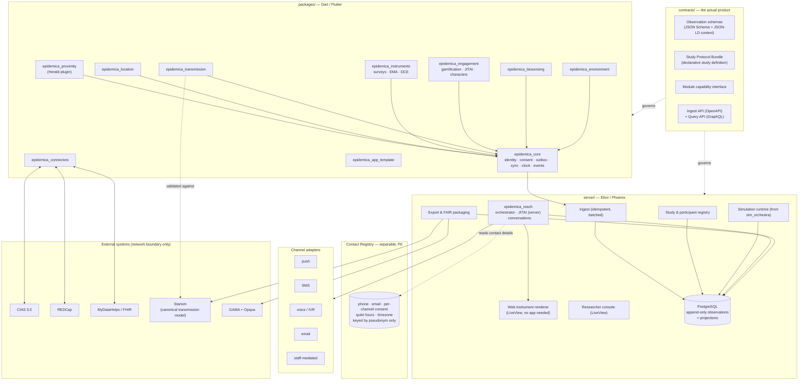

# Epidemica — Architectural Recommendations and Plan of Action

Draft v0.3 · Prepared from the CAREER proposal (Aim 1), the Epigames→OSI migration draft, and a
review of `epigames-app`, `epigames-backend`, `th-app`, and `th-backend`.

> **v0.3 changes:** the document now lives in the repository it describes, so it can be revised in
> the same commits as the code. Sections have been corrected where implementation contradicted the
> plan — the envelope no longer carries an `idempotency_key`, the clock reference is the server
> rather than NTP, `packages/` uses native pub workspaces rather than melos, and the protocol
> bundle's `modules` block became a map. Phase 0 and the first milestone of Phase 1 are checked off
> against what actually exists.
>
> **v0.2 changes:** transmission models re-centred on **Starsim** (§5.4); new section on
> **multi-channel participant reach** — SMS, voice, email, web-without-app (§6); open-source license
> treated as an **open decision** rather than assumed MIT (§9 ADR-009, §10 risk 5); the
> `flutter_background_geolocation` licensing risk downgraded (no longer paid/active in shipped TH).

> **Where things stand.** This document is the plan. For what has been built, see the
> [M1 milestone](milestones/m1-contact-logging.md) and the concept documents on
> [modules](concepts/modules.md), [the server](concepts/server.md), the
> [observation envelope](concepts/observation-envelope.md), and
> [building a study](concepts/building-a-study.md). Where the two disagree, the code and the
> milestone are right and this document is stale.

---

## 0. Executive summary

**The problem to solve is not "write six modules." It is "make it possible for people who are not
in your lab to build studies without reading your source code."** Everything below follows from
that.

Eight recommendations drive the whole plan:

1. **Contracts before code.** Epidemica's primary artifact is a versioned set of *data and protocol
   contracts* (observation schemas, study-protocol document, module capability interface). Libraries
   are implementations of those contracts. This is what makes third-party modules, FAIR metadata,
   and independent deployments possible — and it is cheap to do now, expensive to retrofit.
2. **One universal ingest path: the Observation Envelope.** Every module — proximity, survey,
   symptom, GPS, lateral-flow, air-quality, *message delivery* — emits the same typed envelope into
   one append-only store. One sync engine, one offline queue, one retry policy, one audit trail, one
   export pipeline. Today Epigames and TH each have a bespoke sync stack; this is the single biggest
   source of duplicated effort in your codebase.
3. **The app is one channel, not the platform.** Enrollment, consent, instruments and nudges must
   also work over SMS, voice, email and plain mobile web. Only the sensor modules genuinely require
   an installed app. This has four consequences that are cheap now and very expensive later
   (channel-aware instrument schema, a separated PII contact registry, a server-side JITAI
   evaluator, delivery-as-data) — see §6.
4. **One backend runtime: Phoenix/Elixir.** Drop the proposal's "switch between Phoenix and Lambda"
   plan. Two runtimes is 2× maintenance for a 2-person backend team, and Lambda is *unhostable* by
   Leibniz or any other institution.
5. **Adopt Starsim as the canonical transmission model; do not write epidemiology.** Starsim (MIT,
   Python) becomes the authority. Epidemica's job is to (a) make the study protocol directly
   loadable as Starsim parameters, (b) expose measured contact networks as a Starsim `Network`, and
   (c) run a deliberately restricted *subset* on-device for real-time play. This deletes an entire
   implementation from the earlier draft and makes the in-silico ↔ real-life round trip the default
   rather than a bespoke Aim 3 project. See §5.4.
6. **Do not rebuild what CIAS already does.** CIAS has 15 years of intervention-authoring,
   narrator/TTS, branching, SMS, and TLFB. Epidemica has proximity sensing, transmission
   simulation, and network measurement — which CIAS does not have and will not build. Integrate at
   the network boundary. Note this interacts with the license decision (§9, ADR-009): CIAS is
   GPL-3.0, and a permissive Epidemica license makes the network boundary mandatory.
7. **Extract the Herald integration into a real Flutter plugin — first.** It currently lives in
   `epigames-app/ios/Runner/AppDelegate.swift` and the Android app module. In its present form it
   is not reusable by anybody, including you. This is the highest-value, lowest-ambiguity first
   engineering task and it de-risks four of the six collaborator use cases.
8. **Dogfood as the acceptance gate.** A module is not "done" when it compiles; it is done when
   Epigames (and later TH) ships on it in production. Refactor-then-adopt, never build-in-parallel.

---

## 1. What you already have (asset inventory)

This is the honest starting position. It is stronger than the proposal implies for modules 4–7, and
essentially empty for modules 2–3.

| Capability | Where it lives today | State | Reuse verdict |
|---|---|---|---|
| BLE proximity + distance estimation | `epigames-app/ios/Runner/{SimulationService,DistanceEstimator,CoarseDistanceModel,P2PPayloadDataSupplier}.swift`; Android `io.heraldprox:herald:2.2.0` | Production-grade, thoughtful (Kalman + median, BLE state restoration, device-class RSSI thresholds) | **Extract verbatim into a plugin.** Highest-value asset in the org. |
| Transmission / infection state machine | `epigames-app/lib/data/health_status.dart` (2,398 lines), `parameters.dart` (948 lines) | Works, but monolithic and duplicated against server | **Re-specify, then re-implement.** See §5. |
| Event upload | `/history` endpoint, `HistoryBaseModel` `{time, type, ...}`; `history_event.ex` | Already a primitive observation stream | **Evolve into the Observation Envelope.** |
| Surveys / quizzes | `epigames-app/lib/data/{surveys,quizzes}`, `presentation/default/{surveys,quizzes}`; `th-app` `survey_hive.dart` | Two incompatible models, both hardcoded per study | **Replace with instrument schema + CIAS connector.** |
| Background geolocation | `th-app/lib/logic/bg_geo_location/`, headless isolate, geocoding | Mature and hard-won; `flutter_background_geolocation` is now dormant/unlicensed in shipped TH | **Extract the logic; re-home on an OSS provider.** No longer a blocker (§10, risk 11). |
| Offline queue + background sync | `th-app/lib/logic/services/survey_data_sync_service.dart`, `data_sync/` | Solid; Android 14/15 FGS pitfalls already solved | **Harvest into `epidemica_core`.** |
| Gamification | `epigames-app/lib/logic/{shop,interventions}`, `avatar_generator.dart`, `avatar_service.dart` | Rich (avatars, shop, leaderboard, raffle, multi-strain, AMR, synthetic peers) | **Generalise into engagement module.** |
| Push notifications | FCM via Go `sendPush`; `oo_admin/mobile/firebase_messaging.ex`; `firebase_messaging_service.dart` | Duplicated | Consolidate behind a channel adapter. |
| **SMS / voice / email / web-without-app** | — | **Nothing.** Push is the only outbound channel today | **Build `epidemica_reach` (§6).** Largest genuinely new subsystem. |
| **Participant contact details (PII)** | TH holds identifiers via Cognito; Epigames holds none | No separated PII store anywhere | **Build the Contact Registry as a separable service (§6.1b).** |
| Biosensing / lateral flow | HandLens (not in this workspace); `th-app` camera + `symptoms.dart` | Prototype only | **Year 2.** |
| Environmental sensing | — | Nothing | **Year 2.** |
| Data-quality / FAIR tooling | — | Nothing | **Build early, it's cheap and it's a deliverable.** |

**One fork you are currently paying for twice:**
- *API-style fork:* Epigames uses REST + generated OpenAPI Dart client (`api/o2_api`); TH uses
  GraphQL + Apollo (`th-backend/api/src/type-defs.ts`) + Cognito.

Resolving these two forks *is* a large fraction of Aim 1.

---

## 2. Target architecture



**Note the deliberate asymmetry:** the Contact Registry is the only component holding PII, it is
keyed solely by pseudonym, and it is drawn as a separate deployable so a recruiting site can host it
behind their own firewall while the coordinating centre holds only pseudonymous observations.

### 2.1 Repository layout

One monorepo, `epidemica/`. Atomic contract changes across client and server are worth far more
than the independence of separate repos at your team size.

```
epidemica/
  contracts/          # JSON Schemas, OpenAPI, wire formats, bundle spec, cross-language fixtures
  packages/           # Dart/Flutter packages (native pub workspace)
  server/             # Phoenix application (later: epidemica_reach, contact registry)
  models/             # starsim_epidemica: Starsim Network/Disease/Analyzer + protocol loader
  analysis/           # Python (+ R bindings): validators, FAIR scoring, QA scripts, exports
  studies/            # reference protocol bundles — study definitions containing no code
  deploy/             # local recipe; later a single-VM installer and a k3s chart
  apps/               # template/  (later: epigames/, travelhealthy/)
  docs/               # ADRs, concepts, milestones, this document
```

`models/` is Python and sits alongside `analysis/` deliberately: the canonical transmission model
and the data-quality tooling are used by the same people (modellers and analysts), in the same
environment, against the same exports.

**Correction to v0.2:** the Dart side uses **native pub workspaces**, not melos. Dart 3.6+ ships
workspace support in the SDK, giving one lockfile and one `.dart_tool` with no extra tool to
install. `studies/` was not anticipated in v0.2 and turned out to be the artefact that makes Tier 1
real — see [ADR-0001](adr/0001-monorepo-and-package-boundaries.md).

---

## 3. The keystone: the Observation Envelope

Every module produces observations. One shape, forever:

```jsonc
{
  "envelope_version": "1.0",
  "study_id":       "uuid",
  "protocol_hash":  "sha256:…",        // exact study version that produced this
  "subject":        "pseudonym",        // client-generated; never PII in this field
  "device_id":      "install-scoped uuid",
  "module":         "proximity",
  "schema_uri":     "https://schemas.epidemica.info/observations/proximity/contact_episode/1.0.0.json",
  "observed_at":    "2026-08-11T14:03:22.481Z",   // device clock, UTC with a Z
  "clock_offset_ms": -1843,                        // device minus server; null when never measured
  "seq":            10427,                          // per-install monotonic
  "payload":        { /* validated against schema_uri */ }
}
```

**Two corrections to v0.2.** There is no `idempotency_key` field: the key *is* `(device_id, seq)`,
and duplicating it as a string would allow the two to disagree. And `received_at` is not in the
envelope at all — it is a server-side column, and the envelope is closed
(`additionalProperties: false`) specifically so a client cannot supply it.

The clock reference is the **server**, not NTP. The skew that matters for ordering one participant's
observations against another's is each device's difference from the clock that orders them all, and
the ingest response already carries it — so this needs no extra dependency and no extra round trip.
`clock_offset_ms` is required but nullable: null means no reference was ever reached, which is a
different statement from zero.

**Why this earns its keep:**

- *One sync engine.* `epidemica_core` owns the outbox, batching, backoff, dedup, and background
  execution. A new module contributes a schema and a payload builder — nothing else. Contrast with
  today, where adding a data type to TH means touching Hive models, GraphQL mutations, and the
  background service.
- *Idempotency for free.* `(device_id, seq)` unique constraint. Retries on flaky field networks stop
  being a correctness problem. (Today's `/history` bulk upload has no idempotency key.)
- *FAIR by construction.* `schema_uri` → JSON Schema → JSON-LD context → DCAT/RDF dataset
  description at export. FAIRshake/F-UJI scoring becomes a CI job, not a research project.
- *Clock integrity.* You already pull `ntp` in Epigames. Recording `clock_offset_ms` per observation
  makes contact-network timing defensible — this matters directly for Aim 2's network-fidelity
  analysis and for the Oxford contact-duration study.
- *Provenance for IRB and for Aim 2.* Append-only + `protocol_hash` means you can always answer
  "which version of the study produced this row?"

**Storage:** append-only `observations` table, partitioned by `(study_id, month)`, `payload JSONB`.
Module-specific *projections* (materialised tables like `contacts`, `survey_responses`,
`infection_events`) are derived and rebuildable. Never write to a projection directly.

**Encryption / GDPR:** one data-encryption key per participant, wrapped by a study key. Erasure
requests are satisfied by destroying the participant key (crypto-shredding) — no deletes across
partitioned append-only tables, and it survives backups. This is a concrete, defensible answer for
the Leibniz DPO.

---

## 4. The Study Protocol Bundle

The second contract. A declarative, versioned, signed document that fully defines a study. The app
fetches it on join and caches it; no app rebuild per study. This is what turns Epidemica from "a
library" into "a platform."

```yaml
protocol: epidemica/study@1
id: 5f3a-…
title: "Quarantine Game — Multi-site 2027"
version: 3
irb: { protocol_number: "H00012345", consent_document: "consent/v3.md" }

enrollment:
  join_codes: [ "QG27-A", "QG27-B" ]
  eligibility: { min_age: 18 }
  arms:
    - { id: control,  weight: 1 }
    - { id: smf,      weight: 1 }
    - { id: bp,       weight: 1 }
  randomization: { unit: participant, stratify_by: [site] }

modules:
  proximity:
    provider: herald
    service_uuid: "8693a908-…"
    on_device: { estimator: coarse_distance_v2, min_rssi_samples: 3 }
    upload: { granularity: contact_episode, min_duration_s: 60 }   # data minimisation
  transmission:
    engine: starsim
    starsim_version: "3.5.2"          # pinned; recorded in every export
    pars:                             # loadable directly as ss.Sim(pars)
      diseases:  { type: sir, beta: 0.05, dur_inf: { value: 7, unit: day } }
      networks:  { type: epidemica }  # measured contacts, see §5.4
    edge_runtime: { model: hazard_v1, tick_s: 2 }   # on-device subset
  instruments:
    - { id: baseline,  source: cias,       session: "…", trigger: on_enroll,
        channels: [app, web] }
    - { id: daily_ema, source: epidemica,  schema: "instruments/ema-quarantine.json",
        trigger: { schedule: "daily@19:00", jitter_min: 30 },
        channels: [app, sms, web], escalate: [app, +4h sms, +1d voice] }
    - { id: post_exposure, source: epidemica, schema: "…",
        trigger: { on_event: exposure_notification, within_min: 60 },
        channels: [app, sms] }        # JITAI
  engagement:
    character: { id: "dr-vale", tone: supportive }
    nudges: [ { on: quarantine_eligible, template: "nudge/social-norm",
                runtime: on_device, channels: [app] } ]

reach:
  default_channels: [app, sms, web]
  quiet_hours: { start: "21:00", end: "08:00", tz: participant }
  frequency_cap: { per_day: 3, per_week: 12 }
  opt_out_keywords: [STOP, UNSUBSCRIBE, ALTO]
  provider: { sms: twilio_eu, voice: none, email: institutional_smtp }

retention: { residency: eu-central, raw_ttl_days: 730, on_withdrawal: crypto_shred }
export:    { formats: [csv, parquet], fair: { license: CC-BY-4.0, doi_on_publish: true } }
```

Effects: preregistrable, diffable, reproducible (its hash rides on every observation), and it is the
input to the researcher console's form UI.

**Correction to v0.2:** the implemented bundle makes `modules` a **map** from module id to that
module's configuration, rather than a list of names plus separate configuration blocks. Declaring a
module and configuring it become the same act, so a bundle cannot name a module it forgot to
configure or configure one it never declared. It is also the shape the app's satisfiability check
reads directly. See [`contracts/bundle/1.0.0.json`](../contracts/bundle/1.0.0.json) and
[`studies/contactlog`](../studies/contactlog) for the as-built version; the sketch above remains the
target for `enrollment`, `reach`, `retention` and `export`, none of which exist yet.

---

## 5. Module-by-module recommendations

### 5.1 `epidemica_proximity` — do this first

**Problem:** the Herald integration is app code, not library code. `SimulationService.swift` is a
singleton in `Runner`; the Android side is a Gradle dependency of the app module; the bridge is two
hardcoded channel names (`sendPayloadData.methodChannel` / `receivePayloadData.eventChannel`).
A collaborator at Oxford or UGA cannot use any of it.

**Action:** federated Flutter plugin `epidemica_proximity` (`_platform_interface`, `_android`,
`_ios`), moving the Swift/Kotlin sources in unchanged at first. Then:

- Replace the hand-rolled payload with a **rotating pseudonym**. Today `P2PPayloadDataSupplier`
  broadcasts a stable `UInt64` identifier plus epidemiological state in the clear over BLE. For a
  gamified simulation that is acceptable; for the Oxford *observational cohort* it is a real
  re-identification and health-status-disclosure risk, and it will not pass a German DPIA. Herald
  supports secured/rotating payloads — make payload strategy a protocol-bundle option
  (`open_game` | `pseudonymous` | `secured`).
- Split the payload into **transport** (identity, rotation) and **application** (`epi`, `clin`,
  `mod`, `strain`, `ps/pi/pr`) so non-game studies carry no epidemiological state at all.
- Promote `CoarseDistanceModel` to a pluggable `DistanceEstimator` interface. Publish the RSSI
  thresholds as calibration data, not constants, so Aim 2's calibration sessions can produce
  device-specific tables.
- Emit `contact_episode` observations (start, end, duration, distance distribution, sample count)
  rather than raw RSSI by default — data minimisation, and it is the unit the science actually uses.
- **Test harness:** generalise `synthetic_peers_intervention.dart` into a first-class simulated-peer
  driver. BLE cannot be meaningfully emulated in CI; a synthetic-peer harness is the only way to get
  regression tests on the transmission + network stack.

### 5.2 `epidemica_core`

Owns: pseudonymous identity, consent records, study join/leave, the observation outbox (SQLite/Drift
— migrate off Hive, you need queryable indices and it is the same store on both apps), background
sync, NTP clock offset, permission choreography, structured logging, feature-gated module registry.

Harvest directly from `th-app/lib/logic/services/survey_data_sync_service.dart` and `data_sync/` —
the Android 14/15 foreground-service and headless-isolate landmines are already defused there and
that knowledge must not be lost in the refactor.

### 5.3 `epidemica_instruments` + CIAS

**Recommendation: do not build a survey authoring tool.** Build a *renderer* plus two sources.

- **Source A — native:** a JSON instrument schema (item types, branching, validation, scoring,
  scheduling) with **multiple renderers**: offline-first Flutter (app), LiveView (mobile web, no
  install), SMS conversation, and IVR script. Required for field studies with no connectivity, for
  in-game prompts that must fire in seconds, and for participants who will never install an app.
- **Channel capability is part of the item type, not an afterthought.** Every item type declares how
  it renders per channel and which channels it is invalid on — a visual analogue slider, a photo
  capture, or a TLFB calendar grid has no sensible SMS or IVR representation. Authoring must warn at
  design time, and the protocol bundle must be able to specify a per-instrument channel list and
  escalation ladder. **Define this in Phase 0**; retrofitting it into an authored instrument library
  is a year-long migration (§6.1a).
- **Source B — CIAS:** for PQHS-style multi-session behavioural interventions, embed the CIAS
  session (webview or API-driven) with a participant token. Epidemica pushes *variables* into CIAS
  (exposure status, contact count, adherence streak) so CIAS branching can be sensor-aware —
  something CIAS cannot do today and a genuinely novel contribution. CIAS results return as
  Epidemica observations.

> **Licensing, important:** CIAS 3.0 is **GPL-3.0**. The proposal commits Epidemica to MIT. Keep the
> integration strictly at the network boundary (HTTP/webhooks/SSO/deep-link). Do not vendor, fork,
> or statically link CIAS code into any Epidemica package, and do not accept CIAS-derived code into
> the monorepo. Get this in writing in an ADR before anyone starts coding.

Concrete first CIAS integration to propose to PQHS: **"sensor-triggered CIAS sessions."** A
medication-adherence or smoking-cessation study where an Epidemica-detected context (location
geofence, proximity to a social group, time-since-last-report) triggers a CIAS micro-session. That
is a fundable, publishable, small-surface-area first joint deliverable.

### 5.4 `epidemica_transmission` — Starsim as the canonical model

**Decision (per your direction): [Starsim](https://github.com/starsimhub/starsim) is the
authoritative transmission model.** Epidemica does not define its own epidemiology. Its job is to
make a study protocol loadable as a Starsim simulation, to expose measured contact networks as a
Starsim network, and to run a restricted subset on-device for real-time play. Starsim is MIT,
actively developed (v3.5.2), Python 3.11+ with R bindings, and already carries validated disease
modules (RSV, TB, HIV, cholera, Ebola) plus calibration and scenario tooling.

**Problem this solves:** the model currently exists twice — `health_status.dart` (2,398 lines,
client) and `pathogen_properties.ex` (server) — and the two can drift silently. Worse, neither is
usable by a modeller. Adopting Starsim removes the server implementation entirely and gives the
"flexible epidemic models" claim a concrete, externally maintained backing.

**Three roles, not three implementations:**

| Runtime | Role | Scope |
|---|---|---|
| **Starsim (Python)** | Canonical authority | In-silico scenarios, calibration, power analysis, post-hoc replay of real deployments, Aim 3 digital twin |
| **`epidemica_transmission` (Dart)** | Edge runtime | Real-time, offline, on-phone: evaluate per-contact hazard, advance *this participant's* state. Deliberately **not** a general ABM |
| **Elixir server** | Orchestration only | Scheduling, ticks, persistence, reconciliation. **No epidemiological logic** — `pathogen_properties.ex` math is retired |

**Two bridges — build both in `models/starsim_epidemica`:**

1. **Protocol → Starsim.** The bundle's `transmission.pars` block must be *directly* loadable as
   `ss.Sim(pars)` — `diseases`, `networks`, `interventions`, `n_agents`, and Starsim's time types
   (`ss.dur`, `ss.rate`, `ss.time_prob`). Constrain the schema so that **anything expressible in an
   Epidemica protocol is expressible in Starsim**; refuse Epidemica-only parameters. This constraint
   is what keeps the round trip honest, and it also gives you Starsim's time-unit handling for free
   instead of re-deriving the `parTimeUnit`/`parTimeFactor` scaling in `parameters.dart`.
2. **Measured network → `ss.Network`.** An `EpidemicaNetwork(ss.Network)` that materialises observed
   `contact_episode` observations as a dynamic edge list (`p1`, `p2`, `beta` weighted by duration
   and estimated distance), plus an `ss.Analyzer` for export.

> **This second bridge is the highest-leverage single artifact in the whole plan.** It turns every
> Epidemica deployment into a drop-in empirical substrate for *any* Starsim disease module — a
> collaborator can run RSV, TB, or a co-transmission scenario over your measured contact network
> without your team writing a line of epidemiology. It is also, directly, the empirical-network
> contribution the proposal argues the field is missing.

**Equivalence testing.** This replaces the earlier "golden corpus across three implementations."
Cross-language determinism cannot come from a shared seed (NumPy's `Generator` ≠ Dart's PRNG), so
**inject the random stream instead**: each fixture contains a fixed contact trace *and* a
pre-generated uniform stream, consumed in a specified order. Dart and Starsim must then produce
bit-identical state trajectories. Layer property-based tests on top: over N synthetic traces, the
Dart edge runtime and Starsim must agree within tolerance on aggregate outcomes (attack rate,
generation interval, offspring distribution).

**Sequencing tip:** implement the Epigames model as a Starsim disease module
(`EpigameDisease(ss.Disease)`) *first*, then port it to Dart. The specification then comes from
working, testable Python rather than from prose — and you immediately gain the ability to run
in-silico power analyses before a deployment.

**Two frictions to plan for:**

- *Open populations.* Starsim's agent-based core assumes a defined population; Epidemica studies
  have rolling enrollment and mid-study dropout. Decide early whether to model joins/leaves via
  Starsim demographics, via a pre-allocated agent pool with an `active` state, or by replaying in
  fixed windows. This is a real design question, not a detail.
- *Version coupling.* Pin `starsim_version` per protocol-bundle major, record it in every export,
  and run the equivalence fixtures against new Starsim releases in CI. Starsim moves quickly.

**Relationship to Opqua (Aim 3).** Starsim now covers transmission, networks and interventions —
which overlaps what the proposal assigned to Opqua. Suggested split: Starsim owns transmission
dynamics; Opqua is retained only if genotype-level evolution (mutation, recombination, selection) is
scientifically essential, feeding evolved parameters back into Starsim as time-varying `beta` and
severity. Worth revisiting explicitly at the Aim 3 kickoff rather than assuming both are needed.

### 5.5 `epidemica_engagement` (gamification + JITAI)

Not a module in the proposal, but it is what PQHS is actually asking for. Generalise from
`logic/interventions/`, `avatar_generator.dart`, `shop/`:

- **Action fidelity:** in-app actions (quarantine, test, mask, take medication) as declarative
  `action` definitions with costs, cooldowns, evidence requirements (QR scan, photo, geofence), and
  effects on the transmission model. Today these are hardcoded per intervention class.
- **Characters:** the avatar system is a differentiator. Keep generation on-device and deterministic
  from a seed. If AI dialogue is added, put it behind a provider interface with a scripted default —
  never make an LLM a hard dependency of a study protocol (reproducibility + IRB + cost + it breaks
  offline).
- **JITAI engine — one rule language, two runtimes.** `when <predicate over recent observations> and
  <context> then <deliver instrument | nudge | notification>`. The **on-device** evaluator handles
  low-latency, offline, privacy-preserving app nudges without streaming raw context to the server;
  the **server-side** evaluator (in `epidemica_reach`, §6) is unavoidable because SMS and voice
  originate server-side. The protocol bundle declares which runtime owns each rule. Micro-randomised
  trial support — randomise delivery at decision points, and **log the decision point whether or not
  delivery succeeded** — must be built in from the start; it is nearly free now, expensive later, and
  it is the design PQHS mHealth people will expect.

### 5.6 `epidemica_environment`, `epidemica_biosensing` — Year 2, but stub the contracts now

Cost of defining the observation schemas now: ~2 days. Benefit: collaborators can start collecting
via manual entry or a spreadsheet import immediately, and the app work becomes an optimisation
rather than an unblocking dependency. Do the schemas in Phase 1, the code in Year 2 as planned.

### 5.7 `epidemica_connectors`

Adapters, always at the boundary, never in core:

| Target | Direction | Mechanism | Priority |
|---|---|---|---|
| CIAS 3.0 | both | REST + webhooks + participant token; webview session delivery; optionally its SMS arm | **High** (PQHS) |
| REDCap | push | REDCap API record import; CDISC ODM for instrument definitions | **High** (clinical) |
| **Starsim** | export + load | `models/starsim_epidemica`: protocol→`ss.Sim`, contacts→`ss.Network` | **High** (§5.4) |
| MyDataHelps | both | FHIR-shaped API | Medium |
| FHIR (generic) | export | Map envelope → `Observation`, `QuestionnaireResponse`, `Consent` | **High** — this is the lingua franca that gets you into clinical projects |
| SMS / voice providers | outbound + inbound | Twilio, Vonage, Sinch, institutional gateway, SMPP (§6.3) | **High** (§6) |
| Wearables | pull | Health Connect (Android) / HealthKit (iOS) | Medium |
| Sensor/air-quality APIs | pull | PurpleAir, OpenAQ, weather | Year 2 |
| GAMA / Opqua | export/stream | Aim 3 bridge — scope depends on the Starsim/Opqua split (§5.4) | Year 2 |

---

## 6. Multi-channel participant reach

**Principle: the app is one channel, not the platform.** A participant should be able to enroll,
consent, respond to instruments, and receive nudges over SMS, voice, email or plain mobile web, with
the app as an optional richer experience. Only the sensor modules — proximity, GPS, wearables,
lateral flow — genuinely require an installed app. Everything else should not.

This is not a feature bolted onto the side; it changes four things in the core design, and all four
are cheap to build in now and painful to retrofit.

### 6.1 Four consequences to design in during Phase 0

**(a) Instruments must be channel-adaptive.** The instrument schema (§5.3) must declare, per item
type, how it renders in each channel — app widget, SMS turn, IVR prompt with DTMF/ASR, web form
field — and which channels it is invalid on. A visual analogue slider, a photo capture, or a TLFB
grid has no sensible SMS representation; the authoring tool must say so at design time rather than
failing in the field. *Retrofitting a channel capability model into an already-authored instrument
library is the kind of migration that consumes a year.*

**(b) Identity splits in two — and this is the important one.** Today Epidemica identity is a
client-generated pseudonymous UUID holding no PII, which is exactly why the GDPR story is clean.
Reaching people by SMS or telephone requires storing phone numbers, which are PII by definition.
**Do not put them in the observation store.**

Introduce a physically separable **Contact Registry**: phone, email, preferred channel, per-channel
consent, quiet hours, timezone, language — keyed *only* by participant pseudonym, in its own schema,
with its own keys, access control, audit log and retention policy. Four things follow:

- the observation store stays pseudonymous and therefore freely shareable for analysis and archiving;
- the registry can be hosted **by the recruiting site rather than the coordinating centre**, which is
  the standard multi-site arrangement and pre-empts a large fraction of IRB and DPO questions;
- erasure becomes a single-row delete plus a crypto-shred, with no ambiguity;
- re-identification requires compromising two systems, not one.

Ship it as a separate deployable service from day one. Making it separable later means changing
every query that touches a participant.

**(c) The JITAI engine becomes two engines sharing one rule language.** SMS and voice originate
server-side, so a server-side rule evaluator is unavoidable; the on-device evaluator remains for
low-latency, offline and privacy-preserving app nudges. One rule schema, two runtimes, with the
protocol bundle declaring ownership per rule. Decision points must be logged as observations
**whether or not delivery succeeded** — otherwise micro-randomised trial analysis is impossible.

**(d) Delivery is data.** Every send, delivery receipt, open, click, response and failure is a
`message_delivery` observation flowing through the same envelope as everything else. This gives you
response rate by channel, by time of day, by demographic — precisely the retention metric that PQHS
addiction and adherence studies live or die by, and it feeds the proposal's user-experience metrics
without extra instrumentation.

### 6.2 `epidemica_reach`

A server-side module in `epidemica_server`, with four parts:

- **Channel adapters** behind one Elixir behaviour: `push` (FCM/APNs), `sms`, `voice`, `email`,
  `web`, `whatsapp`/`rcs` (later), and **`manual`** — a staff member logs a phone call or a paper
  form completed on the participant's behalf. Do not skip `manual`: for older, low-literacy,
  low-connectivity or unhoused cohorts it is often the channel that actually works, and modelling it
  as a first-class channel keeps that data inside the same pipeline instead of in a spreadsheet.
- **Orchestrator:** participant-timezone scheduling, quiet hours, frequency caps, per-channel consent
  checks, **escalation ladders** (push → wait 4h → SMS → wait 1d → create a staff call task),
  deduplication, retry with backoff, and a per-study kill switch.
- **Conversation runtime:** SMS is stateful — a participant replying "3" must be matched to a pending
  item. Model this as a short-lived state machine per `(participant, instrument)` with a timeout,
  keyword handling (STOP/HELP/START and localised equivalents), out-of-order reply tolerance, and
  graceful fallback to a web link when an instrument is too complex for SMS.
- **Web instrument renderer:** a tokenized magic link opening the same instrument as a mobile web
  page.

> **The web fallback is the highest-ROI item in this entire section.** Phoenix LiveView is already
> in the stack, so rendering instruments on the web is nearly free — and it removes app installation
> as an enrollment barrier completely. For any study whose primary burden is a periodic survey, a
> link in a text message will out-recruit and out-retain an app install, in every population. Build
> this before SMS conversations, before IVR, before almost anything else in Phase 2.

### 6.3 Providers, and where the OSI goal genuinely does not hold

Honest assessment: **telephony is the one place where "no vendor lock-in" cannot be delivered by
self-hosting.** SMS and voice require carrier relationships; you can self-host the software but not
the network.

| Approach | Reality |
|---|---|
| Commercial API (Twilio, Vonage, Sinch, MessageBird) | Easiest, best deliverability, per-message cost; EU-resident options exist |
| **Institutional gateway** | Many universities and health systems already hold an SMS contract — using theirs solves cost, procurement and residency at once. **Ask UMass Chan and Leibniz before building anything.** |
| Self-hosted SMPP (Jasmin, Kannel) | You host the software; you still need an upstream aggregator |
| GSM modem / Android SMS gateway | Genuinely viable for small local studies (tens of participants); not for scale |
| Self-hosted voice (Asterisk, FreeSWITCH) | Real, but needs a SIP trunk and meaningful ops skill |

**Recommendation:** define the adapter interface; ship a Twilio adapter, a generic SMPP adapter and a
log-only development adapter; document the institutional-gateway path as the preferred production
route. Do **not** promise self-hosted telephony in the Leibniz reference deployment — promise
*provider choice and data residency*, which is what GDPR actually requires.

Where a site already runs CIAS, prefer routing intervention *content* through CIAS's existing
tailored-SMS capability, with `epidemica_reach` owning scheduling and triggering. Two SMS engines in
one study is a support burden with no scientific payoff.

### 6.4 Compliance surface

SMS and voice bring regulatory obligations the app does not:

- **US:** TCPA/CTIA — prior express written consent, immediate opt-out honouring, and **A2P 10DLC or
  toll-free registration**, which has a lead time of weeks and carrier vetting. Start registration
  early in Phase 2; it is a common cause of launch slips and it is pure calendar time.
- **EU:** GDPR + ePrivacy — separate, documented consent per channel; lawful basis recorded per
  purpose.
- **Both:** quiet hours, frequency caps, message-content rules for health-related messaging, and
  careful phrasing so an SMS never discloses health status to whoever happens to see a lock screen.
  (This last point interacts with §5.1: an exposure notification delivered by SMS is a disclosure
  risk that the same notification delivered in-app is not.)

Model consent as **per-channel consent receipts** in the Contact Registry, versioned against the
protocol, with opt-out immediate and global per channel across all studies at that institution.

---

## 7. Backend: consolidate on Phoenix — and simplify the OSI migration

### 7.1 Recommendation

Retire the Go/Lambda backend. Use Phoenix/Elixir for `epidemica_server`.

**Rationale:**

| Criterion | Phoenix | Go + Lambda |
|---|---|---|
| Self-hostable by a university | Yes — one BEAM release, one Postgres | **No.** Lambda + API Gateway + Cognito + Secrets Manager are not portable |
| Ops surface for a research group | 2 processes | ~8 AWS services |
| Team | New to Elixir development | Go + Serverless Framework + 3 plugins |

The one honest advantage of Lambda — scale-to-zero cost for idle studies — is worth roughly a few
dollars a month at your scale, and it is bought at the price of the entire portability goal.

### 7.2 This substantially simplifies the Leibniz migration

The current `Epigames-Migration-to-OSI.md` proposes replacing nine AWS services with nine
open-source services (Traefik, Keycloak, Vault, SeaweedFS, Varnish, Prometheus, Grafana,
Kubernetes RBAC, network policies) at 4–6 FTE-months. That is a large operational burden to hand to
a research institution, and most of it is only needed *because* the Go/Lambda decomposition is being
preserved.

**Alternative, recommended target — a single-VM reference deployment:**

| Concern | Recommended | Replaces |
|---|---|---|
| App runtime | Phoenix release in one container | Lambda + API Gateway containerisation |
| Reverse proxy / TLS / rate limit | **Caddy** (automatic HTTPS, ~20-line config) | Traefik/Kong |
| Database | PostgreSQL 16 | RDS |
| Participant auth | Phoenix-issued study-scoped device tokens | Cognito |
| Researcher auth | Phoenix `mix phx.gen.auth` + **optional** OIDC adapter (Keycloak *if the institution already runs one*) | Cognito → Keycloak |
| Secrets | Environment file via systemd + **SOPS/age** in git | Vault |
| Object storage | Local disk + Postgres large objects; **MinIO** only if >100 GB media | SeaweedFS + CDN |
| Background jobs | **Oban** (Postgres-backed, already in the ecosystem) | EventBridge + dispatcher/worker Lambdas |
| Observability | `PromEx` → Prometheus + Grafana (optional); Phoenix LiveDashboard by default | CloudWatch |
| Push | FCM behind a `PushProvider` behaviour; **ntfy/UnifiedPush** adapter for FCM-free deployments | FCM |
| Backups | `pg_dump` + restic to institutional storage (your `scripts/db_export.sh` already does this) | RDS snapshots |

Moving parts drop from ~9 to ~4. Estimated effort drops from 4–6 FTE-months to roughly 6–10 weeks,
and Leibniz gets something one part-time sysadmin can actually run. Offer Kubernetes (k3s) as an
optional second target for multi-site scale, not as the reference.

**Recommended revision to the Leibniz conversation:** reframe Phase 1 from "containerise the Lambda
functions" to "deploy `epidemica_server` and migrate the Epigames data." It is less work, it lands
on the platform you are going to maintain anyway, and it makes Leibniz an *Epidemica* pilot rather
than an *Epigames* fork.

### 7.3 API style: split the planes

The proposal specifies GraphQL for Module 1. Refine this:

- **Ingest plane → REST + OpenAPI.** Narrow, versioned, batched, idempotent, cacheable, works from
  a background isolate with dumb retry logic, and you already generate a Dart client from
  `o2API.yaml`. GraphQL mutations over an offline outbox are a poor fit: no natural idempotency key,
  awkward batching, no HTTP-level caching, and error semantics that are hard to retry safely.
- **Query/admin plane → GraphQL (Absinthe).** Researcher console, exploratory data access,
  third-party dashboards, variable-shape queries. This is where GraphQL genuinely wins, and it is
  where TH already uses it.

Also: **retire the API-key model.** The existence of `extra-api/proxy/epigames-api-proxy-*` — a
Lambda whose only job is to hide a shared API key from web clients — is a symptom. A single shared
key baked into every installed app is a credential you cannot rotate. Replace with short-lived,
study-scoped, device-bound participant tokens issued at join, refreshable, revocable per device.

---

## 8. Phased plan of action

Assumes the team in the proposal (PI, 1 senior mobile eng, 1 UI/UX, 1–2 backend). **Cap work in
progress at two modules.** Every phase ends with something a real study uses.

### Phase 0 — Decide and scaffold (≈6–8 weeks)

*Goal: no code is written twice because a decision was deferred.*

- [~] Write ADRs 001–013 (§9) and get them agreed. **001, 002, 004, 009 and 012 are Accepted; 003 is
      Proposed.** 005–008, 010, 011 and 013 remain.
- [x] Stand up the `epidemica` monorepo: pub workspace, `mix test`, `pytest` for `models/` and
      `analysis/`, Apache-2.0, SPDX headers.
- [~] `contracts/` v0.1: **envelope, batch, `contact_episode`, `location_fix`, `survey_response`,
      the ingest OpenAPI, the study bundle and the proximity wire format are written, with 65+
      cross-language fixtures.** `symptom_report`, `infection_event`, `app_action` and
      `message_delivery` remain, as does the `reach:` block and per-item channel capabilities.
- [x] **Extract `epidemica_proximity`** as a federated plugin. Delivered as four packages; the
      remaining work is on-device verification, not extraction. Behaviour is *not* byte-identical by
      design — see the correction below.
- [x] **Starsim spike:** `EpidemicaNetwork` and the plumbing spike pass 7/7 criteria; open
      populations resolved as a pre-allocated pool with an `active` state (ADR-0012).
- [x] Dependency license audit and CI allow-list. `rfc3987` excluded as GPLv3+; Herald confirmed
      Apache-2.0 on both platforms.

**Correction to v0.2:** the plan said to move the Swift and Kotlin in *unchanged*. In the event,
distance estimation moved from native to Dart, which was the right call and worth recording: the
banding and episode arithmetic are where the measurement is actually made, and in Dart they run in
CI against synthetic streams instead of requiring two phones in a room. The native surface shrank to
payload, sensor lifecycle and channel bridge. Six native files did not need to move at all.

**Exit criterion:** ~~Epigames builds and runs from the monorepo using `epidemica_proximity`~~ — not
yet met, and deliberately deferred. `apps/template` plus `studies/contactlog` was built first
because it proves Tier 1 with a study that has no legacy behaviour to preserve. Epigames migration
remains the real dogfooding gate.

### Phase 1 — Core + server, proven by Epigames (≈4–5 months)

- [x] `epidemica_core`: identity, join, SQLite outbox, sync engine, clock offset, module registry.
      TH's background-execution knowledge harvested — though see the correction below. Consent
      records and permission choreography remain.
- [~] `epidemica_server`: **study registry, batched idempotent ingest, protocol bundle storage and
      delivery, and device-bound participant tokens are built.** Ticks are scheduled automatically
      by `Twin.Scheduler` under `Oban.Plugins.Cron`
      ([task 0002](../tasks/done/0002-scheduled-ticks.md)). The LiveView console generalised from
      `live/creator` remains, as does the simulation runtime.
- [~] `epidemica_transmission` v1: **`EpidemicaNetwork` is built and benchmarked** (1,000
      participants × 28 days × 696k episodes in 1.3 s). `EpigameDisease`, the protocol→`ss.Sim`
      loader, the Dart edge runtime and the injected-random-stream equivalence fixtures remain.
- [ ] **Migrate Epigames onto core + server.** Run old and new backends in parallel for one real
      deployment; compare exports row-for-row.
- [~] `analysis/` v0.1: **envelope and payload validators are built and run in CI over every
      fixture.** The bimodal contact-distance QA script and the completeness report remain.

**Correction to v0.2:** the plan was to harvest TH's sync stack. Its *background-execution*
knowledge was worth harvesting — the Android 15 `BOOT_COMPLETED` ban, the plugin-registrant guard —
but its persistence approach was not. TH sidesteps multi-isolate access by keeping its upload queue
as a JSON blob in secure storage, which costs an O(n) rewrite per append and has no idempotency key,
no backoff, no `Retry-After` handling and no dead-letter. The outbox instead uses SQLite in WAL mode
with one connection per isolate, which is the thing v0.2 assumed was already solved.

**Exit criterion:** a real Epigames deployment (a class, a workshop) runs entirely on Epidemica, and
its dataset passes automated QA. **This is the milestone worth announcing.**

### Phase 2 — Portability, instruments and reach (≈4–5 months, overlaps Phase 1)

- [ ] `deploy/`: one-command Docker Compose stack (Phoenix + Postgres + Caddy), an install script
      for a bare VM, a restore-from-backup path, and an operator runbook. Target: a competent
      sysadmin goes from bare VM to running study in under an hour.
- [ ] **Leibniz pilot:** they deploy it themselves from the docs, you watch and fix the docs. Do not
      deploy it for them — the documentation is the deliverable.
- [ ] `epidemica_instruments`: instrument schema with channel capabilities, offline app renderer,
      **web renderer (LiveView)**, scheduler, on-device JITAI trigger evaluator.
- [ ] **`epidemica_reach` v1:** Contact Registry as a separate service; orchestrator with quiet
      hours, frequency caps and per-channel consent; **web magic-link participation**; SMS adapter
      and conversation runtime; `message_delivery` observations. Start A2P 10DLC registration at the
      *beginning* of this phase — it is calendar time you cannot compress.
- [ ] `epidemica_connectors/cias`: token exchange, session embedding, variable push, result ingest.
- [ ] GDPR pack: DPIA template, per-channel consent receipts, crypto-shredding, residency config,
      data-processing agreement template.

**Exit criteria (two):** an institution other than yours runs an Epidemica study on their own
hardware; **and** a participant completes a full study arm end to end without ever installing the
app.

### Phase 3 — Breadth (≈4–6 months)

- [ ] `epidemica_location` extracted from TH, re-homed on an OSS provider.
- [ ] **Migrate TH onto Epidemica** — retires the Cognito + GraphQL + Aurora fork and gives you the
      second template app promised in Aim 1.
- [ ] `epidemica_engagement`: actions, characters, nudges, micro-randomisation, **server-side JITAI
      runtime** shared with `epidemica_reach`.
- [ ] `epidemica_reach` v2: voice/IVR adapter, escalation ladders, staff-mediated `manual` channel,
      email adapter, per-channel response analytics in `analysis/`.
- [ ] `epidemica_connectors`: REDCap, FHIR export, Health Connect/HealthKit.
- [ ] `epidemica_app_template` + a study cookbook: "build a contact-network cohort study in one
      afternoon."

### Phase 4 — Year 2+

Biosensing (lateral flow CV, wearable pairing); environmental sensing; GAMA/Opqua bridge (Aim 3);
federated multi-site catalog; external-validity index tooling (Aim 2).

---

## 9. Architecture Decision Records to write in Phase 0

Short documents, one page each, in `docs/adr/`. These are the decisions that are expensive to
revisit. **Written so far: 0001, 0002, 0004, 0009, 0012 (Accepted) and 0003 (Proposed).**

1. **ADR-001** ✅ Monorepo, package boundaries, app hosting and the three tiers.
2. **ADR-002** ✅ Observation Envelope as the universal ingest contract.
3. **ADR-003** 🔶 Phoenix as the single backend runtime; Go/Lambda deprecation and data-migration plan.
4. **ADR-004** ✅ REST/OpenAPI for ingest, GraphQL for query/admin.
5. **ADR-005** Participant tokens replace shared API keys. *(Implemented; not yet written up.)*
6. **ADR-006** Study Protocol Bundle format and versioning. *(Contract exists; ADR not yet written.)*
7. **ADR-007** Schema evolution policy (additive within major; `schema_uri` is immutable).
8. **ADR-008** Privacy architecture: pseudonymity, edge minimisation, per-participant keys,
   crypto-shredding, BLE payload strategies.
9. **ADR-009** ✅ Open-source license selection — **decided: Apache-2.0** (see below).
10. **ADR-010** Module Definition of Done (below) and the dogfooding gate.
11. **ADR-011** Multi-channel: Contact Registry separation, per-channel consent model, channel
    capability declarations on instrument items.
12. **ADR-012** ✅ Starsim as the canonical transmission authority; scope of the Dart edge subset;
    version pinning and equivalence-testing policy; open-population handling.
13. **ADR-013** Division of labour between Starsim, Opqua and GAMA for Aim 3.

**ADR-005 and ADR-006 are the urgent gap.** Both are implemented and load-bearing — device-bound
tokens are how every request is authorised, and the bundle format is what a researcher authors — so
the decisions exist in code without the reasoning being written down anywhere durable.

### ADR-009 — license: decided, Apache-2.0

**Decision (2026-09-02): Apache-2.0 for code, CC-BY-4.0 for documentation and schemas.** Recorded in
`epidemica/docs/adr/0009-open-source-license.md`; `LICENSE` and `NOTICE` are in place.

The options considered were:| License | Effect | Fits Epidemica if… |
|---|---|---|
| **MIT** | Maximum adoption, minimum friction. No patent grant. | You optimise purely for uptake. Matches Starsim (MIT). |
| **Apache-2.0** — *chosen* | Same permissiveness plus an **explicit patent grant** and contributor terms. | You want permissive *and* protection around e.g. distance-estimation methods. Matches Herald (Apache-2.0). |
| **BSD-3-Clause** | Permissive, common in academic infrastructure. | Institutional preference; no patent grant. |
| **MPL-2.0** | File-level copyleft: changes to Epidemica files stay open, but they can be combined with proprietary code. | You want improvements contributed back without blocking closed-source study apps. A reasonable middle ground. |
| **GPL-3.0** | Strong copyleft; would make code-level CIAS integration legally possible. | Only if you accept that closed-source study apps become impossible — many university and industry partners will not. |
| **AGPL-3.0** | Adds the network clause; guards against SaaS capture. | You fear a vendor hosting Epidemica commercially without contributing back. Blocks substantial institutional adoption. |

**Recommendation: Apache-2.0 for code, CC-BY-4.0 for documentation and schemas.** It is permissive
(so researchers and partners can build closed-source study apps, which some IRBs and industry
collaborators require), it carries a patent grant, it is compatible with Starsim's MIT and Herald's
Apache-2.0, and it is one-way compatible with GPL-3.0 should you ever want to combine with CIAS in
that direction.

Three consequences follow: (a) the CIAS integration must stay strictly at the network boundary and
no CIAS-derived code may enter the monorepo; (b) add a CI dependency-license check against the
allow-list; (c) settle DCO sign-off or a CLA *before* the first outside pull request — **DCO
recommended**, since it needs no institutional agreement.

**Module Definition of Done** — no module merges to `main` without all six:
contract (schema + docs) · reference implementation · automated tests incl. offline/failure paths ·
a runnable example in `apps/template` · researcher-facing documentation · at least one
`analysis/` QA script for the data it produces.

---

## 10. Risks and hard calls

| # | Risk | Assessment | Mitigation |
|---|---|---|---|
| 1 | **The Contact Registry introduces PII into a system that currently has none.** | Structural. It is the price of multi-channel reach, and it is where a breach would actually hurt. | Separate deployable, separate keys, pseudonym-only linkage, site-hosted where possible, minimal fields, short retention, audited access (§6.1b). Decide in Phase 0, not when SMS is being wired up. |
| 2 | Scope: 7 modules + backend + reach + 2 app migrations with ~2.5 engineers. | The proposal names this as pitfall #1; multi-channel reach makes it larger. It remains the real risk. | WIP limit of 2 modules; contracts-first so collaborators can start before code lands; the "do not build" list below; Phase 1 delivers value even if Phases 3–4 slip. `epidemica_reach` may well justify its own hire or a subcontract. |
| 3 | Refactoring Epigames while it is running live deployments. | High — this is how platform rewrites die. | Strangler pattern, module by module, each step behaviourally identical and verified against recorded sessions. Never a parallel rewrite. |
| 4 | BLE proximity is untestable in CI. | Real; already the source of subtle field bugs (see the stale-`sensorArray` handling in `SimulationService.start`). | Synthetic-peer harness as a first-class deliverable; a small physical device matrix for release testing; per-deployment calibration sessions (which Aim 2 needs anyway). |
| 5 | ~~License left undecided while code accumulates.~~ **Resolved 2026-09-02: Apache-2.0.** | Remaining exposure is only the follow-through. | Add SPDX headers as files are created rather than retrofitting; add the CI dependency-license allow-list; settle DCO vs. CLA before the first outside PR. |
| 6 | BLE payload broadcasts stable ID + health state in the clear. | Acceptable for games; blocking for EU observational cohorts. | Payload strategies as a protocol option (§5.1). Required before the Leibniz and Oxford studies. |
| 7 | **Herald's last release was v2.2.0, three years ago**, with effectively one maintainer; Epigames pins 2.2.0. | Medium-high and easy to overlook — your core differentiator rests on a quiet upstream. | You have a direct line via the Oxford collaborators. Budget the Herald improvements the proposal already anticipates as *upstream contributions*; be ready to maintain a vendored fork (Apache-2.0 permits it); keep the distance-estimation and payload layers in your own code, as they already are. |
| 8 | **Starsim API churn, and the open-population mismatch.** | Starsim is active and moving (v3.5.2); its agent model assumes a defined population, while Epidemica has rolling enrollment and dropout. | Pin `starsim_version` per protocol major and record it in exports; run equivalence fixtures against new releases in CI; resolve open-population handling during the Phase 0 spike; contribute upstream rather than forking. |
| 9 | **SMS/voice cost, deliverability, and A2P registration lead time.** | Per-message cost lands on study budgets; 10DLC/toll-free vetting takes weeks and can block a launch. | Prefer an institutional gateway; model messaging cost per participant in study budgets; start registration at the beginning of Phase 2; always keep the free web-link path as fallback. |
| 10 | Two backends coexist during migration. | Medium | Time-box the dual-run to one deployment cycle; publish the Go/Lambda sunset date in Phase 0. |
| 11 | Location provider fidelity. | **Downgraded from v0.1** — `flutter_background_geolocation` is dormant and unlicensed in shipped TH, so there is no live commercial dependency to unwind. | Define a `LocationProvider` interface; OSS default (`geolocator` + platform background APIs). Accept reduced fidelity unless a specific study demands more, and only then evaluate a paid adapter as an opt-in package. |
| 12 | Building for hypothetical users instead of real ones. | The classic platform failure. | Every module must be pulled by a named collaborator study (Oxford cohort → proximity; PQHS → instruments + reach + JITAI + CIAS; Leibniz → deployment; Oraby → transmission). If no study needs it, it waits. |

**Do not build:** a survey authoring UI (CIAS) · an identity provider (Phoenix auth + optional OIDC)
· a CDN · Kubernetes for pilots · a second backend runtime · **a transmission or ABM engine
(Starsim)** · a pathogen evolution engine (Opqua) · an urban simulation (GAMA) · a statistics package
(R/Python ecosystem) · a custom BLE stack (Herald) · **an SMS carrier or telephony stack (Twilio or
an institutional gateway)**.

---

## 11. What to put in front of PQHS

Their projects (smoking cessation, medication adherence, mental health) are not infectious-disease
studies, so lead with capabilities rather than with Epidemica's origin story. Five things Epidemica
can offer that CIAS and MyDataHelps do not:

1. **Multi-channel reach from a single study definition.** One protocol delivered over app, SMS,
   voice, web and staff-mediated contact, with escalation ladders and response rates measured per
   channel. For addiction and adherence cohorts retention *is* the study, and app-only designs
   systematically exclude the participants who most need reaching. **Lead with this** — it is the
   concern they will recognise immediately.
2. **Sensor-triggered interventions.** JITAI decision points driven by real context — geofence,
   proximity, activity, time-since-report — with micro-randomisation logged properly. CIAS delivers
   content beautifully; it has no sensing layer.
3. **Social-network measurement.** Herald proximity gives validated peer-exposure and social-context
   measurement. Almost no behavioural-health study has this, and it bears directly on substance-use
   and mental-health outcomes (peer influence, isolation, social support). This is the strongest
   *scientific* differentiator.
4. **Engagement mechanics field-tested at scale.** Avatars, action fidelity, points — validated
   across 7,000+ OO participants.
5. **Portable, self-hostable infrastructure with PII separable from research data by construction.**
   Relevant for international sites and for data-sensitive populations.

**Proposed first joint deliverable (small, fundable, publishable):** a pilot inside one existing
PQHS study that adds an Epidemica sensing + multi-channel layer feeding a CIAS session, with
micro-randomised delivery and a pre-registered comparison of response rates across app / SMS / web.
It exercises `epidemica_core`, `instruments`, `reach`, the CIAS connector and the JITAI engine —
i.e. it funds exactly the Phase 2 work — needs no infectious-disease machinery, and the
channel-comparison result is publishable on its own.

---

## 12. Decisions needed from you before Phase 0 can close

1. ~~**License (ADR-009).**~~ **Decided 2026-09-02: Apache-2.0 + CC-BY-4.0.** Remaining follow-ups:
   DCO vs. CLA (DCO recommended), and confirming with UMass Chan tech transfer that the institution
   is the right copyright holder in `NOTICE`.
2. **Backend consolidation.** Confirm Phoenix-only and the Go/Lambda sunset. Largest single
   technical decision, and it changes the Leibniz proposal.
3. **Leibniz scope.** Reframe their migration as "deploy `epidemica_server`" rather than
   "containerise the Lambdas"? What is already committed in those conversations?
4. **First adopter study.** Which concrete study is the Phase 1 dogfooding target, and when does it
   run? Everything sequences off that date.
5. **Channel priority.** Is web-without-app + SMS enough for Phase 2, with voice/IVR deferred to
   Phase 3? And do UMass Chan or Leibniz already hold an institutional SMS gateway contract worth
   building against instead of Twilio?
6. **Contact Registry hosting model.** Coordinating-centre-hosted, site-hosted, or both supported?
   This shapes deployment topology and the IRB/DPA templates.
7. **CIAS depth.** Loose (deep-link + result export) or deep (variable push driving CIAS branching,
   possibly with CIAS as the SMS delivery arm)? The deep version is far more interesting
   scientifically and needs cooperation from the MSU/HTD team — worth opening early.
8. **Starsim scope (ADR-012/013).** Is Starsim the only transmission engine? Does it displace Opqua
   in Aim 3, or sit alongside it for genotype evolution? And is there appetite to contribute
   `EpidemicaNetwork` upstream to `starsimhub` as a shared empirical-network module — which would be
   an excellent, low-cost community-building move.
9. **TH migration timing.** Phase 3 as proposed, or earlier? Earlier retires the Cognito/GraphQL
   fork sooner but competes with platform work.
