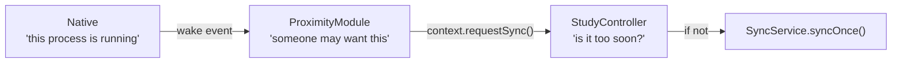

# Background sync

How observations leave a device when nobody is looking at the screen, why the two platforms differ,
and — most importantly — what this does **not** yet solve.

Start with [task 0006](../../tasks/backlog/0006-no-background-sync.md), which is the investigation
this implements. The short version: every sync was driven by a Dart `Timer` owned by a widget, so a
participant who behaved most normally — phone in pocket, app not open — was the one the study
silently dropped.

## Why a Dart timer is not enough

`SyncService.syncOnce()` was deliberately built with no timer and no schedule: *when* to call it is a
policy decision belonging to whoever manages the background service. Nothing owned that decision, so
the answer was "whenever a screen is on".

That is not a small gap for a study with a twin. A tick freezes the network at `received_before` and
is immutable, so a participant whose phone slept through the night has no coverage on record when
the tick runs. They are treated as protected, excluded from transmission, and scored `not_sensing` —
permanently, and with no error anywhere.

## The shape of the fix

Three layers, each with its own vocabulary, none knowing the next one's business:

- **Native says *when*.** It knows only that the OS has given the process execution time. It does
  not know what an upload is.
- **The module passes it on.** `ProximityWake` becomes `ModuleContext.requestSync()`. The module
  applies no rate limit of its own — a second floor nobody can see from the host is worse than one
  that is occasionally generous.
- **Core decides *whether*.** `StudyController.syncThrottled()` applies `SyncThrottle`, and it is
  the only layer that knows an outbox exists.

The trigger reaches the host through `ModuleContext`, not through a callback each app assigns. A
rate limit re-implemented per app is a rate limit that diverges, and an app that forgot to wire it
would look identical to one that had.

## The floor

Two floors apply, and the longer wins:

| Floor | Where | Why |
|---|---|---|
| `StudyController.syncFloor`, 5 minutes | the platform | How hard a phone may be worked is a property of the device and the battery, not of the research question. A study cannot shorten it. |
| `sync.min_interval_seconds` | the study bundle | A study that wants *less* frequent uploads says so. |

This is also the first thing that has ever read `sync.min_interval_seconds`. The bundle contract has
carried the field since before there was a mechanism to honour it.

A failed attempt still spends the interval. Otherwise a device with no connectivity retries as fast
as the platform offers, which is the worst case for the battery and the least likely to succeed.

## Android: the foreground service already exists

`ProximityService` is already a foreground service with `foregroundServiceType="connectedDevice"`
and `stopWithTask="false"`, because that is what it takes to keep scanning alive after the screen
locks. It now posts itself a delayed `Runnable` every five minutes and offers a wake.

This is posted to the main looper, which does **not** hold a wakelock, so under Doze it fires
whenever the device next wakes rather than on time. That is acceptable for a floor and would not be
for a schedule.

## iOS: the wake *is* the trigger

iOS has no equivalent. `BGAppRefreshTask` is opportunistic in a way Apple's documentation is unusually
frank about — the system may simply decide never — and a study whose collection depends on an event
that may not arrive is not a study.

What iOS does deliver reliably is a wake on a BLE detection, because the app declares
`bluetooth-central` and `bluetooth-peripheral` and Herald handles state restoration. So the detection
callback is also the sync opportunity.

The consequence, stated plainly: **upload frequency on iOS is a function of how many participants are
nearby, not of a schedule.** A participant who spends a day alone uploads nothing until they open the
app. That is a real limitation, not a rounding error, and it is the reason this is not a general
solution to background upload.

The wake is throttled natively to once a minute as well as in Dart, because Herald reports detections
several times a second in a crowd and every one would otherwise cross the platform channel to be
discarded.

## A wake is not an observation

Detections are buffered when Dart is not listening — `DetectionBuffer` holds 8192, and overflow is
counted and reported as lost observation, because that loss falls on exactly the long unattended
encounters a transmission study is trying to measure.

A wake carries no evidence, so it goes through `ProximityEvents.offer` instead of `emit`: delivered
if something is listening, dropped otherwise. Buffering it would cost a detection its place, and a
stream of ephemeral notices would surface in the record as missing data. This is enforced by
`ProximityEventsTest` on the Android side; the Swift path is the same three lines and has no test.

## What this does not solve

**Android, app swiped from recents.** `stopWithTask="false"` keeps the *service* alive, but
`onDetachedFromEngine` detaches the event sink and the Flutter engine is gone. Sensing continues and
the outbox fills; nothing drains it, because there is no Dart isolate to drain it. The wake is
offered to nobody and dropped. Closing this needs a Dart entrypoint hosted by the service — a
background isolate, or `WorkManager` with a callback handle — which is a larger change than this.

**iOS, force-quit.** By design: iOS does not relaunch an app the participant swiped away, and it
should not. This is why a sentence has been added to the enrolment info screen.

**Anything at all, unverified on hardware.** The plumbing is unit-tested. Whether iOS delivers enough
background wakes to matter in practice is an empirical question this code does not answer. The
acceptance criteria in [task 0006](../../tasks/backlog/0006-no-background-sync.md) are device tests,
and none of them has been run — which is why that task is still in `backlog` rather than `done`.

## Where things live

| Piece | File |
|---|---|
| The rate limiter | [`sync_throttle.dart`](../../packages/epidemica_core/lib/src/sync/sync_throttle.dart) |
| The floor and the decision to act | [`study_controller.dart`](../../packages/epidemica_core/lib/src/study_controller.dart) (`syncThrottled`, `syncFloor`) |
| What a module is handed | [`embedded_module.dart`](../../packages/epidemica_core/lib/src/modules/embedded_module.dart) (`ModuleContext.requestSync`) |
| The event type | [`proximity_event.dart`](../../packages/epidemica_proximity_platform_interface/lib/src/proximity_event.dart) (`ProximityWake`) |
| Unbuffered delivery | `ProximityEvents.offer` in the Android and iOS packages |
| Android trigger | `ProximityService.kt` |
| iOS trigger | `ProximitySensor.swift` |
