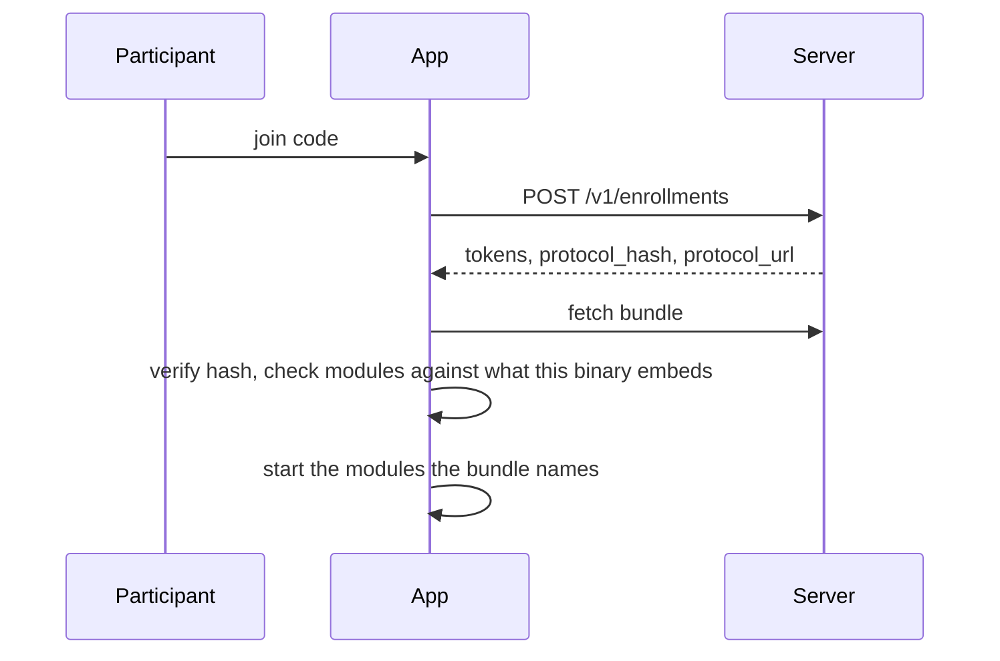

# Building a study

How the pieces fit together, from the point of view of someone who wants to run one.

## Three ways to build

Not every study needs the same amount of work, and the platform is arranged so that most need very
little. [ADR-0001](../adr/0001-monorepo-and-package-boundaries.md) calls these tiers.

| | You write | You ship | Use when |
| --- | --- | --- | --- |
| **Tier 1** | A protocol bundle | Nothing | The modules you need are already embedded in a binary someone runs |
| **Tier 2** | A custom app | Your own app | You need bespoke participant-facing screens or branding |
| **Tier 3** | A new module | A new binary | You are measuring something no module measures yet |

The important boundary is between 1 and 2. A Tier 1 study writes **no code, compiles nothing, and
signs nothing** — which means no app store review, no build infrastructure, and no mobile developer.
That is the difference between a study taking a week and taking a quarter.

The constraint is that Tier 1 only reaches as far as the module set already compiled into the binary
you are using. A study needing a module that binary lacks is refused at enrolment, deliberately and
loudly.

## Tier 1, end to end

### 1. Author the bundle

A bundle names the modules the study uses and configures each one. Declaring and configuring are the
same act, so a bundle cannot name a module it forgot to configure, or configure one it never
declared.

```json
{
  "bundle_version": "1.0",
  "study_id": "c0badf00-1111-4222-8333-444455556666",
  "title": "Contact logging pilot",
  "description": "Measures how much time you spend near other people taking part in this study.",
  "join_code": "CONTACTLOG-2026",
  "modules": {
    "proximity": {
      "on_device": { "max_episode_seconds": 900, "include_rssi": true },
      "upload": { "min_duration_seconds": 0, "min_sample_count": 1 }
    }
  },
  "sync": { "min_interval_seconds": 900 }
}
```

[`studies/contactlog/`](../../studies/contactlog) is the worked example. It is one JSON file and a
README — there is no code in it, and a test asserts there never will be.

The bundle is validated against [`contracts/bundle/1.0.0.json`](../../contracts/bundle/1.0.0.json),
which is closed at the top level: a typo'd key is a loud failure rather than a setting that silently
stays at its default. That is the specific way a misconfigured study otherwise collects the wrong
thing for a month before anyone notices.

**The settings are the study design.** `include_rssi: false` means you cannot recalibrate the
distance estimator afterwards. `min_duration_seconds: 60` means brief contacts are never recorded,
not merely filtered later. These are irreversible choices about what the dataset can answer, and
they belong in the protocol discussion, not in the deployment.

### 2. Register it

```sh
cd server
mix epidemica.seed_study --bundle ../studies/contactlog/bundle.json --code CONTACTLOG-2026
```

The bundle's bytes are stored verbatim and its hash derived from them, so the hash always describes
exactly what will be served. That hash is stamped on every observation the study produces, so a
dataset always says which configuration produced it — and changing the bundle changes the hash,
which makes a mid-study configuration change visible in the data rather than silent.

For a local run, [`deploy/local/up.sh`](../../deploy/local/up.sh) does the database, the migration,
the registration and the server in one command.

### 3. Participants join

They install a binary that embeds the modules the study needs, and type the code.



If the binary lacks a module the bundle names, enrolment is refused with *"This study needs a newer
version of the app"* — and the participant is never left enrolled in a study that collects nothing.

### 4. Collection runs

Modules record observations into a local outbox. The outbox is SQLite in WAL mode, writable from a
background isolate, and its guarantee is narrow but firm: a recorded observation is delivered exactly
once, or is visibly parked, but is never quietly lost. Twenty-four hours offline loses nothing.

The participant can see what the app is doing — recording, waiting to send, last sent — and can
leave at any time, which stops collection and destroys everything held on the device including
observations not yet uploaded.

### 5. Get the data out

```sh
cd analysis && uv run pytest -q   # validate exported observations against the contracts
cd models   && uv run pytest -q   # load the contact network into Starsim
```

The second step is the one people skip and shouldn't. If the measured network cannot drive a
simulation, something upstream is wrong in a way no unit test reveals — a systematically truncated
duration, a network with no reciprocal edges, a time base that drifted. That is why it is an
acceptance criterion rather than a nice-to-have.

## Running the same binary as two different studies

This is the claim Tier 1 rests on, and it is worth testing on your own bundles before you rely on
it. Register a second bundle naming different modules or different minimisation settings, join with
its code, and the app collects something else — no rebuild, no new signature, no store review.

Two studies with opposite privacy postures, on the same signed binary:

```json
"modules": { "proximity": { "on_device": {
  "include_rssi": false, "include_pair_key": false, "include_min_distance": false
} } }
```

## When Tier 1 is not enough

**You need a module nobody has built.** That is Tier 3: a payload contract, an on-device reduction,
and possibly native code. See [modules](modules.md). The reduction is usually the majority of the
work and needs no hardware.

**You need bespoke screens.** Tier 2: your own app, consuming the same packages through their public
APIs. Do not fork `apps/template` — depend on the packages, as it does.

**You need a module that exists but is not in the binary your institution ships.** This is a build
decision, not a study decision, and it is worth getting right once: an institution's binary should
embed the modules it expects to need across its whole portfolio, not just its first study. Adding a
module later means a new release and a new review for every participant.

## What you are signing up for

Being honest about the parts that are not software:

- **Someone must run a server.** One Phoenix app and one Postgres. Not nothing, but one thing.
- **Someone must publish a binary** if your institution does not already have one, with the app
  store review that implies.
- **Permissions are participant-facing.** The proximity module asks for Bluetooth, and on Android 11
  and older, location. Both appear in your consent materials.
- **The bundle's participant-facing text is consent text.** Titles, descriptions and the Android
  notification wording are read by participants and may need ethics approval.

## Current limitations

Worth knowing before planning around them:

- **The proximity module broadcasts a fixed pseudonym.** A passive listener could track a device for
  the duration of a study. Rotating identifiers are not built, which makes today's proximity
  collection unsuitable for a study facing a European DPIA or a cohort review.
- **There is no query API yet.** Retrieval is SQL against Postgres. Fine for one institution;
  inadequate for a multi-site study.
- **A refused enrolment leaves a server-side record.** The bundle's location is only known after
  enrolling, so the module check necessarily runs afterwards. The device activates nothing and
  stores nothing, but there is no way to withdraw the enrolment.
- **Background sync is not scheduled.** Uploads happen while the app is in use. Nothing is lost
  offline, but a phone left untouched for days will not deliver until it is opened.
