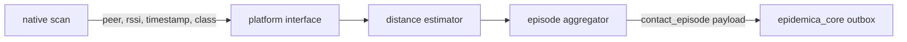

# Epidemica modules

A module is the unit of measurement in Epidemica. Proximity is one. Instruments, location and
biosensing will be others. This is what a module is, how one is put together, and how modules get
into an app.

## What counts as a module

Not everything that is a package is a module. A module is a Dart package that:

1. an app embeds **at build time** — which is why the module set is fixed per binary;
2. declares its own platform requirements: permissions, manifest entries, usage strings;
3. owns a **payload contract** in `contracts/`;
4. is **activated and configured at runtime by the protocol bundle**;
5. emits observations into `epidemica_core`'s outbox.

A module may span several packages and still be one module, because it satisfies those five
properties once. Internal layers are not modules: the proximity episode aggregator has no contract,
no platform requirements, and nothing a bundle could enable independently, so it lives inside
`epidemica_proximity` rather than beside it.

The test is useful in the other direction too. If you find yourself wanting to enable half a module
from a bundle, you have found two modules.

## The shape of one

`epidemica_proximity` is the worked example, and it is federated across four packages:

```
epidemica_proximity                      app-facing: aggregation, configuration, endorsement
epidemica_proximity_platform_interface   the Dart↔native boundary
epidemica_proximity_android              Kotlin, and the only place Herald appears on Android
epidemica_proximity_ios                  Swift, and the only place Herald appears on iOS
```

Federation is not ceremony. It buys two specific things:

**A substitutable radio.** An institution that needs different hardware — dedicated BLE badges, or a
nationally mandated stack — registers its own `ProximityPlatform` instead of forking the module,
which [ADR-0001](../adr/0001-monorepo-and-package-boundaries.md) forbids.

**Containment of a dependency we do not control.** Herald is unmaintained upstream. Confining it to
two packages means replacing it touches no contracts, no aggregation logic, and no server code.

## Where the epidemiology lives

The most consequential decision in the proximity module is that almost none of it is native.



The native layer advertises, scans, and reports sightings. Everything downstream — smoothing,
distance banding, episode assembly, minimisation — is Dart. The reference app did the opposite, and
the cost was two implementations of the same arithmetic that could only be compared on real
hardware.

Two consequences worth internalising when writing a module:

**Put the measurement where it can be tested.** The rule for how observation time is credited to
distance bands is the part that decides whether a dataset means anything, and it now runs in CI
against synthetic streams. None of the proximity module's Dart tests need a radio.

**Timestamp at the source.** Native stamps `observed_at` when the radio makes the measurement, not
when Dart receives the event. iOS batches background delivery, and an aggregator that credited time
from arrival would misattribute exactly the long background encounters that matter most.

## How a module reaches an app

One dependency line:

```yaml
dependencies:
  epidemica_proximity: ^0.1.0
```

That works because the app-facing package **endorses** the platform implementations:

```yaml
flutter:
  plugin:
    platforms:
      android: { default_package: epidemica_proximity_android }
      ios:     { default_package: epidemica_proximity_ios }
```

Herald, the Kotlin foreground service and the Swift lifecycle all arrive transitively. No native
edits, no `Podfile` or `build.gradle` changes.

### Platform requirements are not symmetric

This is the part that surprises people.

**Android is automatic.** A plugin's `AndroidManifest.xml` merges into the host app, so a module
contributes its own permissions, foreground service and features. An institution declares nothing.

**iOS is not.** `Info.plist` keys must be in the app target and no plugin can contribute them. Omit
`NSBluetoothAlwaysUsageDescription` or the `bluetooth-central` background mode and the app does not
crash — it simply stops sensing when the screen locks, and the study finds out at analysis time.

Because that failure is invisible, a module is expected to check for its own requirements at runtime
and refuse to start rather than pretend:

```dart
final missing = await ProximityPlatform.instance.missingPlatformRequirements();
if (missing.isNotEmpty) throw StateError(missing.join('; '));
```

Each module also states its requirements verbatim in its README, because that text is what an
institution copies into its build — and, later, what a manifest generator will consume.

## How a module is activated

The app embeds modules; the **bundle** decides which of them run and how.

```dart
abstract class EmbeddedModule {
  String get id;
  Future<void> start(ModuleContext context);
  Future<void> stop();
}
```

`ModuleContext` is deliberately narrow. A module receives its own configuration block, the study id,
the participant pseudonym, and one function that appends an observation. It never sees the whole
bundle, the outbox, the tokens, or another module's settings.

That narrowness is doing work. A module that can read the whole bundle grows opinions about other
modules' configuration, and the coupling stays invisible until two studies disagree.

## Two packages, not one

A module is written as a pair, and the split is where the boundary actually lives:

| | Holds | May name `epidemica_core` |
|---|---|---|
| **The capability** — `epidemica_proximity`, `epidemica_survey` | The domain logic: episode aggregation, distance banding, instrument parsing, scheduling, presentation | **No** |
| **The adapter** — `epidemica_proximity_module`, `epidemica_survey_module` | `implements EmbeddedModule`, and nothing else: start, stop, status, and the call that puts a payload in the outbox | Yes |

ADR-0001 rule 2 permits a module to depend on `epidemica_core`; this narrows *where in a module* it
may. The reason is not tidiness. The capability package is where the epidemiologically load-bearing
logic lives, and it needs to be readable, testable and adoptable with no outbox, no tokens and no
database in the picture — a sensing library that drags in a storage library cannot be any of those.
The adapter is where the subtle bugs live instead, and it stays small enough to inspect.

`analysis/tests/test_package_boundaries.py` enforces this: a package that names `epidemica_core`
without implementing `EmbeddedModule` fails the suite. It also enforces ADR-0001 rule 2 proper — two
modules may not share a package — and rule 5, that nothing reaches into another package's `src/`.

An earlier version of this document said a module must not depend on `epidemica_core` at all, and
that the adapter belonged in the app. Both were wrong: the first contradicts ADR-0001, and the
second would put the same adapter in every app that used the module.

## The registry, and the failure it prevents

An app's module registry is derived from what it actually embeds:

```dart
ModuleRegistry({for (final m in modules) m.id})
```

Never hand-maintained. A hand-written list is a second source of truth that can claim a module the
binary does not contain — which would defeat the check it exists to support.

At enrolment, `epidemica_core` compares the bundle's module set against that registry and refuses
a study this binary cannot service. The message is participant-facing: *"This study needs a newer
version of the app."*

The failure being prevented is specific and expensive. Enrolling anyway looks completely healthy:
the participant sees a normal app, the server sees a normal enrolment, and nothing reveals the
problem until analysis, by which time the collection window has closed.

There is one honest gap. The bundle's location is only known once enrolment returns it, so the check
necessarily runs *after* the server has recorded the enrolment. The client refuses to activate and
stores nothing, but the server keeps a record that will never produce data. Closing that needs a way
to withdraw, which the ingest contract does not yet have.

## What a module must not do

- **Let the capability package depend on `epidemica_core`.** The adapter may; the logic it fronts
  may not. See *Two packages, not one* above.
- **Depend on another module.** If two modules need to share something, it belongs in a package
  below both of them, or in a contract.
- **Read the whole bundle.** Take your own block.
- **Invent data.** The proximity module credits observation time only where a sighting vouches for
  it; a silence is bridged but credited to nothing. Whatever the equivalent is for your signal,
  find it before writing the aggregation.
- **Fail silently.** A module that cannot do its job should say so loudly enough to stop enrolment.

## What the server needs from a new module

A module's payload is an opaque blob to almost everything: the outbox, the sync service and the
`observations` table all carry it without interpreting it. So the honest answer to "does a new module
mean server work?" is **a little, and less than you would expect** — but it is not zero, and the part
that is not zero fails quietly if skipped.

Three separate stages, with three different answers.

### Storing it — no server change

`observations` has a `payload` column of type `jsonb`. A module the server has never heard of can
enrol, upload, and have every observation stored, indexed by `(device_id, seq)` and attributed to a
participant. Nothing needs to be added for that.

### Validating it — three lines, and skipping them is silent

The server validates payloads against compiled JSON Schemas, and the map of what it can validate is
explicit:

```elixir
@payload_validators %{
  (@base <> "proximity/contact_episode/1.0.0.json") => :validate_contact_episode,
  (@base <> "location/location_fix/1.0.0.json") => :validate_location_fix,
  ...
}
```

An unrecognised `schema_uri` is **quarantined**, not rejected: the observation is stored with
`validated: false` and `validation_reason: :unknown_payload_schema`, and the client is told it was
quarantined rather than accepted. Nothing is lost, but nothing downstream will touch it either,
because every projection reads only validated rows.

Adding a module's contract to the server is three lines in
`server/lib/epidemica_server/contracts.ex`:

```elixir
@external_resource "../contracts/observations/<module>/<name>/1.0.0.json"

Exonerate.function_from_file(:def, :validate_<name>,
  "../contracts/observations/<module>/<name>/1.0.0.json")

# ...and an entry in @payload_validators
```

The schema is compiled into the binary at build time, which is why this is a deploy rather than a
configuration change.

> **Today, adding the schema later does not rescue data already quarantined.** Nothing re-validates
> stored observations, so a study that ran before the server knew its contract keeps rows that are
> permanently `validated: false`. Add the contract *before* the study collects anything. Filed as
> [`tasks/backlog/0003`](../../tasks/backlog/0003-revalidate-quarantined-observations.md).

### Projecting it — usually not needed at all

**A projection is not part of getting a module working.** The observation store is the source of
truth; a projection is a derived read model, built only where something needs typed, indexed access
to a payload's insides.

Exactly one exists — `contacts`, from `contact_episode` — and it exists because the twin and
reconciliation query contact structure on every tick. `location_fix` and `survey_response` are fully
validated and have no projection at all, which is the normal case rather than an omission.

Before writing one, check whether you actually need it. Postgres queries `jsonb` directly:

```sql
SELECT payload->>'peer', (payload#>>'{band_seconds,immediate}')::float
FROM observations
WHERE schema_uri = 'https://schemas.epidemica.info/observations/proximity/contact_episode/1.0.0.json'
  AND validated;
```

and the analysis path in `analysis/` reads observations directly, so exports and offline work need
nothing added server-side.

Write a projection when, and only when, the **server itself** has to answer a question about the
payload repeatedly and cheaply — a simulation tick, a scoring rule, a live dashboard. If the answer
is only ever needed by a human or a notebook, the query above is the whole solution.

If you do write one, two properties are required rather than optional: it must read only
`validated: true` rows, and dropping and rebuilding it must reproduce it exactly. That second
property is what keeps `observations` the single source of truth rather than one copy among several.

## Adding a module

Roughly in order, because each step constrains the next:

1. **Write the payload contract** in `contracts/observations/<module>/<name>/1.0.0.json`, with valid
   and invalid fixtures. The invalid ones are the real contract.
2. **Decide what is reduced on-device.** Raw signal is rarely what a study needs, and is usually a
   re-identification surface. Decide what the epidemiologically meaningful quantity is, and emit
   that.
3. **Build the reduction in Dart**, testable without hardware, generating its fixtures from real
   runs so they cannot describe payloads the module never emits.
4. **Add the platform interface and implementations** if native access is needed. Keep the native
   surface as small as the radio requires.
5. **Document platform requirements verbatim** and implement `missingPlatformRequirements()`.
6. **Register the contract with the server** — three lines in `contracts.ex`. Do this before any
   study collects, or that study's observations stay quarantined for ever.
7. **Wire an adapter** in `apps/template` and add the module to the app's module list.
8. **Write a projection only if the server needs one.** Most modules do not.

Steps 1–3 need no device, and in the proximity module they were the majority of the work.

