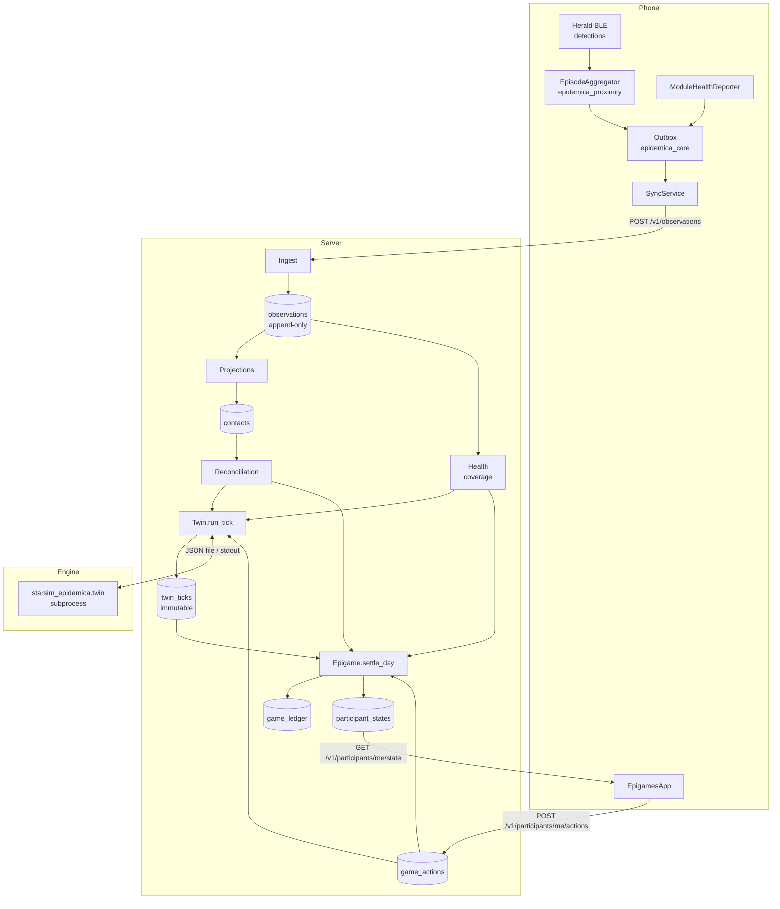
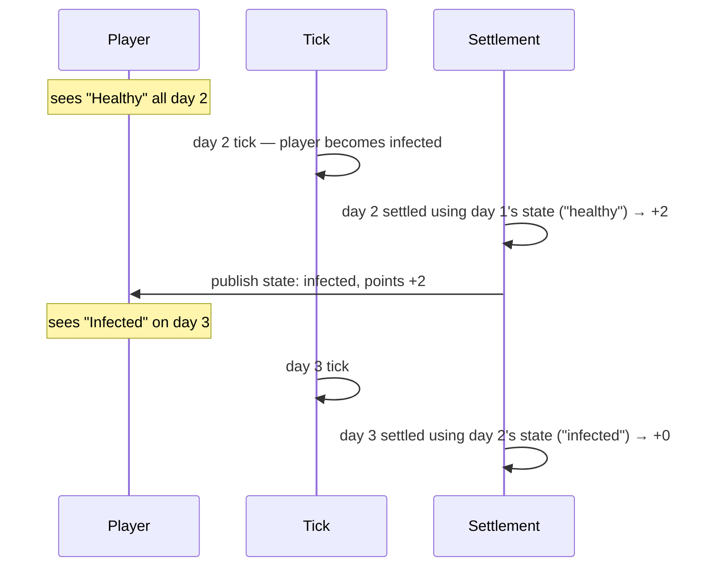
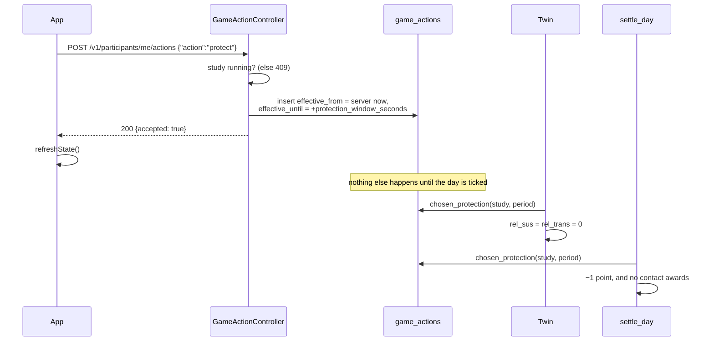

# Epigames end to end

How a phone seeing another phone becomes a number on a screen, and every clock that governs the
journey.

This is the Tier 2 reference: one study app, one server-side twin, one scoring engine. It assumes
[modules](modules.md), [the observation envelope](observation-envelope.md),
[proximity](proximity.md) and [the state channel](state-channel.md), and joins them up.

## The pieces



Four boundaries carry the whole design:

| Boundary | Rule |
|---|---|
| Phone → server | Observations only. The phone never computes anything the study is scored on. |
| Observations → projections | Derived and rebuildable. Dropping `contacts` and rebuilding must reproduce it exactly. |
| Elixir → Python | A tick is a pure function of a JSON document. The engine knows nothing about studies, participants or points. |
| Twin → scoring | The twin decides what *happened*; scoring decides what it was *worth*. Either can run without the other. |

---

## Part 1 — From a radio detection to an edge in the model

### 1.1 On the phone: detections become episodes

Herald emits a detection whenever it hears a nearby device advertising the study's service UUID.
The UUID is derived from the study id, so two studies never discover one another
([`service_uuid.dart`](../../packages/epidemica_proximity/lib/src/service_uuid.dart)).

`EpisodeAggregator` turns a stream of instants into intervals. Its behaviour is entirely bundle-
driven — [`aggregator_config.dart`](../../packages/epidemica_proximity/lib/src/aggregator_config.dart)
reads the `proximity.on_device` block:

| Bundle key | epigame7 | What it does |
|---|---|---|
| `max_episode_seconds` | 900 | Longest episode emitted; longer encounters are cut and marked `truncated`. |
| `max_gap_seconds` | 600 | A silence longer than this ends the encounter. Shorter silences are bridged. |
| `sample_credit_seconds` | 90 | **The guard against inventing data.** One sighting vouches for at most 90 s of observation. |
| `dropout_threshold_seconds` | 75 | A silence longer than this increments `gap_count`, so a stitched-together episode is visibly weaker evidence. |

`sample_credit_seconds` is the one to understand. A detection says where the peer was at an
instant. Crediting a ten-minute silence as ten minutes at that distance would manufacture exactly
the sustained-contact signal a transmission study exists to find. Time beyond the cap is bridged —
the episode continues — but credited to no distance band. This is why **`band_seconds` can sum to
less than the episode's wall-clock duration, and that is correct**.

Each credited second is filed into a band by estimated distance
([`distance_bands.dart`](../../packages/epidemica_proximity/lib/src/distance_bands.dart)):

| Band | Upper edge |
|---|---|
| `immediate` | 0.5 m |
| `close` | 1.5 m |
| `medium` | 3.5 m |
| `far` | 8.0 m |

An episode is emitted when the encounter ends, when it hits `max_episode_seconds`, when a
once-a-minute timer finds it idle, or when the module stops. It is then filtered against the
`upload` block — epigame7 requires ≥ 60 s and ≥ 3 samples — and anything shorter is discarded on the
phone and never exists ([`episode_aggregator.dart:173`](../../packages/epidemica_proximity/lib/src/episode_aggregator.dart#L173)).

### 1.2 Coverage, reported separately

A second, entirely independent stream matters as much as the contacts.

`ModuleHealthReporter` emits a `module_status` observation per module per interval, each asserting
`{state, window_start, window_end}`. Consecutive windows abut, so **any gap between them is a real
gap**, and a period with no report is *uncovered* rather than *quiet*.

This exists because of one question the data must be able to answer: did this participant meet
nobody, or was their phone not listening? Those are the same empty set of contacts and opposite
epidemiological facts. Coverage is asserted positively so the difference survives.

`ProximityModule.status()` checks the cases separately and in order — missing permissions, radio
off, sensor not running — because a running sensor with Bluetooth off produces no detections and is
indistinguishable from a quiet day.

### 1.3 Upload

Both streams go into the same SQLite outbox and leave through the same door. `SyncService.syncOnce`
claims a batch, uploads it, and applies per-observation outcomes: `rejected` → dead-letter,
`duplicate` and `quarantined` → delivered anyway. Everything the server did not explicitly reject is
now the server's, which is why the client removes on absence rather than on acknowledgement.

### 1.4 On the server: three hops to a network

**Hop 1 — stored.** `Ingest.submit/2` checks the token binds to the batch's device, study *and*
subject before schema validation, then appends to `observations`. Unvalidated observations are
quarantined with `validated: false` rather than dropped.

**Hop 2 — projected.** `Projections.project_contacts/2` flattens validated `contact_episode`
payloads into the `contacts` table. Ingest calls it inline with `only: ids`, because an empty
`contacts` table is indistinguishable from a study where nobody met anyone — a projection that only
runs when someone thinks to ask is a silent wrong answer. An anti-join keeps repeat calls cheap.

**Hop 3 — reconciled.** [`Reconciliation.network/4`](../../server/lib/epidemica_server/reconciliation.ex)
turns two one-sided recordings into one edge. This is the most consequential decision in the
pipeline, because A sees B for twelve minutes while B sees A for seven.

| Output field | How it is derived | Why |
|---|---|---|
| `seconds` | **Union** of both sides' intervals | Contact happened when *either* side saw it. Summing double-counts; intersecting discards contact every time one phone slept. |
| `band_seconds` | From the **better-observed side only**, unmodified | The union says how long; the side that watched more says how close. Scaling one side up to the unioned duration would assert distance for a period no device measured. |
| `both_reported` | Whether two subjects reported | A study that wants to be strict can filter later; one that discarded one-sided reports cannot get them back. |

So `band_seconds` may sum to less than `seconds` for a second reason, on top of `sample_credit`.
Both are the same honesty: we know contact lasted longer than we know how close it was.

### 1.5 Into the engine

`Twin.contacts/5` maps subjects to agent indices and hands the engine one record per pair:

```json
{"a": 3, "b": 11, "seconds": 842.0, "band_seconds": {"immediate": 120, "close": 300, "medium": 90, "far": 0}}
```

Python converts `band_seconds` to a single transmission weight
([`twin.py`](../../models/src/starsim_epidemica/twin.py), `edge_weight`):

$$w = \frac{\sum_b s_b \cdot \omega_b}{R}, \qquad
\omega = \{1.00,\ 0.50,\ 0.15,\ 0.02\},\quad R = 900$$

$R$ is 15 minutes of immediate contact — the familiar "15 minutes within 2 m" exposure definition —
chosen so a weight of 1.0 means something rather than nothing. The example above gives
$(120 + 150 + 13.5 + 0)/900 = 0.315$.

The weight becomes the edge's `beta` multiplier in Starsim. **Note that `seconds` is not used by the
engine at all** — transmission is driven entirely by dose-weighted band time. `seconds` is used by
*scoring*, for the `contact_min_seconds` threshold. The two subsystems deliberately read different
columns of the same edge.

---

## Part 2 — The tick

### 2.1 What a day is

A day is a half-open interval anchored on the bundle's declared start:

$$[\,\text{starts\_at} + (d-1)\cdot I,\ \ \text{starts\_at} + d\cdot I\,)$$

with $I$ = `twin.tick_interval_seconds` (86 400). Anchoring on the *declared* start rather than on
registration means re-seeding a bundle cannot move a boundary that participants' days are numbered
from.

Day 1 of epigame7 is `2026-09-03T06:00Z → 2026-09-04T06:00Z`.

### 2.2 What the engine is given

`Twin.build_inputs/7` assembles a complete, self-contained document. Nothing is read from the
environment, which is what makes a stored tick re-runnable:

```jsonc
{
  "study_id": "…", "day": 1,
  "seed": 1734829911,          // phash2({study_id, day}) — derived, not drawn
  "population": 60,
  "pars":       { /* the bundle's twin.pars, verbatim */ },
  "protection": { "efficacy": 1.0, "blocks_transmission": true },
  "agents": [
    { "index": 0, "subject": "ada53349…", "virtual": false,
      "state": "susceptible", "protected": false,
      "infected_on_day": null, "recovers_on_day": null, "dies_on_day": null }
    // …one per active agent, index order fixed for this tick
  ],
  "contacts": [ /* §1.5 */ ],
  "total_cases_before": 0
}
```

Everything is string-keyed, because this map is written to Postgres and read back for verification.
Atom keys in memory and string keys after a reload would make a replayed tick subtly different from
the one that ran.

The seed is *derived* from `{study_id, day}` rather than drawn, so a tick is reproducible from the
record alone.

### 2.3 The roster

`reconcile_roster/3` runs before every tick and keeps the population at the declared size:

- **Newcomers are enrolled** into fresh slots. Slots are permanent, so a participant joining on day
  four takes a slot no one has ever held — they never inherit a simulated person's infection
  history.
- **Virtual agents fill the remainder** up to `twin.population`. With two real players and a
  declared population of 60, 58 agents are simulated.
- **Retiring is highest-slot-first** — arbitrary, but fixed, so the same enrolment always produces
  the same population.

`seed_outbreak/4` runs exactly once, before the study's first tick, and only if no agent is already
infected. It infects `twin.seed.infections` agents chosen by `phash2({study_id, slot})` — derived,
not drawn — with `infected_on_day = 0`, so they are already infectious when day 1 runs.

`among: "virtual"` is the default for a reason: a real participant infected on day one loses most of
the game to a lottery they can neither see nor influence, and every real infection then has a
contact behind it rather than an unexplainable beginning.

### 2.4 Inside Starsim

The engine holds no state between days. Each tick builds a fresh two-day sim, writes the stored
states onto the agents, takes exactly one step, and reads them back.

**Every time-valued parameter is stated in days, explicitly.** Starsim's defaults are year-scaled,
and an inherited default and an explicit day-scaled value *print the same repr* while behaving 365×
apart. `beta` becomes `ss.perday(0.35)`; `dur_inf_days: 5` becomes
`ss.lognorm_ex(mean=ss.days(5), std=ss.days(1.5))`.

**Clocks are carried as absolute study days.** Starsim stores `ti_infected` / `ti_recovered` /
`ti_dead` as offsets into whichever timeline the sim was built with, and each tick builds a new one.
Storing raw offsets would silently reinterpret them daily, so `CLOCKS` converts on the way out and
back on the way in. An agent restored as infected with no recovery deadline never recovers and the
epidemic quietly becomes permanent — which is why `_seed_missing_prognoses` draws one for any
index case the study injected.

**Virtual agents get their own mixing.** They have no measured contacts, so without
`_virtual_edges` they would be epidemiologically inert and completing the population would achieve
nothing. Each draws `pars.virtual.contacts_per_day` partners from the *whole* population, which is
also the only route by which the wider epidemic reaches a participant. The draw uses a separate RNG
stream seeded from the tick, so it is reproducible without perturbing Starsim's transmission draws.

**Protection is applied as susceptibility and transmissibility.** `rel_sus = 1 - efficacy`, and if
`blocks_transmission` then `rel_trans` too — protection is partly altruistic.

### 2.5 What comes back

Per agent: the new `state`, `newly_infected`, the three clocks as absolute days, and for anyone
newly infected, an `infection` record:

```json
{"cause": "virtual_population", "sources": [{"index": 41, "subject": null, "virtual": true}]}
```

Starsim exposes no transmission tree, so the specific transmitting edge is **not recoverable**. What
is recoverable is the exposure *set* — the infectious neighbours the agent actually had — and
reporting that rather than picking one keeps the record honest. `cause` is `measured_contact`,
`virtual_population`, or `ambiguous` when both kinds of neighbour were infectious. A single source
is an attribution; several is an ambiguity, and saying so beats inventing certainty.

### 2.6 Immutability, and the two guards

A tick is written once. `twin_ticks` has a unique index on `(study_id, day)`, and a losing writer is
reported as `:already_run` rather than as a database error. Re-running a day is *verification*
against the stored inputs and seed (`verify_tick/3`), never replacement.

Because it is permanent, two things are refused:

| Guard | Returns | Why |
|---|---|---|
| `ensure_in_schedule` | `:before_study_start` / `:after_study_end` | Running past the last day would continue an epidemic after a final score was shown. |
| `ensure_elapsed` | `:day_not_finished` | A day still in progress — or in the future — would be settled on a network that has not happened. |

`ensure_elapsed` exists because of an actual field-test failure: day 2 was ticked while day 1 was
still running, found zero contacts and zero coverage, and permanently scored both players
`not_sensing`. `allow_incomplete: true` (or `mix epidemica.tick --force`) overrides it for tests and
demonstrations, where nobody is waiting a real day.

### 2.7 What epigame7's numbers actually do

Worth working through, because the bundle's parameters interact in a way that is not obvious from
reading them.

The virtual mixing block declares `band_seconds` of `{immediate: 300, close: 900, medium: 600}`, so
every virtual edge carries

$$w_v = \frac{300(1.0) + 900(0.5) + 600(0.15)}{900} = \frac{840}{900} = 0.93$$

— near the reference exposure of a full 15 minutes at conversational distance. With
`contacts_per_day: 6` and 58 virtual agents, the tick adds $58 \times 6 = 348$ virtual edges drawn
across the whole population, so each *real* player picks up $348/59 \approx 6$ of them per day.

Compare that to a measured contact. A ten-minute episode spent entirely in the `close` band is
$600(0.5)/900 = 0.33$, and `sample_credit_seconds` means much of a real encounter's wall-clock time
is credited to no band at all.

**So with two players in a population of 60, exposure is dominated by the virtual population** —
roughly six strong edges a day against a handful of weaker measured ones. Infections will mostly
report `cause: "virtual_population"`, and the outbreak will burn through the simulated remainder
quickly at `beta: 0.35`.

That is the intended shape — a small group still has to produce an outbreak worth playing — but it
does mean the measured network is a *minority* contributor to any individual's risk at this
population size. Lowering `contacts_per_day`, weakening the virtual `band_seconds`, or shrinking
`population` all shift the balance back towards real contacts. This is the main dial to turn when
moving from a two-phone test to a real cohort.

### 2.8 Running one

```sh
mix epidemica.tick --study <uuid> --day 3
mix epidemica.tick --study <uuid> --catch-up
```

Or through Oban: `Twin.Worker` runs a day and then enqueues `Epigame.Worker` to settle it. Scoring
is queued separately so a failure to settle never looks like a failure to simulate. Days run one at
a time and in order, because each tick starts from the state its predecessor wrote.

**Nothing schedules ticks automatically yet** — see [`tasks/backlog/0002`](../../tasks/backlog/0002-scheduled-ticks.md).

The engine runs as a subprocess (`uv run python -m starsim_epidemica.twin <file>`) outside any
transaction: a job taking seconds should not hold a database connection, and if it fails there is
nothing to roll back because nothing was written.

---

## Part 3 — Scoring, and the one-day lag

`Epigame.settle_day/3` requires the day's tick, because points are a function of *published* state.

### 3.1 The rule that shapes everything

> Points depend only on what the participant was already shown.

`states_shown_during/3` reads the **previous** day's tick outputs. A player told they were healthy
earns that day's points even if today's tick then infects them; the infection announces itself
tomorrow. Nobody is ever retroactively docked.



### 3.2 The lines

[`Epigame.Rules`](../../server/lib/epidemica_server/epigame/rules.ex) is pure — no database, no
clock — because the app computes the same function for immediate feedback and the two must agree.
`contracts/game/epigame_rules/1.0.0.vectors.json` is the shared evidence that they do.

| Line | epigame7 | Condition |
|---|---|---|
| `not_sensing` | 0, **and nothing else** | Coverage below threshold. The day is not scored and not penalised. |
| `healthy` | +2 | Shown state was not `infected`. |
| `infected` | 0 | Shown state was `infected`. |
| `protection` | −1 | Protection was chosen. |
| `contacts` | +5 × count | Qualifying contacts on this day. |
| `carried_over` | +5 × count | Qualifying contacts from earlier days, confirmed late. |

An unobserved day is neither charged nor free by accident: charging would correlate the score with
the participant's phone, and making it free would make going dark the dominant strategy and the
study would collect nothing.

A contact qualifies when `edge.seconds ≥ contact_min_seconds` (600), **both** participants were
observed and unprotected, and the pair is not inside `contact_cooldown_days` of a previous award.
Protection removes the reward as well as the risk — that trade-off is what the study is there to
measure.

### 3.3 Carry-over: where the twin and the ledger diverge

This is the most important asymmetry in the system.

A contact needs both sides to be reconciled. If B's phone uploads a day late, the pair looked
one-sided when day 2 was decided.

- **Scoring can repair this.** `award_carry_over/5` revisits the last `carry_over_days` (3) looking
  for contacts whose other side has since arrived. The earlier day's settlement is *untouched* — the
  credit lands on today's ledger line as `carried_over`.
- **The twin cannot.** Day 2's tick is immutable. A contact that arrives afterwards enters the
  observation record and every subsequent analysis, but it **never affects transmission**.

So a late upload can still earn you points and can never retroactively infect you. That is a
deliberate choice — the alternative is rewriting a day whose consequences participants have already
been told about — but it means **the tick's `received_before` cutoff is epidemiologically
load-bearing.** Ticking a day the instant it closes will miss whatever is still in transit.

### 3.4 Publishing

Each settled participant gets a state document written through `ParticipantState.put/5`, which
validates against `state/epigame/1.0.0.json` before writing. If validation fails the whole
settlement rolls back: settling a day and failing to tell the participant is worse than not settling
it, and the next run failing identically is the right noise for a bug in what a study publishes.

Note `current_state/3`: the *screen* shows this tick's outcome, even though it was *yesterday's*
state that earned today's points.

---

## Part 4 — Player decisions



**The time is the server's, never the client's.** Protection costs points and changes transmission,
so a participant who could name their own effective time could protect themselves retrospectively.

**It is an interval, not a flag.** `[effective_from, effective_until)` with a 24 h window, so "was I
protected all along?" is answerable from the record. `release` truncates `effective_until` to now
and does not refund the day already charged for.

**Any overlap with the tick period counts.** `chosen_protection/3` matches
`effective_from < period_end AND effective_until > period_start` — protecting for five minutes at
23:55 protects you for that whole day, in both the model and the ledger. Whether that is right is a
game-design question the current rules answer generously.

**A decision outside the study's run is refused, not recorded.** It would otherwise be charged for
on a day that will never be settled.

### The two sources of protection

They are computed independently and unioned, and neither can see the other's case:

| Source | Set by | Player sees | Releasable |
|---|---|---|---|
| `chosen` | The player, via an action | Shield icon, −1 point | Yes |
| `not_sensing` | The platform, from coverage | "Protected because your phone is not sensing", button disabled | No |

The platform's inference is not a courtesy. A phone in a drawer must not be read as a participant
who met nobody, so it is treated as protected in the model — and its day goes unscored.

---

## Part 5 — Every clock in one place

| Interval | Where declared | epigame7 | Governs |
|---|---|---|---|
| Detection → episode close | `max_gap_seconds` | 600 s | When an encounter is considered over |
| Episode cap | `max_episode_seconds` | 900 s | Longest single episode |
| Sample credit | `sample_credit_seconds` | 90 s | Maximum observation time one sighting vouches for |
| Idle sweep | hardcoded, `ProximityModule` | 60 s | Closes episodes nothing announces the end of |
| Health report | `health.interval_seconds` | 3600 s | One coverage assertion per module per interval |
| Sync | **hardcoded in the app** | 60 s | Outbox drain + state refresh (see below) |
| Tick | `twin.tick_interval_seconds` | 86 400 s | One immutable simulated day |
| Protection window | `rules.pars.protection_window_seconds` | 86 400 s | How long one `protect` lasts |
| Contact cooldown | `rules.pars.contact_cooldown_days` | 1 day | How often a pair can earn again |
| Carry-over lookback | `rules.pars.carry_over_days` | 3 days | How far back late contacts are credited |

### How they interact

**Sync must outrun the tick.** Anything not uploaded before a tick's `received_before` cutoff is
invisible to that day's transmission, permanently. With a 60 s poll and a 24 h tick there is
enormous slack — but only while the app is alive to run the timer.

**Health interval sets the resolution of "observed".** A `module_status` covering
`[t, t+3600)` is only *emitted* at $t+3600$, then still has to sync. Coverage is retroactive, so it
does eventually cover the hour — but for the first hour after joining, a participant has asserted no
coverage at all.

> This is what made the first field test look broken. Two phones joined at 15:15 and the day was
> ticked at 15:38. Contact episodes had uploaded; not one health report had been emitted yet. With
> zero coverage, both players fell below the 0.5 threshold and were marked `not_sensing`. **The
> proximity module was working perfectly.** For a short demonstration, set
> `health.interval_seconds` to 300 or less.

**The coverage threshold is a fraction of the tick period.** 0.5 over 86 400 s means a phone must
assert 12 hours of sensing to be scored at all. Over a real day with hourly reports that is easy;
over any shortened window it is nearly impossible, because the arithmetic still divides by a full
day.

**Cooldown and carry-over overlap deliberately.** `awarded_pairs/4` blocks re-payment within
`contact_cooldown_days` of the *contact* day, so a contact carried over from day 1 to day 3 cannot
also be paid as a fresh day-3 contact.

**Episodes straddling midnight are counted in both days.** `Reconciliation.network/4` selects on
`started_at < to AND ended_at >= from` and does not apportion. An episode is capped at 15 minutes,
so the overlap is bounded and small — but it is not zero.

---

## Part 6 — Known gaps

These are real, verified, and worth knowing before building on this.

**`sync.min_interval_seconds` is dead configuration.** `ProtocolBundle.minSyncInterval` parses it
and **nothing reads it**. The epigames app polls every 60 s regardless. A study author setting 900
gets no such floor.

**There is no background sync.** The only caller of `sync()` is the poll timer in
[`app.dart:51`](../../apps/epigames/lib/src/app.dart#L51) plus pull-to-refresh. Both stop when the
app is not foregrounded. Sensing continues — Android runs a foreground service, iOS has BLE
background modes, and both buffer detections natively — but nothing leaves the device.

For a collection-only study that is merely a delay, because the outbox is durable. **For a study
with a twin it is a correctness bug**, because a tick freezes the record at `received_before` and is
immutable: a participant whose phone slept through the night has no coverage on record when the
tick runs, so they are treated as protected, excluded from transmission, and scored `not_sensing` —
permanently. See [`tasks/backlog/0006`](../../tasks/backlog/0006-no-background-sync.md).

**Coverage can be over-claimed across a suspension.** `ModuleHealthReporter`'s windows abut by
construction, so if the isolate is suspended and later resumed *in the same process*, the next
report emits a single window covering the whole gap with the status observed at that moment. The
module's guarantee — "a period with no report is uncovered" — holds when the app is killed and
fails when it is merely suspended. See
[`tasks/backlog/0007`](../../tasks/backlog/0007-coverage-over-claims-after-a-suspension.md).

**In-progress episodes do not survive termination.** `OpenEpisodeStore` exists and documents the
problem — *"that loss would not be random: it falls preferentially on the longest encounters"* — but
`ProximityModule` constructs its `EpisodeAggregator` without one, so the interface is unused.

**The bundle's `study_id` is not the study id.** The server generates its own and never reads the
bundle's — see [`tasks/backlog/0005`](../../tasks/backlog/0005-bundle-study-id-is-not-the-study-id.md).

**`Twin.Worker` retries a premature day.** It calls `run_tick/2` without options, so a job enqueued
for a day that has not finished returns `:day_not_finished` and burns all five Oban attempts. A
snooze until `period_end` would be the right behaviour.

**A tick cannot be undone through any supported path.** Recovering from a wrongly-ticked day means
deleting rows from `twin_ticks`, `game_ledger`, `game_contact_awards`, `participant_states` and
`twin_agents` by hand. That immutability is deliberate, but there is no `--undo` and no operator
story for "we ticked the wrong thing".

---

## Reading order for the code

1. [`packages/epidemica_proximity/lib/src/episode_aggregator.dart`](../../packages/epidemica_proximity/lib/src/episode_aggregator.dart) — detections to episodes2. [`server/lib/epidemica_server/reconciliation.ex`](../../server/lib/epidemica_server/reconciliation.ex) — two sides to one edge
3. [`server/lib/epidemica_server/twin.ex`](../../server/lib/epidemica_server/twin.ex) — orchestration and immutability
4. [`models/src/starsim_epidemica/twin.py`](../../models/src/starsim_epidemica/twin.py) — one simulated day
5. [`server/lib/epidemica_server/epigame/rules.ex`](../../server/lib/epidemica_server/epigame/rules.ex) — the whole scoring function, pure
6. [`server/lib/epidemica_server/epigame.ex`](../../server/lib/epidemica_server/epigame.ex) — settlement, carry-over, publishing
7. [`apps/epigames/lib/src/game_state.dart`](../../apps/epigames/lib/src/game_state.dart) — the state document as a screen

To watch all of it happen in half an hour rather than a week, see
[`studies/epigame-debug`](../../studies/epigame-debug), which compresses the seven days into
five-minute rounds and comes with a step-by-step debugging guide.
