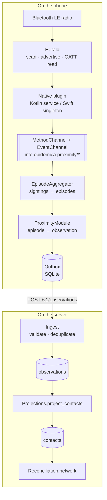

# How proximity sensing works

What happens between two phones being in the same room and a row appearing in `contacts`. Written
to be read while debugging: each stage says what it does, what it looks like when it is working, and
how it fails.

The short version: **radios produce sightings, the device reduces sightings to episodes, episodes
become observations, observations become a network.** Each step throws information away on purpose,
and knowing which step discarded what is most of what debugging consists of.

## The stack



Five packages, split so that the parts which can be tested without hardware are separated from the
parts which cannot:

| package | what it holds |
|---|---|
| `epidemica_proximity_platform_interface` | The contract: `ProximityPlatform`, `ProximityConfig`, the `ProximityEvent` union, channel names |
| `epidemica_proximity` | The reduction: `EpisodeAggregator`, `CoarseDistanceEstimator`, `ContactEpisode`, `studyServiceUuid` |
| `epidemica_proximity_android` | Kotlin: foreground service wrapping Herald |
| `epidemica_proximity_ios` | Swift: singleton sensor wrapping Herald, plus the standalone `wire` package |
| `epidemica_proximity_module` | The glue: `ProximityModule` implements `EmbeddedModule` and writes to the outbox |

## Stage 1 — Discovery is scoped to the study

Two devices find each other only if they advertise the same BLE service UUID, and that UUID is
**derived from the study**, not fixed:

```dart
String studyServiceUuid(String studyId)  // UUID v5, namespace 6f6d1c0e-3a2b-4d5e-8f70-1a2b3c4d5e6f
```

Both platforms then switch Herald's own service off entirely:

```
BLESensorConfiguration.customServiceUUID = <derived>
BLESensorConfiguration.customServiceDetectionEnabled = true
BLESensorConfiguration.customServiceAdvertisingEnabled = true
BLESensorConfiguration.standardHeraldServiceDetectionEnabled = false
BLESensorConfiguration.standardHeraldServiceAdvertisingEnabled = false
```

So devices in different studies are not filtered after the fact — they never see each other at the
protocol level. This is also why two studies can run in the same room without contaminating each
other's data, and why a phone enrolled in the wrong study looks *exactly* like a phone that is
switched off.

> **Debugging:** if one phone sees nobody, the first thing to check is that every phone joined the
> *same* study. A different join code produces a different service UUID and total, silent invisibility.

## Stage 2 — What crosses the air

18 bytes, specified in [`contracts/wire/proximity_payload/1.0.0.md`](../../contracts/wire/proximity_payload/1.0.0.md)
and checked on both platforms against shared vectors:

| offset | size | field |
|---|---|---|
| 0 | 1 | `format_version`, currently `1` |
| 1 | 16 | `pseudonym`, raw UUID bytes |
| 17 | 1 | `device_class` — `0` iOS, `1` Android, `255` unknown |

No study identifier, no timestamp, no epidemiological state. The study is not named because it does
not need to be — the service UUID already scopes discovery — and naming it would make study
membership observable to any passive listener.

Herald carries this as `PayloadData` over a **GATT characteristic read**, not in the advertisement,
so advertising length limits do not apply.

`device_class` travels because the RSSI-to-distance relationship is hardware-dependent and a
receiver cannot infer the sender's platform.

## Stage 3 — Native detection

Both platforms use exactly one Herald callback:

```
sensor(_ sensor, didMeasure: Proximity, fromTarget:, withPayload:)
```

The payload-only and proximity-only callbacks are ignored, because neither can produce a detection
without guessing the other half. RSSI without a pseudonym is an anonymous radio; a pseudonym without
RSSI has no distance.

Each detection is stamped **natively, at measurement time** — not when Dart receives it. iOS batches
background delivery, and crediting time from arrival timestamps would misattribute precisely the long
unattended encounters the study cares most about.

### Android

A **foreground service** (`ProximityService`), type `FOREGROUND_SERVICE_TYPE_CONNECTED_DEVICE`, with
a persistent notification. This is what keeps sensing alive when the screen locks; without it Android
suspends the process and the encounter silently stops being recorded.

Detections go into a `DetectionBuffer` — a ring of **8192** entries. When it overflows the oldest are
dropped and counted, and the count is reported to Dart as a `ProximityDetectionsDropped` event rather
than being swallowed. That loss is not random: it happens when the app has been killed and relaunched,
which correlates with long unattended encounters.

### iOS

No foreground service exists on iOS. Instead `ProximitySensor.shared` is a process-lifetime singleton,
and the app declares:

```xml
<key>UIBackgroundModes</key>
<array><string>bluetooth-central</string><string>bluetooth-peripheral</string></array>
```

Both are required. Declaring only `bluetooth-central` yields an app that discovers others but is
invisible to them — which produces a contact network that reconciles to half the truth.

iOS relaunches the app for Bluetooth state restoration, so the sensor distinguishes a genuine cold
start from a restoration: a `sensorArray` inherited from a previous process points at a dead BLE
stack, looks alive, and reports nothing.

**Herald's CoreLocation mobility sensor is explicitly disabled:**

```swift
BLESensorConfiguration.mobilitySensorEnabled = nil
```

It is on by default and turns on background location updates, which crashes any app that has not
declared the `location` background mode — and quietly collects location on one that has. Herald for
Android has no equivalent, so this is an iOS-only hazard. Never add `location` to `UIBackgroundModes`
to make the crash go away.

## Stage 4 — Crossing into Dart

Two channels, both named `info.epidemica.proximity/…`:

| channel | direction | members |
|---|---|---|
| `…/methods` | Dart → native | `start`, `stop`, `isRunning`, `isRadioEnabled`, `observerDeviceClass`, `missingPlatformRequirements` |
| `…/events` | native → Dart | `detection`, `started`, `dropped` |

Events arrive as a sealed union so that "we lost some detections" cannot be quietly ignored:

```dart
sealed class ProximityEvent
  ProximityDetection            // peer, rssi, observedAt, peerDeviceClass
  ProximitySensingStarted       // running, native buffer drained
  ProximityDetectionsDropped    // count, oldestRetained
```

`missingPlatformRequirements` is the diagnostic worth knowing: it returns a list of strings naming
exactly which Info.plist keys are absent. The module refuses to start when it is non-empty, and
`status()` reports `permissionDenied` with the first entry as the detail.

## Stage 5 — Sightings become episodes

This is where the interesting reduction happens, in `EpisodeAggregator`. Raw detections are never
uploaded: they are high-volume, and a stream of timestamped sightings is far more re-identifying than
a summary.

**RSSI becomes a band, not a distance.** `CoarseDistanceEstimator` (version `2.0.0`) runs a per-peer
Kalman filter over a window of 5 samples and maps the result into four bands with edges
`[1.0, 2.0, 5.0]` metres:

| band | representative distance |
|---|---|
| `immediate` | 0.5 m |
| `close` | 1.5 m |
| `medium` | 3.5 m |
| `far` | 8.0 m |

Time-in-band is the measurement, not mean distance: infectious dose accumulates as
duration × f(distance), so two minutes at arm's length plus eight across the room is
epidemiologically unlike ten minutes at mid-range — yet both average the same.

**Time is credited between sightings, with a cap.** When a detection arrives, the elapsed time since
the previous sighting is credited to the band the peer was *last* seen in, limited to
`sample_credit_seconds` (default **90 s**). One sighting cannot vouch for an unlimited stretch of
presence, so a peer seen at T and again at T+300 s credits only 90 s, not 300.

This is why **`observed_seconds` is normally less than wall-clock duration**, and why the server later
takes the *union* of two devices' views rather than the sum.

Four thresholds govern the shape, all bundle-configurable under `modules.proximity.on_device`:

| setting | default | meaning |
|---|---|---|
| `sample_credit_seconds` | 90 | most time a single sighting may credit |
| `dropout_threshold_seconds` | 75 | a longer silence increments `gap_count` — a quality signal, not a split |
| `max_gap_seconds` | 600 | a longer silence **ends** the episode |
| `max_episode_seconds` | 900 | episode splits here, emitting `truncated: true` and opening a continuation |

An encounter ends by *absence*, which no detection can announce, so the module runs a timer every
minute calling `tick()` to close anything silent beyond `max_gap`.

The resulting `ContactEpisode` carries `band_edges_m` and `estimator_version` inline, so an
observation stays self-describing if the banding later changes — which is what keeps datasets poolable
across app versions.

## Stage 6 — Episode becomes observation

`ProximityModule` wraps each episode in an envelope and hands it to the outbox:

```dart
schemaUri = 'https://schemas.epidemica.info/observations/proximity/contact_episode/1.0.0.json'
```

What is included is bundle-controlled (`include_rssi`, `include_min_distance`, `include_pair_key`,
`include_device_class`), and what is *uploaded at all* is filtered by `modules.proximity.upload`:
`min_duration_seconds` and `min_sample_count`. `contactlog` sets both to keep everything, because its
purpose is to exercise the pipeline; a transmission study would raise them.

From here the module is done. `epidemica_core` owns delivery: batching, retry, dead-lettering, and the
guarantee that a recorded observation is delivered exactly once or visibly parked.

## Stage 7 — How the server stores it

**`observations`** — the raw record, one row per episode, never modified:

| column | note |
|---|---|
| `study_id`, `subject`, `device_id`, `seq` | `(device_id, seq)` is unique — retries are idempotent |
| `module`, `schema_uri`, `envelope_version` | what it is |
| `observed_at`, `received_at`, `clock_offset_ms` | when the device says, when we got it, and the skew |
| `envelope`, `payload` | jsonb, stored verbatim |
| `validated`, `validation_reason`, `validation_detail` | see below |

**An observation this build cannot validate is still stored**, with `validated: false`. A newer client
can outrun a server upgrade, and discarding data because the server is behind would be an unrecoverable
loss. Quarantined rows are reported back in the ingest response.

**`contacts`** — a *projection*, derived from `observations` by `Projections.project_contacts/1`:

| column | derivation |
|---|---|
| `observation_id` | unique — the projection is idempotent and re-runnable |
| `subject`, `peer`, `pair_key` | straight from the payload |
| `started_at`, `ended_at`, `duration_s` | wall-clock span |
| `band_seconds` | jsonb, per band |
| `observed_seconds` | **sum of `band_seconds`** — the credited time, which is ≤ `duration_s` |
| `sample_count`, `gap_count` | quality signals |

> **This table is empty until something projects into it.** The twin does so before every tick, but a
> collection-only study like `contactlog` has nothing that would. If observations exist and `contacts`
> is empty, that is expected, not data loss:
> ```sh
> cd server && mix run -e 'IO.inspect(EpidemicaServer.Projections.project_contacts())'
> ```

**Reconciliation** then turns two one-sided views into one pair. Alice saw Bob for 12 minutes, Bob saw
Alice for 19; the truth is the *union* of the intervals, not the sum and not either alone. That is
`Reconciliation.network/4`, and it is where `both_reported` comes from.

## Debugging by symptom

| symptom | most likely stage | what to look at |
|---|---|---|
| No detections at all, one phone | 1 | Is it in the *same* study? Different join code → different service UUID → invisible |
| No detections at all, every phone | 3 | Bluetooth off, or permissions declined. `status()` returns `radioOff` or `permissionDenied` |
| iOS senses nothing, no error | 3 | `missingPlatformRequirements()` — an Info.plist key is absent |
| iOS crashes on launch with `CLClientIsBackgroundable` | 3 | Herald's mobility sensor; do **not** add the `location` background mode |
| A sees B, B never sees A | 3 | B advertising but not scanning, or missing `bluetooth-peripheral` |
| Detections stop when screen locks | 3 | Android: foreground service not started. iOS: background modes |
| Detections flowing, no episodes | 5 | Episodes only close after `max_gap` (600 s) or on the 1-minute tick; wait |
| Episodes exist, none uploaded | 6 | `upload.min_duration_seconds` / `min_sample_count` filtering them |
| Pending count climbing on device | 7 | Upload failing — wrong server URL, or unreachable |
| `observations` has rows, `validated: false` | 7 | Payload does not match the contract; `validation_detail` says why |
| `observations` populated, `contacts` empty | 7 | The projection has not been run |
| `observed_seconds` < `duration_s` | 5 | Expected. The `sample_credit` cap; not a bug |
| `gap_count` high | 5 | Sightings sparser than `dropout_threshold`; weak signal or a busy radio |

## What is deliberately not recorded

No location, ever — on either platform, by construction rather than by policy. No device addresses.
No peer identity beyond a study-scoped pseudonym. No raw detection stream leaves the device.

The pseudonym is per-enrolment: withdrawing deletes it along with everything else held locally, so a
later enrolment cannot be linked to an earlier one.

## See also

- [`contracts/wire/proximity_payload/1.0.0.md`](../../contracts/wire/proximity_payload/1.0.0.md) — the 18 bytes, and the rules for readers
- [`packages/epidemica_proximity/README.md`](../../packages/epidemica_proximity/README.md) — package-level detail and the four test suites
- [`observation-envelope.md`](observation-envelope.md) — what wraps every payload
- [`modules.md`](modules.md) — what makes something a module
- [`server.md`](server.md) — ingest, projections and reconciliation in full
