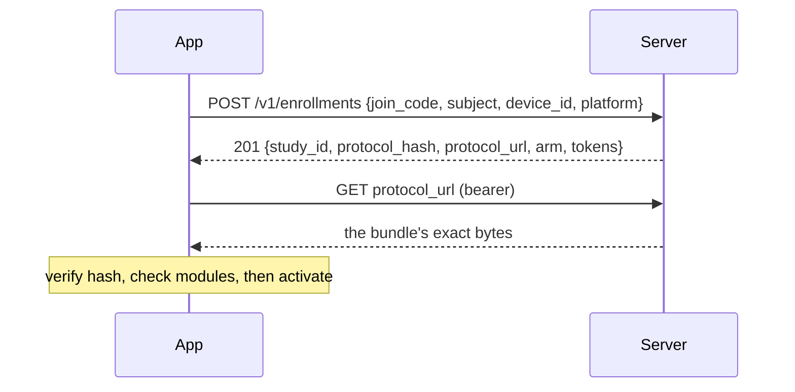

# The study server

One Phoenix application and one PostgreSQL database. It enrols devices, accepts observations,
stores them, and derives query-friendly projections from them. This is what it does and why it does
it that way.

## Shape

[ADR-0003](../adr/0003-single-backend-runtime.md) chose a single runtime over the
earlier Go-plus-Lambda split. An institution running a study should have one thing to deploy, one
place to look when something is wrong, and one process to keep alive — the operational surface is
part of whether a platform is adoptable by a research group without a devops team.

[ADR-0004](../adr/0004-rest-for-ingest-graphql-for-query.md) splits the interfaces by their
different jobs. Ingest is REST: high volume, one shape, from constrained clients on bad networks.
Query is intended to be GraphQL, where the shapes are many and the callers are analysts.

## Enrolling a device



Three things are load-bearing here.

**The client generates its own pseudonym.** The `subject` is created on the device and presented at
enrolment; the server binds a token to it. This is what allows a study to hold no participant
identifier at all — there is nothing to link the pseudonym back to a person because nothing was ever
collected.

**A 404 does not distinguish an unknown code from a closed or full study.** Otherwise join codes
could be enumerated to discover which studies exist.

**Arms are assigned server-side.** Randomisation the client can influence is not randomisation.

Access tokens are short-lived so a leaked one has a small blast radius; refresh tokens are
long-lived but revocable per device, which is what lets one installation be cut off without
disturbing a study.

## The protocol bundle

A study is a configuration document, not code. The server stores the bundle's **exact bytes** and
serves them back verbatim.

That matters more than it looks. The client hashes what it receives and compares it against the
`protocol_hash` enrolment promised, and two JSON documents that parse identically can serialise
differently — so serving a re-encoding of a decoded map would produce mismatches that appear only on
the device. Storing the source also means the hash identifies the *authored artefact*, so two
institutions running the same study stamp the same `protocol_hash` and their datasets pool.

A changeset validation enforces that a stored study's hash describes its own bytes. A study that
fails that invariant enrols successfully and is then refused by every client, with the mismatch
visible nowhere but the phone.

## Accepting observations

`POST /v1/observations` takes up to 1000 envelopes, gzipped. The validation criterion for the whole
design is that **adding a new observation type requires zero changes to the ingest API** — the
envelope is uniform and the payload is opaque to the transport.

Each observation is processed independently, and the response reports only the ones that were not
plainly accepted:

| Outcome | Stored? | What it means |
| --- | --- | --- |
| accepted | yes, `validated = true` | Envelope and payload both matched their contracts. |
| duplicate | already held | The server has this `(device_id, seq)`. The expected result of a safe retry. |
| quarantined | yes, `validated = false` | Stored but not validated — an unknown schema, or a payload that violates a known one. |
| rejected | no | Identifying fields could not be read, so there was nothing to store under. |

**Accepted observations are omitted from `exceptions` entirely.** A client that removed from its
outbox exactly what the server listed would delete its failures, keep every success, and resend them
forever — a loop that looks like healthy traffic from both ends.

### Why one bad record never fails a batch

A field site's upload contains data from a whole afternoon. Rejecting the batch because one
observation is malformed would discard everything else with it, and the malformed one is usually a
client bug that will recur on every retry. So each item is judged alone.

### Why quarantine exists

`quarantined` is the answer to a version skew that will certainly happen: a device running a newer
module emits a payload whose schema the server does not have yet. Rejecting it would lose real data
because the server was behind; accepting it silently would let unvalidated data pass as validated.
Quarantine stores it with `validated = false` so it can be re-validated after an upgrade.

The `reason` distinguishes the two cases that look identical from the outside:
`unknown_payload_schema` means the server is behind and this is recoverable; `payload_invalid` means
a producer is emitting something that violates a contract the server *does* know, which is a defect.
The first is alerted quietly, the second loudly.

### Exactly-once, without coordination

A unique index on `(device_id, seq)` is the whole mechanism. `seq` is a per-installation counter
allocated by the device inside the same transaction that writes to its outbox, so retrying a batch
whose response was lost produces `duplicate` rather than a second row. Clients need no locks, and an
ambiguous network failure is always safe to retry.

`GET /v1/observations/ack` returns the highest contiguous `seq` the server holds for the calling
device, so a client can prune its outbox after an ambiguous failure instead of re-uploading a large
batch to find out what landed. It is an optimisation — retrying is always safe — but a meaningful one
on a metered connection.

## Storage

```
studies        the protocol bundle, its hash, and its exact bytes
join_codes     what a participant types in; case-insensitive
participants   study + pseudonym, arm, enrolled_at, withdrawn_at
devices        one app installation; platform, app_version, locale
tokens         hashed, never stored in the clear
observations   the record
contacts       a projection, derived and rebuildable
```

An observation row keeps **both** the whole envelope and the payload as JSON, *and* extracts the
fields worth indexing — `study_id`, `subject`, `device_id`, `seq`, `module`, `schema_uri`,
`observed_at`, `clock_offset_ms`, `received_at`. The extraction is for querying; the intact envelope
is so a re-validation after a schema upgrade sees exactly what the device sent, not a
reconstruction.

`received_at` is stamped by the server and never trusted from a client. Together with
`clock_offset_ms` it is what makes device-clock drift recoverable rather than baked in.

## Projections

`contacts` is the first derived table: one row per contact episode, with the pair, the interval,
seconds in each distance band, and the reliability counts.

Projections are **derived and rebuildable**. Nothing writes to `contacts` except the projector, and
`rebuild_contacts/1` regenerates the table from the observations it came from. That property is what
makes it safe to change how a projection is computed after data has been collected — the record is
the observations, and everything else is a view that can be recomputed.

```elixir
Projections.project_contacts(study_id)   # incremental; safe to run repeatedly
Projections.rebuild_contacts(study_id)   # from scratch, after changing the logic
```

## Getting data out

Today, retrieval is SQL against Postgres — the `observations` table for the record, `contacts` for
the analysis-shaped view. `deploy/local/README.md` has worked queries for checking a run.

The path onward is `analysis/`, which validates exported observations against the same contracts the
server used, and `models/`, which loads a contact network into the Starsim bridge. That round trip is
deliberately part of M1's acceptance criteria rather than a nice-to-have: if the measured network
cannot drive a simulation, something upstream is wrong in a way no unit test reveals.

**The GraphQL query API in ADR-0004 is not built yet.** Until it is, an analyst needs database
access, which is fine for a single institution and will not do for a multi-site study.

## What the server deliberately does not do

- **Interpret payloads.** It validates them against their contracts and stores them. Meaning lives
  in `analysis/` and `models/`.
- **Trust client-supplied server fields.** `received_at` and `validated` are the server's;
  `additionalProperties: false` on the envelope enforces this mechanically rather than by
  convention.
- **Reject what it does not understand.** An unknown schema is quarantined, not discarded.
- **Hold participant identity.** It holds a pseudonym the device invented.
