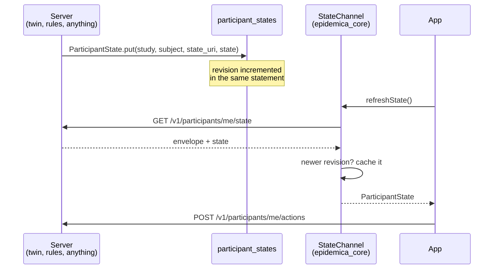

# The state channel

How the server tells a device something about the person carrying it.

Epidemica was one-directional for its first milestone: observations flowed up through the outbox, and
the only thing that came back was the protocol bundle, fetched once at enrolment. A device could tell
the server what happened, and the server could tell a device what to collect, but it could not tell a
device anything about the participant.

The state channel is the other direction. It was built for Epigames — a twin decides who is infected
and the app has to show it — but nothing about it is game-specific. An adherence study showing a
streak, a screening study showing a result, a risk-communication study showing a score: all need
computed state to reach a phone, and all use this.

The decision is recorded in [ADR-0014](../adr/0014-participant-state-channel.md); this explains how
it works.

## The shape: a mirror of the observation envelope

The channel is deliberately the observation envelope reflected. If you know one, you know the other.

| Going up | Coming down |
|---|---|
| `envelope_version` | `state_version` |
| `schema_uri` | `state_uri` |
| `payload` (opaque) | `state` (opaque) |
| `seq` — per-device, monotonic | `revision` — per-participant, monotonic |
| `observed_at` | `as_of` |

```json
{
  "state_version": "1.0",
  "study_id": "75576509-aec6-4b2f-b846-19e67bf0db11",
  "subject": "1b6f2b50-516a-4bd7-ab2f-8ed13611cb5c",
  "state_uri": "https://schemas.epidemica.info/state/epigame/1.0.0.json",
  "revision": 12,
  "as_of": "2026-09-03T06:00:04.117Z",
  "state": { "day": 3, "days_total": 7, "epi_state": "susceptible", "points": 14 }
}
```

The envelope is governed by
[`contracts/state/participant_state/1.0.0.json`](../../contracts/state/participant_state/1.0.0.json).
The `state` inside it is governed by whatever contract `state_uri` names — for Epigames,
[`state/epigame/1.0.0.json`](../../contracts/state/epigame/1.0.0.json).

**`epidemica_core` never looks inside `state`.** It parses the envelope, checks the revision, caches
the document, and hands it to the app. That is the same discipline as the outbox, which carries a
payload it does not interpret, and it is what keeps one study's vocabulary out of the platform.

## The flow



Delivery is **polled**, not pushed. The Epigames app refreshes on a one-minute timer and on manual
pull-to-refresh, which is generous for something that changes daily. A push variant — a notification
waking a fetch — would be an optimisation layered on top and would change nothing described here.

## Writing state

```elixir
ParticipantState.put(study_id, subject, state_uri, state, as_of \\ DateTime.utc_now())
#=> {:ok, document}
#=> {:error, :no_such_participant}
#=> {:error, {:invalid_state, error}}
```

Four things happen, in this order, and each is load-bearing.

**The participant is resolved first.** "No such participant" is a more fundamental error than a
schema complaint, and reporting the latter for someone who was never enrolled would send you looking
in the wrong place. State cannot be written for a subject that does not exist — the channel never
creates a participant as a side effect.

**The state is validated against the contract its `state_uri` names.** A malformed document is caught
once here rather than by every client at once. This matters more than it sounds: `state` is opaque to
core, so the *client* cannot catch it. A study renderer reading a missing field leniently shows a
default — `points: 0`, or "waiting for your first update" — and on screen that is indistinguishable
from a computed answer.

**An unknown `state_uri` passes through unvalidated, on purpose.** A study may define a state shape
this build has never seen, and refusing it would make the channel useless to precisely the studies it
exists for. It mirrors the way an unknown `schema_uri` is quarantined rather than rejected on the way
in.

**The revision is allocated by the database in the same statement that writes the state:**

```elixir
on_conflict: from(r in Record, update: [set: [...], inc: [revision: 1]]),
conflict_target: [:participant_id]
```

Read-then-write would let two concurrent writers both see revision 4 and both write 5, after which a
client holding one of them would treat a stale document as current. There is exactly one row per
participant; history lives in whatever produced the state, not here.

## Reading state

```
GET /v1/participants/me/state
```

**Scoped by token, not by path.** There is no parameter naming a participant, so one device cannot
ask about another even by guessing an identifier. This is why the route says `me`.

**404 when nothing has been computed.** The server does not synthesise an empty document, and the
client holds `null` rather than inventing one. An invented "you are healthy" is indistinguishable
from a measured one, and a participant acting on it would be acting on fiction. This is why an
Epigames player sees nothing until the first tick has run — deliberately, not as a gap.

## The client side

`StateChannel` in `epidemica_core` handles fetching and caching:

```dart
ParticipantState? current({String? expectedSubject});
Future<ParticipantState?> refresh();
void clear();
```

Three behaviours are worth knowing when debugging.

**A newer revision never loses to an older one.** Responses can arrive out of order on a bad
connection, so `refresh()` compares revisions and keeps the newer. This is what `revision` is for on
the client; the server uses it for concurrency.

**A cached document is bound to its subject.** `current(expectedSubject: ...)` returns null if the
cached document belongs to a previous enrolment on the same device. Withdrawing clears it outright.

**Failures are distinguishable.** A 404 keeps the cache — after a document has been seen, a 404 is far
more likely to be a routing or deployment problem than a real deletion. A 401 raises
`IngestUnauthorized`; a 5xx raises `IngestTransient`. A caller can tell "nothing has changed" from
"we could not ask", which a nullable return alone would not permit.

The document itself is parsed strictly:

```dart
ParticipantState.fromJson(json)   // throws on a missing or mistyped envelope field
Duration ageAt(DateTime now)      // how old the computation is
```

`ageAt` exists because **`as_of` is when the computation ran** — not when it was served, and not when
it was fetched. A study that recomputes daily is a day stale by design, and an interface that cannot
say so implies a liveness it does not have. The Epigames screen prints "updated 4 h ago" from this.

## The upward mirror: actions

State coming down is only half a conversation. A participant who is shown something usually needs to
respond to it, so there is a matching opaque channel going up:

```dart
await controller.postAction({'action': 'protect'});
```

```
POST /v1/participants/me/actions
```

Same discipline: token-scoped, body opaque to core, interpreted only by the study's rules engine.
`StudyController.postAction` refreshes state afterwards, so the effect of a decision is visible
immediately rather than at the next poll.

This is not an observation. Observations are measurements of the world, immutable and queued for
eventual delivery; an action is a decision that needs a synchronous answer — Epigames refuses one
taken outside the study window with a `409`, which the participant must see now, not tomorrow.

## Using it in another study

Nothing here is Epigames-specific. To give participants feedback in a new study:

1. **Write a state contract** at `contracts/state/<study>/1.0.0.json`, with valid and invalid
   fixtures. Keep it small — a participant sees their own situation, not the study's data.
2. **Name it in the bundle.** For a simulated study that is `twin.state_uri`; anything else can carry
   its own field. The contract is what ties the producer to the renderer without either knowing about
   the other.
3. **Register it with the server** in `contracts.ex`, the same three lines a module's payload contract
   needs. Without this the state is stored and served *unvalidated* — the channel keeps working, but
   the safety net is not there.
4. **Write state whenever it changes**, with `ParticipantState.put/5`. Whatever computes it — a twin
   tick, a scoring rule, a clinician's entry — is your business, not the channel's.
5. **Render it in the app** from `controller.participantState`. Show `ageAt` somewhere; a daily
   computation displayed as if live is a small lie that compounds.

What you do **not** need: a new endpoint, a change to `epidemica_core`, or a migration. The channel is
already there.

## Where it can go wrong

| symptom | cause |
|---|---|
| App shows "waiting for your first update" for ever | Nothing has called `put/5`. For a twin study, no tick has run |
| `{:error, :no_such_participant}` | Writing for a subject that withdrew, or a study/subject mismatch |
| `{:error, {:invalid_state, _}}` | The state does not match its contract — read `error` for the failing path |
| State never changes on the phone | Polling stopped, or every response is an older revision |
| Cached state from a previous enrolment | Should be impossible: the subject binding rejects it. If seen, that binding is broken |
| A field the app expects is missing | The contract permits it. Required fields belong in `required` |

## See also

- [ADR-0014](../adr/0014-participant-state-channel.md) — why this shape and what was rejected
- [`observation-envelope.md`](observation-envelope.md) — the upward channel this mirrors
- [`modules.md`](modules.md) — registering a contract with the server
- [`server.md`](server.md) — where state fits among the server's other jobs
