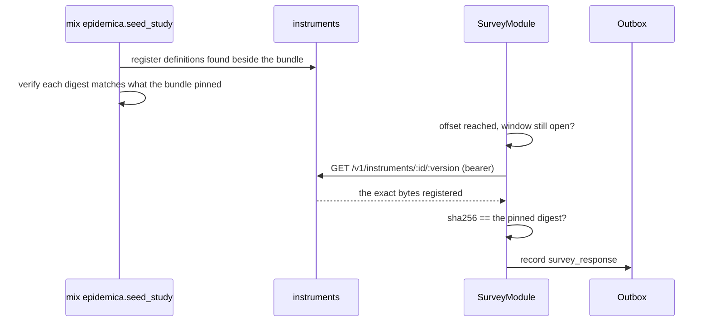

# Surveys

How an instrument gets from a file in a repository to an answer in the observation store, and how to
add one to a study.

Surveys are a module like any other: the binary embeds the capability, the bundle decides whether a
study uses it. What makes them different from proximity is that the *content* — the questions
themselves — is study data too, and it versions on a schedule of its own.

## Three documents, three lifetimes

This is the whole design, and the rest follows from it.

| Document | Contract | Versions when |
|---|---|---|
| The **bundle** | [`bundle/1.0.0`](../../contracts/bundle/1.0.0.json) | The study changes. Re-registering makes a *new study*. |
| The **instrument definition** | [`instruments/definition/1.0.0`](../../contracts/instruments/definition/1.0.0.json) | The questions change. |
| The **response** | [`observations/instruments/survey_response/1.0.0`](../../contracts/observations/instruments/survey_response/1.0.0.json) | Never, per response. It names the version it was collected under. |

The questions live **outside** the bundle deliberately. A study's identity is its protocol hash, so
carrying the questions inside would mean that fixing a typo in one prompt creates a different study
and every participant has to re-enrol. The response contract already assumed this separation before
any of it was built:

> Item types live in the instrument definition, which versions independently, so validation against
> `instrument_id` + `instrument_version` is a separate step.

The bundle therefore *names* an instrument and *pins* a version and digest. That keeps the study
reproducible — you can always tell which questions a run asked — without coupling the two lifetimes.

## What a definition may contain

Three item types, and no others:

| Type | Answer recorded | Needs |
|---|---|---|
| `single_choice` | one option's `value` | `options`, at least two |
| `multi_choice` | an array of `value`s | `options`, at least two |
| `likert` | an integer in range | `scale` with `min` and `max` |

**There is no free-text type, and its absence is load-bearing.** The response contract warns that
free text can carry identifiers no schema is able to screen, which makes the observation store
pseudonymous *by policy* rather than by construction. With no way to ask an open question, a study
cannot break that promise by accident — which is a far stronger guarantee than a note in a README.
If you need free text, that is a contract change and an ethics conversation, not a config change.

Two smaller rules worth knowing:

- **`value` and `label` are separate on purpose.** The label is what a participant reads and may be
  reworded freely; the value is what the data means. Improving wording should not change what an
  answer records.
- **Items default to optional.** A participant who declines is recorded as having *refused*, which
  is a measurement. One who is trapped by a required question abandons the instrument and takes
  every later answer with them.

## What a response records

Every item is reported, including ones the participant never reached, because attrition within an
instrument is itself a measurement and cannot be recovered later. The distinctions are deliberate:

| `status` | Means |
|---|---|
| `answered` | A value is present. |
| `refused` | Explicitly declined — the participant chose to say nothing. |
| `skipped` | Presented and passed over. |
| `not_reached` | The instrument was abandoned before this item. |

Collapsing these into a single null would lose the difference between someone who declined and
someone who gave up, which are different missing-data mechanisms with different implications.

A response also carries `partial: true` when a required item was left unanswered, `duration_ms`, and
`channel: "app"` — the last because mode effects are real and the same question asked by an app, an
SMS and a person does not yield the same distribution.

## When an instrument is due

Scheduling is **seconds after the study opens**, not a day number:

```json
{ "instrument_id": "checkin", "version": "1.0.0", "offset_seconds": 900, "window_seconds": 86400 }
```

Two reasons for an offset rather than a day.

**Minute precision.** "Fifteen minutes in", "two days and six hours" — days cannot express these,
and half the point of an in-app instrument is asking about something recent.

**Nothing on the device has to count days.** The server already decides which day it is, in
`Studies.day_at/3`, using the study's own `tick_interval_seconds`. A second implementation on the
phone would be free to drift from it, and hardest to notice when it did — exactly the class of bug
that made a short-tick study compute one day in one place and simulate another elsewhere. An offset
from `starts_at` needs no notion of a day at all.

`window_seconds` closes the instrument again. Both ends matter: offering one early asks about a
period that has not happened, and offering one for ever turns a scheduled measurement into an open
invitation, with answers that no longer refer to the period they asked about.

The key that records completion is `instrument_id@version`, so **revising an instrument asks it
again** rather than treating the old answer as covering the new wording.

### Anchored to the study, or to the participant

The offset is measured from the study's start by default. Set `anchor: "enrollment"` to measure it
from when *this participant* joined instead:

```json
{ "instrument_id": "demographics", "version": "1.0.0", "offset_seconds": 300,
  "window_seconds": 86400, "anchor": "enrollment" }
```

The distinction is what the instrument is about. One about the study — "how is the outbreak going"
— belongs to the calendar, and a participant who joined after its window closed was never owed it:
they were not there. One about the person — demographics, baseline beliefs — belongs to them, and a
late joiner should still be asked, minutes after they join, whenever they join. Anchoring both to
the study would silently skip the second kind for anyone who enrolled late, which is exactly the
case rolling enrollment produces.

`anchor: "study"` is the default and is what every instrument above uses. An enrollment-anchored
instrument whose enrollment time the device does not have is never due, rather than guessed at.

## How it reaches the phone



Three checks, each guarding a different failure:

**At seeding, the digest is verified against the file.** A stale hash in a bundle would otherwise
surface in the field as a survey that simply never appears — a long way from the file that is
actually wrong. This check caught a real bug the first time it ran: `START=` writes a dated copy of
the bundle to a temp file, which left the sibling `instruments/` directory behind.

**On the device, the digest is verified against what was served.** Same rule as the protocol bundle,
for the same reason: questions a study did not author must never reach a participant. A mismatch
shows nothing and marks nothing done, because a definition that cannot be verified today may arrive
intact tomorrow.

**Re-registering different bytes under the same version is refused.** Responses already collected
name that version; quietly changing what it means would merge two measurements with nothing
downstream able to tell. Give the edited instrument a new version instead.

## What the module reports as its status

`SurveyModule.status()` answers about the schedule rather than about hardware, because there is no
sensor to be running:

- **`sensing`** while any window is still open and unanswered — the study is still expecting
  something.
- **`stopped`** once every instrument is done or expired, and once more if the study declares no
  schedule at all, since there is then nothing to measure an offset against.

Reporting `sensing` for ever afterwards would claim the study was still collecting something it had
finished collecting, and coverage is one of the few things the platform asserts positively.

## Adding a survey to a study

**1. Write the definition** beside the bundle, in `instruments/`:

```
studies/my-study/
  bundle.json
  instruments/
    checkin-1.0.0.json
```

The filename is for humans; the identity comes from `instrument_id` and `version` inside the file.

**2. Take its digest** over the exact bytes:

```sh
shasum -a 256 studies/my-study/instruments/checkin-1.0.0.json | awk '{print "sha256:"$1}'
```

**3. Declare it in the bundle** under `modules.survey`. Naming the module is what enables it; a
binary that does not embed `survey` will refuse the study at enrollment rather than run it half:

```json
"modules": {
  "survey": {
    "instruments": [
      {
        "instrument_id": "checkin",
        "version": "1.0.0",
        "sha256": "sha256:d6e00a…",
        "offset_seconds": 60,
        "window_seconds": 1800
      }
    ]
  }
}
```

`url` is optional. Without it the app fetches `instruments/<id>/<version>` from the study server,
which is what registration in step 4 provides. Set it to an absolute URL to host definitions
elsewhere; the digest is checked either way.

**4. Seed.** Definitions beside the bundle are registered automatically, and every declared entry is
checked against them:

```sh
mix epidemica.seed_study --bundle studies/my-study/bundle.json
```

A wrong digest, or an instrument declared but not present, fails here rather than on a phone.

**5. Check the responses arrive validated:**

```sh
psql epidemica_server_dev -c "
SELECT subject, validated, payload->>'instrument_id' AS instrument,
       payload->>'partial' AS partial
FROM observations WHERE module = 'survey';"
```

`validated: false` means the payload did not match the response contract — the observation is kept
and quarantined rather than lost, but nothing downstream will read it.

### Revising an instrument mid-study

Add a new file at the new version, declare it alongside or instead of the old entry, and re-seed.
The old version stays registered, because responses already reference it. Participants who answered
`1.0.0` will be asked `1.1.0`, since completion is tracked per version — which is usually what you
want, and is worth thinking about before bumping a version for a typo.

## More than one instrument in a study

A study schedules as many as it needs. Each entry in `modules.survey.instruments` is independent:
its own definition, its own version, its own offset and window. One ten minutes into the first day
and another six hours into the second is just two entries:

```json
"modules": {
  "survey": {
    "instruments": [
      {
        "instrument_id": "checkin",
        "version": "1.0.0",
        "sha256": "sha256:d6e00a…",
        "offset_seconds": 600,
        "window_seconds": 1800
      },
      {
        "instrument_id": "day_two",
        "version": "1.0.0",
        "sha256": "sha256:dt4eea…",
        "offset_seconds": 108000,
        "window_seconds": 1800
      }
    ]
  }
}
```

Each is registered, fetched and verified on its own. Each is answered once, tracked by its own
`instrument_id@version`, and none has to finish before the next is due — the second is offered the
moment its window opens even if the first was never answered.

One constraint, already noted in the gaps: **the module offers one at a time**, the earliest due
first, so two instruments whose windows overlap are queued rather than both waiting on screen.
Spaced as in this example it never arises; a study that genuinely wants two instruments open at
once is a current limitation.

## Known gaps

**Nothing tells a participant a survey is waiting.** The card appears when the app is next opened.
Local notifications are the obvious fix and are genuinely separate work: a new dependency needing an
[ADR-0009](../adr/0009-open-source-license.md) licence check, runtime permissions on both platforms,
and consent text — because permission to interrupt someone is a thing to ask for, not assume.

**One instrument at a time.** If two come due together the earliest is offered first and the other
waits for the next refresh. Fine for a schedule with days between entries; wrong for a study that
wants a battery of instruments at one moment.

**No branching.** Every item is presented to everyone. The response contract anticipates
`not_applicable` for items branched around, but nothing produces it yet.

**Scoring is not computed.** The response contract has a `scores` field, recorded alongside raw
answers so scoring can be recomputed if the algorithm is later corrected. Nothing writes it.

## See also

- [modules](modules.md) — what a module is, and what the server needs from a new one
- [the observation envelope](observation-envelope.md) — what wraps a response on its way up
- [epigames](epigame.md) — the study this was first built for
- [arms](arms.md) — a study that randomises its rules across participants, which surveys can then
  measure
- [`tasks/backlog/0008`](../../tasks/backlog/0008-survey-module.md) — the task this came from,
  including the decisions taken and why
