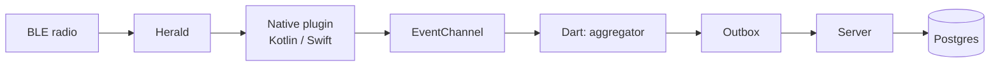

# Debugging Epidemica from VS Code

Epidemica is five runtimes in one repository — Dart, Kotlin, Swift, Elixir and Python — and a bug in
proximity sensing can live in any of them. Most of the difficulty is not setting breakpoints; it is
working out **which layer to attach to**, because the symptom is nearly always the same: no data.

Ready-made configurations live in [`.vscode/`](../.vscode) and are committed, so everything below is
already wired up.

## 0. Open the repository root

Open `epidemica/` itself as your VS Code folder, not `apps/template` and not the parent directory.

This matters more than it looks. The Dart packages form a **pub workspace** — one lockfile and one
`.dart_tool` for the whole repo, declared in the root `pubspec.yaml`. Open a single app folder and
the analyser resolves a different package graph from the one `flutter run` uses, so you get
red squiggles on code that compiles, or worse, no squiggles on code that does not.

Install the recommended extensions when prompted (`.vscode/extensions.json`): Flutter, ElixirLS,
Python, and the Kotlin and Swift language servers.

## 1. Start a server first

The app is close to useless without one. **Terminal → Run Task**:

| task | what it does |
|---|---|
| `study: contactlog (local)` | Postgres, migrations, registers the pilot, prints a join code |
| `study: epigames (local, starts now)` | The same, plus a schedule beginning at the top of this hour |

Both print the LAN address and the exact `flutter run` command with it filled in. Note the address —
you need it in the next step.

## 2. Launch the app

**Run and Debug** (⇧⌘D) has four app configurations:

| configuration | when |
|---|---|
| `template: emulator` | Android emulator; uses `10.0.2.2`, the emulator's alias for your Mac |
| `template: device` | Real phone; prompts for the server URL |
| `epigames: emulator` / `epigames: device` | The same for the game |

For a real device, paste the LAN URL the task printed, **including the trailing `/v1/`**.

> **The single most common mistake.** `EPIDEMICA_SERVER` is a compile-time constant
> (`String.fromEnvironment`). Launch without it and the app silently uses `http://10.0.2.2:4000/v1/`,
> which on a physical phone is nothing at all. Symptom: enrollment fails with "no connection" while
> the server logs absolutely nothing.
>
> The prompt is deliberately not remembered between launches — a stale hardcoded IP that used to work
> is harder to spot than a prompt you have to answer.

`server + template` under compounds starts both together.

Once running you have hot reload (⌘\), hot restart (⇧⌘F5), and breakpoints in any Dart file across
all the workspace packages — `epidemica_core`, `epidemica_proximity`, the module — not just the app.

## 3. Choose the right layer

This is the part that saves time. Ask **where the data stopped**, then attach there.



| where it stopped | you cannot see it from | attach with |
|---|---|---|
| Radio, Herald, native plugin | Dart | logcat / Xcode |
| The channel crossing | either side alone | both at once |
| Aggregation, outbox | native | VS Code Dart debugger |
| Upload, ingest, projection | the phone | ElixirLS / `psql` |

**A Dart breakpoint that never fires tells you almost nothing** — it is equally consistent with a
radio that is off, a permission that was declined, a peer in a different study, and a bug in your
aggregator. Move down a layer before assuming.

## 4. Dart: the aggregator and the outbox

The interesting breakpoints are in packages, not the app:

- `packages/epidemica_proximity/lib/src/episode_aggregator.dart` — `add()` fires on every sighting.
  If it fires, the whole native path works and the problem is above it.
- `_emit()` in the same file — fires when an episode completes. Remember episodes close on *absence*,
  after `max_gap` (600 s) or the one-minute tick, so "no episodes yet" is often just impatience.
- `packages/epidemica_core/lib/src/outbox.dart` — `record()` is the moment an observation becomes
  the platform's problem rather than the module's.
- `packages/epidemica_core/lib/src/sync/sync_service.dart` — `syncOnce()` for upload failures.

Set a **conditional breakpoint** on `add()` when chasing one device: right-click the breakpoint →
Edit → `detection.peer == "2a6b2d4e-..."`. With several phones in a room this is the difference
between usable and unusable.

The Debug Console evaluates expressions against the running app, which is the quickest way to inspect
aggregator state without stopping:

```dart
_aggregator?.openEpisodeCount
```

## 5. Android native (Kotlin)

VS Code cannot debug the Kotlin side of a Flutter plugin. You have two options, and the first is
usually enough.

**Logs.** Run task `android: proximity logs`:

```sh
adb logcat -v time -s EpidemicaProximity:* AndroidRuntime:E
```

`EpidemicaProximity` is the real tag used by the plugin. `AndroidRuntime:E` catches native crashes,
which otherwise appear in Flutter as an app that simply vanished.

**Breakpoints.** Open `packages/epidemica_proximity_android/android` in Android Studio and use
*Attach debugger to Android process*. Worth it only for genuinely native problems — Herald
lifecycle, the foreground service, `DetectionBuffer` overflow.

Things worth checking here before anything else:

```sh
adb shell dumpsys bluetooth_manager | head -20      # is the radio actually on
adb shell dumpsys activity services | grep -i proximity   # is the foreground service alive
```

If the foreground service is not running, sensing stops the moment the screen locks — and the data
loss is invisible until analysis.

## 6. iOS native (Swift)

Also outside VS Code.

**Logs.** Console.app, filtered by subsystem `info.epidemica.proximity`, or:

```sh
xcrun simctl spawn booted log stream --predicate 'subsystem == "info.epidemica.proximity"'
```

For a physical device, Console.app with the device selected in the sidebar.

**Breakpoints.** Open `apps/template/ios/Runner.xcworkspace` in Xcode, then *Debug → Attach to
Process*. `ProximitySensor.swift` is where sensing starts and where detections are emitted.

Two iOS-specific traps, both already fixed but worth recognising:

- **`missingPlatformRequirements()`** returns the Info.plist keys that are absent. If it is non-empty
  the module refuses to start and senses nothing, with no crash and no error dialog. Call it from the
  Dart debug console.
- **Never add `location` to `UIBackgroundModes`.** If you see
  `Invalid parameter not satisfying: !stayUp || CLClientIsBackgroundable(...)`, that is Herald's
  CoreLocation mobility sensor, which we disable in `ProximitySensor.start`. Granting the background
  mode silences the crash and starts collecting location.

## 7. The server (Elixir)

Three configurations:

| configuration | use |
|---|---|
| `server: phx.server` | Run with breakpoints in controllers, `Ingest`, `Twin`, `Epigame` |
| `server: mix test` | The whole suite under the debugger |
| `server: mix test (current file)` | Just the file you have open |

ElixirLS breakpoints work in any `lib/` module. Good places:

- `Ingest.submit/2` — every upload arrives here
- `Ingest.validate/1` — why something was quarantined
- `Projections.project_contacts/2` — why `contacts` is not what you expect
- `Twin.run_tick/3` — a day of the simulation

For quick interactive work `IEx.pry` is often faster than the debugger. Add `require IEx; IEx.pry`
in the code and start the server in a terminal with `iex -S mix phx.server` — you get a shell at that
point with everything in scope.

Without a debugger at all, the server's own logs show every request; a `POST /v1/observations`
appearing tells you the upload path works and the problem is server-side.

## 8. The twin (Python)

`models: pytest` and `analysis: pytest` run under debugpy against the right virtualenv, with
`justMyCode: false` so you can step into Starsim when the epidemic does something surprising.

The twin runs as a **subprocess** in production, so a breakpoint in `twin.py` will not be hit from a
server tick. To debug a real tick, take its stored inputs and replay them:

```sh
cd server && mix run -e '
  tick = EpidemicaServer.Repo.get_by(EpidemicaServer.Twin.Tick, study_id: "<id>", day: 1)
  File.write!("/tmp/tick.json", Jason.encode!(tick.inputs))
'
```

Then debug `models/src/starsim_epidemica/twin.py` with `/tmp/tick.json` as its argument. Every tick
stores its inputs and seed precisely so this is possible.

## 9. Following one episode end to end

When something is wrong but nothing is obviously broken, walk the pipeline in order and stop at the
first stage that is empty.

1. **Is the radio seeing anything?** Breakpoint on `EpisodeAggregator.add`, or watch logcat.
2. **Are episodes closing?** Breakpoint on `_emit`. Nothing for ten minutes is normal; nothing for
   twenty is not.
3. **Is it queued?** The app's status screen shows pending observations. Climbing means detection
   works and upload does not.
4. **Did it arrive?** Server log, or:
   ```sql
   SELECT module, subject, count(*), max(observed_at) FROM observations GROUP BY module, subject;
   ```
5. **Was it accepted?** `validated = false` means the payload failed its contract:
   ```sql
   SELECT validation_reason, validation_detail FROM observations WHERE NOT validated;
   ```
6. **Did it project?** `contacts` is built during ingest, so a populated `observations` with an empty
   `contacts` means the episodes were quarantined, or they were health reports rather than contact
   episodes.
7. **Does the pair reconcile?** Both directions should appear. An asymmetry means one phone was
   advertising but not scanning.

Run task `db: psql` for a shell on the development database.

## 10. Repository-specific gotchas

**Two phones minimum.** A single device detects nothing — there is no peer to see. Half the "sensing
is broken" reports are one phone in a room.

**The join code decides visibility.** The BLE service UUID is derived from the study id, so a phone
enrolled in a different study is invisible at the protocol level, not merely filtered. Identical
symptom to a dead radio.

**Hot restart does not restart the native sensor.** `ProximitySensor` on iOS and the Android
foreground service outlive a Dart hot restart. If you are changing sensing behaviour, stop and
relaunch rather than trusting ⇧⌘F5.

**Changing native code needs a full rebuild.** Editing Kotlin or Swift and hot-reloading gives you
the old binary with new Dart on top, which is a confusing place to be.

**A withdrawn participant is gone.** Withdrawing deletes the local identity by design, so the phone
enrols as a new subject next time. Testing withdrawal repeatedly leaves a trail of participants in
the database.

**`observed_seconds` < `duration_s` is correct.** A single sighting credits at most
`sample_credit_seconds` (90 s), so credited time is normally below wall-clock. Not a bug.

## See also

- [`concepts/proximity.md`](concepts/proximity.md) — the full data path and a symptom table
- [`../deploy/local`](../deploy/local) — running a study on a laptop
- [`concepts/server.md`](concepts/server.md) — ingest, projections and reconciliation
