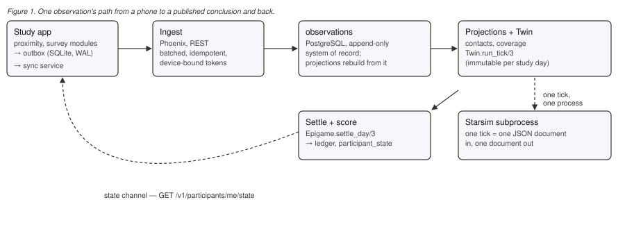

## 1. Introduction

Digital tools for infectious disease surveillance improved considerably over the last decade,
accelerated by the COVID-19 pandemic's demand for contact tracing at population scale
[@ferretti2020; @kucharski2020]. What emerged, however, was mostly single-purpose: an app that traces
contacts, a survey platform that collects symptoms, a simulation package that models spread — each
built once, for one study, rarely reused by the next. A research group that wants to measure a
contact network, ask participants how they felt about it, and feed the result into a transmission
model still assembles that pipeline from parts that were never designed to fit together, and largely
does so again for the next study.

Epidemica is an attempt at the alternative: infrastructure a study is *assembled from* rather than
*built against*. Its central claim is that this is possible without sacrificing the two things a
one-off app usually gets right by construction — a data model that means exactly what the study
needed it to mean, and a epidemiological model a specific research question actually calls for — provided
the boundary between "what the platform guarantees" and "what a study defines" is drawn as an
explicit, versioned **contract** rather than left implicit in whichever code happens to run.

This paper describes that contract-first design, the reference implementation built against it, and
a companion application — a short transmission game in which a phone's own measured contacts, not a
scripted schedule, decide who a server-side epidemic model infects next. It also describes an
extension of the same discipline to a newer kind of collaborator: the coding agents now routinely
used to build and maintain a codebase like this one, for whom the same lesson applies — an
undocumented convention re-learned by trial and error is exactly the failure mode contracts exist to
prevent, whether the reader is a person or a language model.

We do not report epidemiological results. Epidemica has not yet run a study at the scale or duration
its own milestones require, and this paper is explicit about that rather than eliding it — see
§8. What we report is a platform whose internal seams have been exercised end to end with real
devices, whose behaviour is pinned down by an automated test suite in three languages, and whose
architecture we believe generalises past its first reference application.

## 2. Related Work

Structured, empirical contact data has driven epidemiological modelling for decades. Diary-based
studies such as POLYMOD established that contact patterns are age-structured and setting-dependent at
a scale still cited in transmission models today [@mossong2008], and RFID- or Bluetooth-based
proximity studies — the Copenhagen Networks Study among the largest — showed that sensor-derived
contact networks capture structure a diary cannot, at the cost of purpose-built, non-reusable
infrastructure for each deployment [@stopczynski2014]. The COVID-19 pandemic then produced a wave of
literature on digital contact tracing specifically: modelling work argued that population-scale
Bluetooth tracing could plausibly control an epidemic if adopted widely enough [@ferretti2020], and
comparative studies of tracing, testing and distancing measured what such interventions achieved in
practice [@kucharski2020]. Classical network epidemiology, meanwhile, had already established that
*which* contact network a model assumes changes its qualitative predictions, not just their
magnitude [@eames2003] — an argument for measuring the real network rather than assuming a stylised
one, which is Epidemica's proximity module's entire job.

On the modelling side, agent-based transmission simulators — Covasim and the wider Starsim family
from the Institute for Disease Modeling being a widely used example — demonstrated that a general
disease-and-network simulation framework, not a bespoke model per study, can serve a whole research
program [@kerr2021; @starsim]. Epidemica adopts this position directly: rather than writing its own
transmission mathematics, it treats an external simulator as the canonical authority and limits its
own scope to getting a measured network and a study protocol into that simulator's native shape.

Research data platforms such as REDCap solved an adjacent problem — a metadata-driven, reusable
instrument for capturing structured research data across studies without bespoke software per project
[@harris2009] — for questionnaire-style data. Epidemica's survey module is deliberately compatible in
spirit (a versioned instrument definition, closed-response items, one contract every study reuses)
while extending the same reusable-instrument idea to passively sensed data, which a form-based tool
was never built to hold. FAIR data principles [@wilkinson2016] motivate a design choice that runs
through the whole platform: every observation carries a schema URI that resolves to a machine-readable
description of what it means, so that a dataset remains interpretable independent of the software that
produced it.

Epidemica's own lineage includes two prior single-purpose platforms built by the same lab —
Operation Outbreak, a proximity-sensing outbreak-simulation game deployed at over a hundred schools,
and Travel Healthy, a participatory surveillance app for international travellers — plus an early
Epidemica-based prototype, Epigames, shown publicly as a proof of concept in 2025. Each solved its
own problem well and duplicated infrastructure the next one needed again; Epidemica is the
generalisation of what those three builds had in common.

## 3. Design Principles

Four decisions shape everything described in the sections that follow.

**Contracts before code.** Epidemica's primary artifact is a versioned set of JSON Schema contracts —
what an observation looks like, what a study protocol declares, what the server publishes back to a
participant — with reference implementations of those contracts, not the contracts *as* an
implementation detail of one. A module, in this platform, is not "a package that happens to collect
proximity data"; it is a package that owns a payload contract, is activated and configured at
runtime by a study's protocol document, and emits observations into a shared, append-only store
without ever touching another module's data. This is what makes a second module (surveys, built
after the first field test, described in §5) additive rather than a rewrite, and it is what makes a
study author's job writing a configuration document rather than forking an app.

**One ingest path for every kind of data.** Proximity episodes, survey answers, and a module's report
of its own health all travel in the same *observation envelope*: a wrapper the platform controls
(who, which study, which protocol version, when) around a payload the module controls and the
platform never inspects. One sync engine, one offline queue, one retry policy, one export pipeline,
regardless of how many kinds of module a study combines.

**One canonical transmission model, not our own.** Epidemica does not implement epidemiology. A
study's transmission parameters are constrained to be directly loadable as parameters of an external,
general-purpose agent-based simulator [@starsim], and a measured contact network is exposed to that
simulator as a first-class network object rather than reimplemented as a parallel, drift-prone
mathematical model maintained in two languages. This was a correction, not a starting assumption: an
earlier design sketch specified both a server-side and an on-device transmission implementation, and
the risk that the two would silently disagree was judged worse than the cost of running the canonical
model server-side and treating the phone as measurement, not computation.

**A study's identity is its bytes.** A protocol bundle is a signed, versioned configuration document,
and the server stores and serves its exact bytes rather than a re-derived copy. A participant's device
verifies the bundle's hash before activating any module. The consequence that matters most in
practice: a study's identity *is* its bundle's hash, so a change to a study's rules — intentional or a
typo — creates a new, distinct study that participants must (re-)join, rather than silently mutating
one they already joined mid-run.

## 4. Architecture

Figure 1 traces one observation's round trip through the system. A study app embeds one or more
**modules** at build time — proximity sensing over Bluetooth Low Energy, and scheduled survey
instruments are the two shipped today — each of which is handed a narrow `ModuleContext`: its own
configuration block from the protocol bundle, the study and participant identifiers, a recorder, and
nothing about any other module. Observations accumulate in a durable, on-device outbox (SQLite in
write-ahead-logging mode, chosen after an earlier design's JSON-blob queue proved to cost an
unbounded rewrite per append and offer no retry semantics) and are drained by a sync service whose
only job is one upload pass; when to call it is left to whatever manages the platform's background
execution, deliberately, because that policy differs by operating system and by how aggressively a
study needs data in near-real-time.



The server is a single Phoenix/Elixir application over PostgreSQL — a deliberate rejection of an
earlier plan to split ingest and simulation across two runtimes, on the grounds that an institution
running its own study should have one process to operate, not two. Ingest is a high-volume REST path
built for constrained clients on unreliable networks: batched, idempotent, authenticated by
short-lived, per-device tokens rather than a shared API key. Every accepted observation lands in one
append-only table; everything else — a contact list, a coverage judgement, a day's simulated outcome
— is a *projection* derived from it, and is required to be exactly reproducible from the observation
store alone. This is what makes the observation store the platform's actual system of record rather
than one copy of the truth among several: if a derived table and a full projection rebuild ever
disagree, the derived table is wrong by definition.

For studies that include a transmission model, a **twin** runtime settles one study-day at a time by
handing a single JSON document — the day's reconciled contact network, the participants' declared
choices, and each affected agent's prior state — to a Python subprocess that runs one simulated day
against the canonical transmission model and returns the updated states. The settlement this produces
is immutable: a study day, once decided, is never re-simulated against different inputs, because
participants are told its result and a live study cannot retract a conclusion it has already
published. Conclusions reach a participant's device through a **state channel** — a single document
the server publishes and the client can only read, never negotiate — which keeps a hard line between
what the platform has concluded (a settled score, a coverage judgement) and what is true right now (a
radio is or is not scanning), a distinction that proved easy to blur in practice and is discussed
further in §8.

Every payload contract, the protocol bundle format, and the participant-facing state documents are
JSON Schema, closed to additional properties, with machine-checked valid and invalid examples for
each. This is not incidental tooling: it is what lets analysis code, generated client types, and
server-side validation all be produced from — and stay honest to — one specification rather than
three independently maintained approximations of it.

## 5. Epigames: A Digital Twin Reference Application

The platform's first non-trivial application is a short transmission game: over seven simulated
days, participants carry a phone that senses nearby participants, choose each day whether to spend
points protecting themselves, and are scored on contacts made and avoided — while a real epidemic,
seeded onto the *measured* contact network the participants themselves produced, decides who is
actually infected. It exists to prove a specific claim about the platform: that the same client
modules and the same server, unmodified, can run both a plain contact-logging study and a study with
game mechanics layered on top, so that "a module" is a genuine reusable unit and not a description
that only happens to hold for one app.

Three properties of the design carry the whole game. First, every infection is attributable to a
specific, reconciled contact or to the study's *virtual population* — participants injected into the
simulation to complete an epidemiologically plausible population size around a real cohort too small
to sustain transmission on its own — never to an unexplained default. Second, the network aggregates
both sides of every encounter server-side, which is strictly more information than either phone has
alone and is why the earlier on-device transmission design (§3) was set aside for this application.
Third, a settled day's score never changes retroactively except by an explicit, audited carry-over
rule that recomputes what was actually true on each earlier day it revisits — a rule whose absence,
during development, produced a real bug: crediting a participant today for a contact made while they
were protected days ago, using today's protection state rather than the one that held at the time.

Two extensions built on the same reference application illustrate how a study author varies a
platform-provided mechanism without touching platform code. **Arms** let a study randomise its
economics — different point values, cooldowns, or protection costs — across participants drawn by a
weighted, deterministic assignment at enrolment, with every rule resolved through one function that
folds a study's defaults, its declared parameters, and a participant's arm into the parameters that
actually govern their day; no scoring path is allowed a second, competing notion of what a
participant's rules are. **Scheduled surveys**, added as the platform's second module after the first
field test, close a gap sensing alone cannot: the sensors measure what happened, not what a
participant knew, believed, or felt about it, which for a study whose research question is about
understanding transmission is often the actual outcome of interest. Survey items are restricted to
closed responses by construction — no free-text field exists in the instrument contract — which turns
"the store should be pseudonymous" from a policy statement into a structural guarantee the schema
itself enforces.

## 6. Agentic Readiness

A platform built as an explicit contract between components generalises, we argue, to a contract
between a codebase and the coding agents that increasingly help build and maintain it. The same
failure mode that motivated §3 — a rule known only by whoever last debugged it, silently violated by
the next change — recurs verbatim when the "next change" is proposed by an autonomous agent with no
memory of the debugging session that established the rule in the first place.

Epidemica addresses this the same way it addresses the client/server contract problem: by writing the
non-obvious knowledge down, once, in a place an agent is specified to read before acting. Two
converging conventions exist for this purpose. `AGENTS.md` is a plain-Markdown, vendor-neutral
convention with no required schema, read by multiple coding-agent tools, that supports nested files
resolved nearest-first — a repository can carry one root-level file plus more specific files in
subdirectories whose local conventions differ. `CLAUDE.md` is a related, Claude-Code-specific
convention with its own loading model (a hierarchy from managed policy down to a project-local file,
concatenated rather than overridden) and a stated preference for brevity — on the order of two hundred
lines — on the grounds that content an agent can already derive from the codebase (a directory
listing, a dependency manifest) should not be spent on, leaving room for what cannot be derived:
pitfalls, rationale, and hard-won conventions.

Epidemica's root `AGENTS.md` follows that discipline deliberately: it omits directory listings and
dependency inventories — an agent with repository access can enumerate those itself — and instead
states the traps that have actually caused defects during development. That an epidemiological
simulation library's time-scaled defaults print an identical representation whether they are
day-scaled or year-scaled, silently 365-fold apart, unless every time-valued parameter is stated
explicitly. That a settlement, once computed and published to a participant, is immutable by design,
and that a wrongly-ticked day is recoverable only by discarding the whole run and replaying it from
stored observations. That a coverage threshold is a fraction of the *tick* period, so a health-check
interval that is not comfortably shorter than the tick interval silently reports every participant as
unobserved with no error anywhere. A companion `CLAUDE.md` imports this file rather than duplicating
it, and adds only what is specific to that tool, including pointers to reusable **Agent Skills** —
self-contained, front-matter-tagged procedures for recurring workflows such as running the full
cross-language test sweep, or verifying that a new regression test actually detects the bug it claims
to, by temporarily reintroducing the defect and confirming the test fails before restoring it —
codified as a named, invokable procedure precisely because it was learned expensively enough once that
it deserved to stop being tribal knowledge.

We note this section is itself an instance of its own argument: this manuscript was substantially
drafted by a coding agent operating under exactly these conventions, and the venue we submit it to —
an archive built on the premise that AI involvement in research writing is the default case rather
than an exception requiring disclosure [@genrxiv2026] — is a small piece of evidence that the same
contracts-first instinct extends naturally from data formats, to software interfaces, to the
documents that describe both to a reader that may not be human.

## 7. Safeguards for Agent-Assisted Development

Agentic readiness cuts in a second direction beyond the one §6 describes. A codebase built
substantially by coding agents inherits two risks that a documented convention file does not, by
itself, address: an agent can reproduce a distinctive, non-trivial snippet from its training data,
some of which is licensed under terms this project's Apache-2.0 license cannot absorb without
consequence, and a body of code produced primarily through prompting invites the question of whether
it carries the human creative control that copyright protection is generally understood to require
[@uscopyright2023]. Epidemica treats both as engineering problems, with the same discipline it
applies everywhere else: name the risk, build a check, and state plainly what the check does not
cover.

For the first, an automated scan runs an open-source license-text detector against the repository's
own source on every push and pull request, matching file contents against known license text and
failing the build on any GPL-, AGPL-, or LGPL-family match in project source; matches that are
neither on the project's license allow-list nor clearly copyleft are surfaced for a human to look at
rather than auto-rejected, on the reasoning that blocking every low-confidence match trains people to
ignore the report entirely. The check is explicitly scoped: it is a text-matching tool, not a
semantic clone detector, and a clean run is not evidence that no code was derived from anything — a
limitation the project states rather than elides. Its first run against this repository's own source
is itself an instructive example of that scope: it correctly flagged two code comments explaining why
a GPL-licensed package had been excluded from a dependency list, which a human confirmed on
inspection to be the tool doing exactly its job — a documented exclusion, not an inclusion — and it
correctly left the project's own license-comparison documentation alone despite that documentation
naming every license under discussion.

For the second, a companion tool renders a coding session's raw interaction log into a readable
transcript — every message from both sides in full, tool invocations reduced to one line each — on
the premise that the record of direction given, alternatives rejected, and output reviewed and
revised is the evidence a human-authorship claim would actually rest on, not the final diff by
itself. Neither tool is specific to this repository: a research group building its own study app or
module with a coding agent can point either at their own source, and the project's documentation says
so explicitly rather than assuming the practice stops at this codebase's boundary.

That documentation is itself a third safeguard, and the one that generalises furthest: guidance
addressed to anyone adopting the platform, not only to this project's own contributors, states what
license obligations follow from building on Apache-2.0 code, what a copyleft dependency does to a
combined binary, and what agent-assisted development specifically asks of a study that may handle
IRB-governed data — most concretely, that a general-purpose coding agent's context window is not
bound by a study's own privacy protocol, and real participant data has no more business there than it
does in a screenshot posted to a public forum. Writing this down for adopters, rather than assuming
it is obvious, follows the same instinct that produced the observation envelope in §4: the platform's
job is to make the correct choice the legible one, not to trust that everyone would have found it
unprompted.

## 8. Current Status and Validation

We report this honestly rather than optimistically, because a platform whose whole premise is that
contracts should be checked rather than assumed ought to hold its own status claims to the same
standard. Epidemica is best described as an *alpha*: the complete arc from sensing to a published,
settled conclusion runs end to end, and has been exercised on real devices for two reference study
types (a plain contact-logging study, and the transmission game of §5) — but it has not been operated
unattended, at the scale or duration its own milestone documents specify as acceptance criteria, or
self-hosted anywhere outside its own development environment.

Concretely: the platform's cross-language test suite — Elixir server, Dart client packages, and the
Python transmission bridge — currently comprises 1,016 automated tests, all passing but one
explicitly skipped, with static analysis reporting zero outstanding issues across the Dart codebase.
Ten JSON Schema contracts exist, each verified against machine-checked valid and invalid examples by
a self-discovering test harness that requires every violation to be traceable to a single, named
rule; two further contracts — the device-facing ingest API and the Bluetooth wire format — extend
that same versioned-contract discipline to interfaces JSON Schema does not fit. The transmission
game's field exercise used a compressed, purpose-built variant of its own study protocol — rounds of
minutes rather than a day, so that a full arc could be debugged repeatedly in one sitting against real
Bluetooth hardware rather than waited on over a week — which is precisely why it does not exercise the
behaviour a real deployment depends on most: sustained background execution over many hours, app
termination and relaunch, and the day-scale rhythm the compressed variant deliberately collapses.

Two known gaps are the ones we would prioritise before calling any real cohort study ready. First,
there is currently no background synchronisation: data moves from a device to the server only while
the study app is in the foreground, which for a multi-day unattended deployment is close to a
disqualifying limitation rather than a rough edge. Second, a study's daily settlement is currently
triggered by an operator running a command by hand rather than by a scheduler, which is safe only
because the alternative — an automatic scheduler firing an *immutable* settlement while an operator is
mid-inspection of a live run — was judged a worse failure mode than a manual step, for now. Both are
named, scoped, and filed as prioritised work rather than left implicit, in keeping with the platform's
own convention that a problem worth remembering is written down once rather than rediscovered by the
next person who hits it.

## 9. Applications and Future Directions

The reference application in §5 exercises one point on a wider design space the architecture was
built for. The same contract — an observation envelope, a protocol bundle, a module boundary — should
in principle support a plain observational cohort study using only the proximity module; a randomised
controlled trial using the arms mechanism without any game mechanics at all; and a study whose
research question is squarely about behaviour, using the survey module to pair passively sensed
contact data with participants' stated beliefs and choices about it — a combination the platform's
motivating research questions treat as a genuine current gap: how contact duration relates to
measured infection risk, how digital contact-tracing strategies compare against each other, and how
individual behavioural choices aggregate into population-level transmission outcomes are all
questions that need both signals together, not either alone.

Further out, the architecture's roadmap anticipates channels beyond an installed app — SMS, voice, and
plain mobile web — on the position that enrolment, consent, and instruments should not require a
smartphone app even where sensing modules do, which matters directly for reaching participants in
lower-resource settings where continuous app usage cannot be assumed. It also anticipates connectors
to research-data infrastructure already in wide use — REDCap [@harris2009] and HL7 FHIR [@fhir] among
them — on the position that a platform for collecting novel data types should not require abandoning
the infrastructure a research group already has for the data types it already knows how to handle.
None of this is built yet; it is named here because the architecture in §4 was deliberately shaped to
make it additive rather than a redesign, and that claim is falsifiable by whether it turns out to be
true.

## 10. Limitations

Beyond the validation gaps named in §8, three limitations are structural rather than incidental.
Epidemica's proximity module currently broadcasts a stable per-participant pseudonym in the clear over
Bluetooth for its first reference deployment, which is an explicit, documented trade-off adequate for
a consenting internal pilot and not for an externally facing study without rotating identifiers, a
prerequisite the platform's own milestone record treats as scheduled rather than optional. The
platform's canonical transmission model is an actively developed external dependency
[@kerr2021; @starsim]; the architecture's own risk register names pinning a model version per study
protocol, and recording it in every export, as a required mitigation not yet implemented — an
upstream release could otherwise change a study's results without the study's authors noticing.
Finally, self-hosting — the platform's stated design goal of
being deployable by a research group without dedicated infrastructure staff — has been exercised only
in the authors' own development environment; whether the deployment tooling holds up when operated by
someone who did not write it is, at the time of writing, untested and the single largest open question
standing between the alpha status reported here and the platform's stated goal.

## 11. Conclusion

Epidemica generalises three single-purpose platforms built by the same lab into infrastructure a
study is assembled from rather than built against, by drawing an explicit, versioned contract between
what the platform guarantees and what a study defines, and by holding every component — a Bluetooth
payload, a server endpoint, a transmission model's parameters, and, we argue, the conventions a coding
agent needs to work safely in the codebase — to that same discipline. The platform's data and protocol
contracts, reference implementations, and reference application are built, tested, and field-exercised
end to end; what remains before its stated milestones are met is scale, duration, and independent
operation, each named rather than assumed, and each the kind of empirical question this platform is
specifically designed to help answer once it is put to that use.

---

*AI-generated research. This article was generated or co-generated using AI and reviewed by the
author(s) before submission to GenRxiv.*

```bibtex
@article{ferretti2020,
  author = {Ferretti, Luca and Wymant, Chris and Kendall, Michelle and Zhao, Lele and Nurtay, Anel and Abeler-D\"orner, Lucie and Parker, Michael and Bonsall, David and Fraser, Christophe},
  title = {Quantifying SARS-CoV-2 transmission suggests epidemic control with digital contact tracing},
  journal = {Science},
  volume = {368},
  number = {6491},
  pages = {eabb6936},
  year = {2020},
  doi = {10.1126/science.abb6936}
}

@article{kucharski2020,
  author = {Kucharski, Adam J. and Klepac, Petra and Conlan, Andrew J. K. and Kissler, Stephen M. and Tang, Maria L. and Fry, Hannah and Gog, Julia R. and Edmunds, W. John},
  title = {Effectiveness of isolation, testing, contact tracing, and physical distancing on reducing transmission of SARS-CoV-2 in different settings},
  journal = {The Lancet Infectious Diseases},
  volume = {20},
  number = {10},
  pages = {1151--1160},
  year = {2020},
  doi = {10.1016/S1473-3099(20)30457-6}
}

@article{eames2003,
  author = {Eames, Ken T. D. and Keeling, Matt J.},
  title = {Contact tracing and disease control},
  journal = {Proceedings of the Royal Society of London. Series B: Biological Sciences},
  volume = {270},
  number = {1533},
  pages = {2565--2571},
  year = {2003},
  doi = {10.1098/rspb.2003.2554}
}

@article{mossong2008,
  author = {Mossong, Jo\"el and Hens, Niel and Jit, Mark and Beutels, Philippe and Auranen, Kari and Mikolajczyk, Rafael and Massari, Marco and Salmaso, Stefania and Tomba, Gianpaolo Scalia and Wallinga, Jacco and Heijne, Janneke and Sadkowska-Todys, Malgorzata and Rosinska, Magdalena and Edmunds, W. John},
  title = {Social contacts and mixing patterns relevant to the spread of infectious diseases},
  journal = {PLOS Medicine},
  volume = {5},
  number = {3},
  pages = {e74},
  year = {2008},
  doi = {10.1371/journal.pmed.0050074}
}

@article{stopczynski2014,
  author = {Stopczynski, Arkadiusz and Sekara, Vedran and Sapiezynski, Piotr and Cuttone, Andrea and Madsen, Mette My and Larsen, Jakob Eg and Lehmann, Sune},
  title = {Measuring large-scale social networks with high resolution},
  journal = {PLOS ONE},
  volume = {9},
  number = {4},
  pages = {e95978},
  year = {2014},
  doi = {10.1371/journal.pone.0095978}
}

@article{kerr2021,
  author = {Kerr, Cliff C. and Stuart, Robyn M. and Mistry, Dina and Abeysuriya, Romesh G. and Rosenfeld, Katherine and Hart, Gregory R. and Núñez, Rafael C. and Cohen, Jamie A. and Selvaraj, Prashanth and Hagedorn, Brittany and George, Lauren and Jastrzębski, Michał and Izzo, Amanda S. and Fowler, Greer and Palmer, Anna and Delport, Dominic and Scott, Nick and Kelly, Sherrie L. and Bennette, Caroline S. and Wagner, Bradley G. and Chang, Stewart T. and Oron, Assaf P. and Wenger, Edward A. and Panovska-Griffiths, Jasmina and Famulare, Michael and Klein, Daniel J.},
  title = {Covasim: An agent-based model of COVID-19 dynamics and interventions},
  journal = {PLOS Computational Biology},
  volume = {17},
  number = {7},
  pages = {e1009149},
  year = {2021},
  doi = {10.1371/journal.pcbi.1009149}
}

@misc{starsim,
  author = {{Starsim Development Team}},
  title = {Starsim: An agent-based modeling framework},
  year = {2026},
  howpublished = {\url{https://starsim.org}}
}

@article{harris2009,
  author = {Harris, Paul A. and Taylor, Robert and Thielke, Robert and Payne, Jonathon and Gonzalez, Nathaniel and Conde, Jose G.},
  title = {Research electronic data capture (REDCap)—A metadata-driven methodology and workflow process for providing translational research informatics support},
  journal = {Journal of Biomedical Informatics},
  volume = {42},
  number = {2},
  pages = {377--381},
  year = {2009},
  doi = {10.1016/j.jbi.2008.08.010}
}

@article{wilkinson2016,
  author = {Wilkinson, Mark D. and Dumontier, Michel and Aalbersberg, IJsbrand Jan and Appleton, Gabrielle and Axton, Myles and Baak, Arie and Blomberg, Niklas and Boiten, Jan-Willem and da Silva Santos, Luiz Bonino and Bourne, Philip E. and others},
  title = {The FAIR Guiding Principles for scientific data management and stewardship},
  journal = {Scientific Data},
  volume = {3},
  pages = {160018},
  year = {2016},
  doi = {10.1038/sdata.2016.18}
}

@misc{fhir,
  author = {{HL7 International}},
  title = {FHIR (Fast Healthcare Interoperability Resources)},
  year = {2026},
  howpublished = {\url{https://www.hl7.org/fhir/}}
}

@misc{genrxiv2026,
  author = {Fenwick, Robert},
  title = {GenRxiv: An Open Archive for AI-Generated Research},
  year = {2026},
  howpublished = {GenRxiv, ark:99999/genrxiv-2026-00001, \url{https://genrxiv.org/article/ark:99999/genrxiv-2026-00001}}
}

@misc{uscopyright2023,
  author = {{U.S. Copyright Office}},
  title = {Copyright Registration Guidance: Works Containing Material Generated by Artificial Intelligence},
  year = {2023},
  howpublished = {Federal Register, 88 FR 16190, \url{https://www.federalregister.gov/documents/2023/03/16/2023-05321/copyright-registration-guidance-works-containing-material-generated-by-artificial-intelligence}}
}
```
