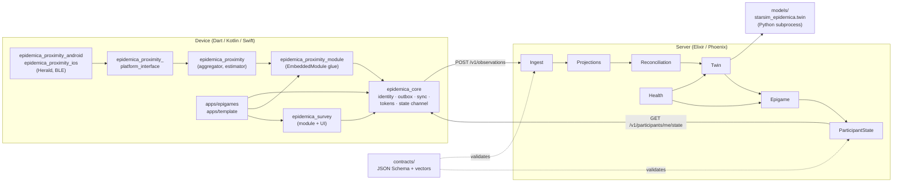
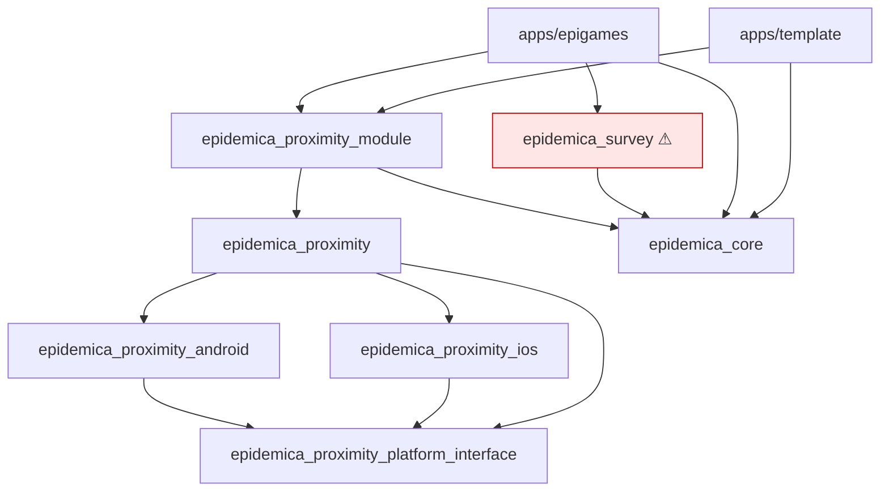
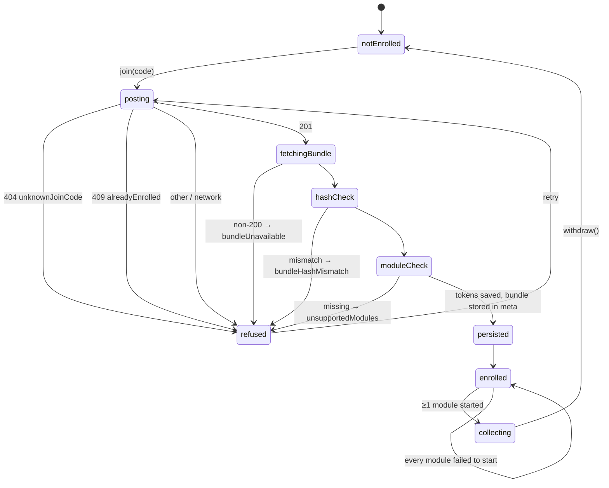
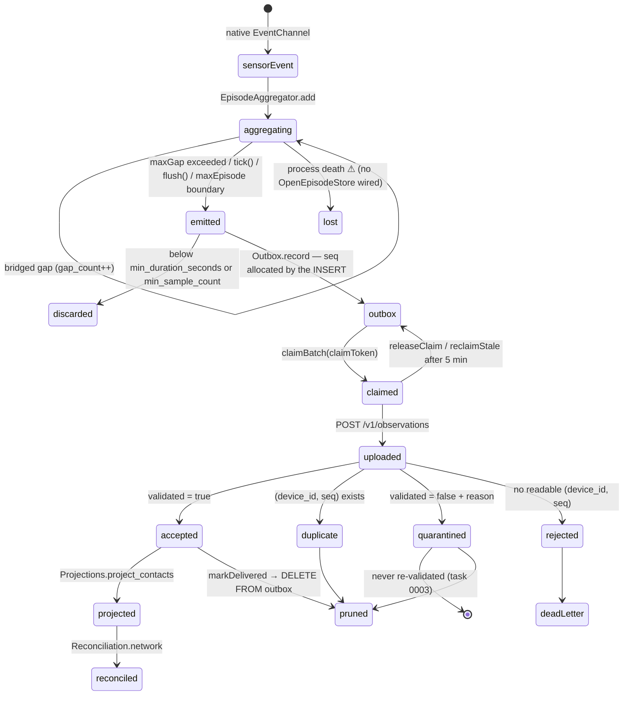
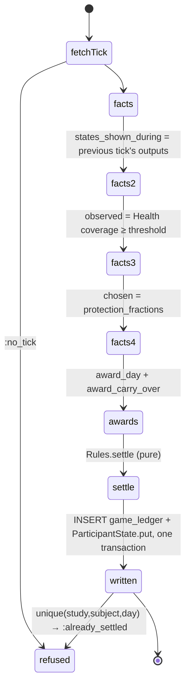
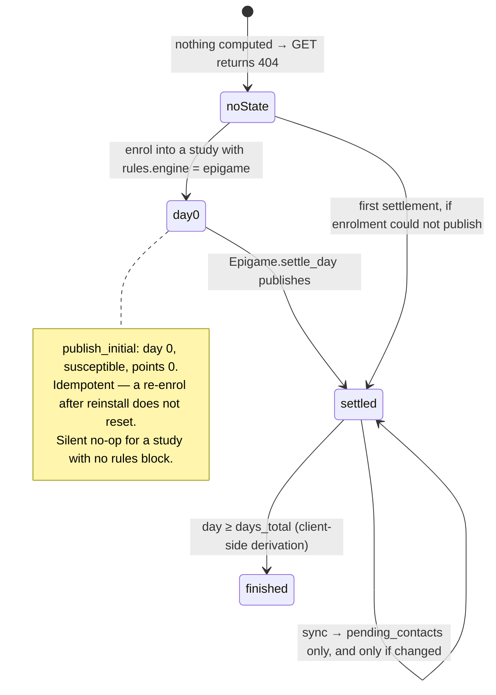
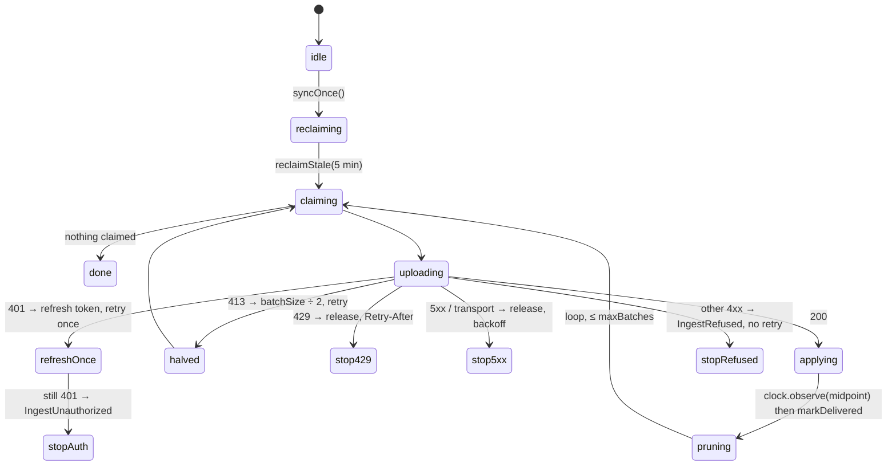
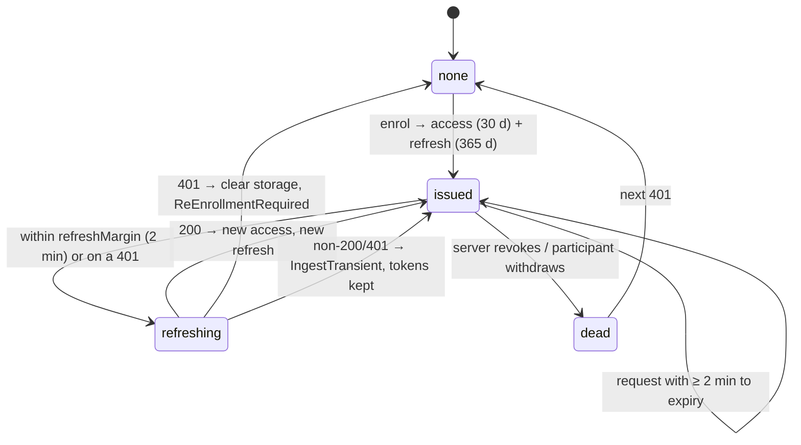

# Epidemica technical invariants (v0.0.1)

**Status:** audit of the working tree as of 2026-09-06. Read-only; no code was changed.

**What this is.** A verified description of how the system actually behaves, written so that anyone
— human or agent — adding a feature can tell what they are allowed to assume. Everything here was
checked against source. Where the existing documentation and the code disagree, **the code is
recorded as correct** and the disagreement is listed in §6.

**How to read it.** §1 and §5 are the ones to read before writing code. §2 and §3 are reference.
§4 tells you which of the claims in §1–§3 are actually defended by a test, and §6 tells you which
existing documents to distrust.

**Confidence markers.** Statements are grounded in quoted code unless marked *unverified*, which
means I could not establish it from the repository alone.

---

## Contents

- [§0 System map](#0-system-map)
- [§1 Module boundary audit](#1-module-boundary-audit)
- [§2 State machines](#2-state-machines)
- [§3 Data lifecycle and integrity](#3-data-lifecycle-and-integrity)
- [§4 Test coverage map](#4-test-coverage-map)
- [§5 Fragile points register](#5-fragile-points-register)
- [§6 Discrepancies between docs and code](#6-discrepancies-between-docs-and-code)
- [§7 The short version](#7-the-short-version)

---

## §0 System map

Four languages, one contract tree.



**Runtime topology.** One Phoenix app, one Postgres, Oban with a single `twin` queue (concurrency 1).
The transmission engine is a **short-lived subprocess**, not a service:
`Twin.Runner.Subprocess.run/1` writes the tick document to a temp file and runs
`uv run python -m starsim_epidemica.twin <path>` with `cd: models_dir`, reading JSON from stdout.

---

## §1 Module boundary audit

### 1.0 The dependency graph as it actually is

Read from the `pubspec.yaml` files and `mix.exs`.



`epidemica_core` depends on **no** Epidemica package. That is the load-bearing rule and it holds.

**⚠ The one violation.** `docs/concepts/modules.md` ("What a module must not do") and ADR-0001 rule 2
state that a module must not depend on `epidemica_core`. The proximity stack obeys this by splitting
in two — `epidemica_proximity` (pure sensing, no core) plus `epidemica_proximity_module` (the glue
that knows about `EmbeddedModule` and the outbox). **`epidemica_survey` does not split.** It is a
single package that `implements EmbeddedModule`, depends on `epidemica_core`, and additionally ships
Flutter UI (`lib/src/survey_screen.dart`). Nothing enforces the rule, so nothing caught it.

This is the clearest instance of the drift described in the audit brief: the survey package was added
without the two-package pattern the proximity stack established.

### 1.1 `epidemica_core` ↔ a module

| Boundary | Crosses | Must not cross | Implicit coupling |
|---|---|---|---|
| `EmbeddedModule` interface (`modules/embedded_module.dart`) | `String get id`; `Future<void> start(ModuleContext)`; `Future<void> stop()`; `Future<ModuleStatus> status()` | Core must never `import` a module package. `ModuleRegistry` is built as `{for (final m in modules) m.id}` in `StudyController`, so it can never claim a module the binary lacks | `id` must equal (a) the bundle's `modules` map key and (b) the envelope's `module` field. Three places, one string, no type. `'proximity'` and `'survey'` are hardcoded literals in Dart *and* in Elixir (`Twin.@proximity_module`) |
| `ModuleContext` (what a module receives) | `config` (that module's block **only**), `studyId`, `subject`, `studyStartsAt`, `record` (an `ObservationRecorder`), `store` (a namespaced `ModuleStore`) | **The whole bundle.** `configFor(module)` returns only `raw['modules'][module]`. Another module's config. The outbox itself. Tokens. The HTTP client | `studyStartsAt` is parsed from `schedule.starts_at` and must be the *same instant* the server anchors days on (`Studies.starts_at/1`). Both parse the same ISO-8601 string; nothing tests that they agree |
| `ObservationRecorder` (module → outbox) | `({required String schemaUri, required DateTime observedAt, required Map payload}) → int` | A module never supplies `study_id`, `protocol_hash`, `subject`, `device_id`, `module`, `seq` or `clock_offset_ms`. `recorderFor` binds all of them | `observedAt` is expected UTC; nothing coerces it. `Outbox._iso` calls `.toUtc()` so a local-time `DateTime` is silently converted rather than rejected |
| `ModuleStore` | `read/write/delete(String)` | Not a second outbox. Not for observations. Cleared on withdrawal | `DatabaseModuleStore` namespaces by `moduleId`; two modules with the same `id` would collide silently |
| `ModuleStatus` | `ModuleState` ∈ {`sensing`, `stopped`, `permissionDenied`, `radioOff`} + optional `detail` | `detail` must never carry participant data (comment-enforced only) | `ModuleState.toJson()` must match the `state` enum in `observations/health/module_status/1.0.0.json`. It does; nothing tests it |

### 1.2 `epidemica_proximity` ↔ `epidemica_proximity_module`

| Boundary | Crosses | Must not cross | Implicit coupling |
|---|---|---|---|
| `EpisodeAggregator` | `add(ProximityDetection) → List<ContactEpisode>`; `tick(DateTime) → List<ContactEpisode>`; `flush()`; `checkpoint()`/`restore()`; `AggregatorConfig.fromModuleConfig(Map)` | The aggregator has **no clock, no I/O, no radio**. It never sees the outbox, the study, or the envelope | `AggregatorConfig.fromModuleConfig` reads `on_device` and `upload` sub-blocks by literal key. The bundle schema declares module config as `{"type": "object"}` — open — so a typo (`sample_credit_second`) silently falls back to the default |
| `ContactEpisode.toPayload()` | The exact `contact_episode/1.0.0` payload map | Must not carry the subject, the study, or a device address | Payload keys are hand-written strings matched against the JSON Schema only by fixture tests |
| Pseudonym → BLE | `studyServiceUuid(studyId)`, RFC 4122 v5 over a frozen namespace `6f6d1c0e-…` | Changing `epidemicaUuidNamespace` silently partitions a running study | The same derivation must be reproduced by nothing else — it is Dart-only, passed to native as a string |

**Gap.** `ProximityModule.start` constructs `EpisodeAggregator(selfPseudonym:, observerDeviceClass:,
config:)` — with **no `store:`**. `checkpoint()` and `restore()` are never called outside tests, and
no SQLite `OpenEpisodeStore` implementation exists anywhere in the tree. `context.store` is available
and unused. See §5-F1 and §6-D2.

### 1.3 Platform interface ↔ native

| Boundary | Crosses | Must not cross | Implicit coupling |
|---|---|---|---|
| `MethodChannel('info.epidemica.proximity/methods')` | `start(Map)`, `stop()`, `isRunning()→bool`, `isRadioEnabled()→bool`, `observerDeviceClass()→String`, `missingPlatformRequirements()→List<String>` | Native never sees the study, the bundle, or any observation | The config map keys (`pseudonym`, `service_uuid`, `notification.{title,body,channel_name,channel_description}`) are literal strings duplicated in Dart, Kotlin and Swift |
| `EventChannel('info.epidemica.proximity/events')` | `{type: "detection", peer, rssi, observed_at_ms, peer_device_class}`, `{type:"dropped", count, oldest_retained_ms}`, `{type:"started"}` | Native must never stamp timestamps on the Dart side | `observed_at_ms` is **native-clock epoch milliseconds**, stamped inside the Herald callback (`System.currentTimeMillis()` / `Date().timeIntervalSince1970 * 1000`). Both platforms comment that this is deliberate because iOS batches background delivery |
| BLE wire payload | 18 bytes: `[0]=version(1)`, `[1..16]=pseudonym UUID big-endian`, `[17]=device_class` (`0`=iOS, `1`=Android, `255`=unknown) | Nothing else. No study identifier on the air — study scoping is the service UUID | Kotlin and Swift **both load `contracts/wire/proximity_payload/1.0.0.vectors.json`** by walking up from the working directory. This is the one genuinely cross-language-tested boundary in the repo |

**Android/iOS divergences that matter:**

| | Android | iOS |
|---|---|---|
| `notification` config block | Read and used for the foreground-service notification | **Parsed and ignored** — no consumer |
| Process model | `startForegroundService`, `START_STICKY`, restart arrives with a null intent | In-process `SensorArray`; `hasStartedThisSession` guard discards a sensor left over from BLE state restoration |
| Herald mobility sensor | No equivalent | Explicitly `nil`ed — Herald's default enables CoreLocation, which crashes an app without the `location` background mode |
| Herald logging | `SensorLoggerLevel.off` | Herald default |
| Buffer | `DetectionBuffer`, 8192, FIFO eviction, drop count emitted before survivors | Identical logic, same capacity |

### 1.4 Device ↔ server (HTTP)

| Boundary | Crosses | Must not cross | Implicit coupling |
|---|---|---|---|
| `POST /v1/enrollments` (unauthenticated) | up: `{join_code, subject, device_id, platform, app_version?, locale?}`; down: `{subject, study_id, arm, protocol_hash, protocol_url, access_token, token_type, expires_in, refresh_token, server_time}` | The server never invents a subject; the client never invents a `study_id` | `subject` must satisfy the envelope pattern `^[A-Za-z0-9_-]{8,128}$`. The OpenAPI spec asserts the two patterns match (`test_subject_pattern_matches_the_envelope_contract`); the Elixir enrollment path does **not** validate it |
| `GET /v1/studies/:id/protocol` | exact registered bytes | 403 unless `conn.assigns.auth.study_id == id` | Client hashes bytes; server stores `protocol_source` verbatim (`Study.hash_of/1`). A re-encoding on either side breaks enrolment |
| `POST /v1/observations` | `{observations: [envelope, …]}`, gzipped, ≤ 1000 | Client-supplied `received_at`/`validated`: blocked by `additionalProperties: false` | The batch must be homogeneous *and* match the token on all three of `device_id`, `study_id`, `subject`, checked **before** schema validation |
| `GET /v1/participants/me/state` | `{state_version, study_id, subject, state_uri, revision, as_of, state}` | No path parameter: token scopes it. 404 rather than a synthesised document | `state` is opaque to core and to the platform; only `Contracts.@state_validators` knows `epigame/1.0.0` |
| `POST /v1/participants/me/actions` | `{action: "protect" \| "release"}` | The client cannot supply an effective time — the server stamps `DateTime.utc_now()` | `StudyController.postAction` sends an opaque map; the epigame app is the only thing that knows the vocabulary |

### 1.5 Server-internal boundaries

| Boundary | Crosses | Must not cross | Implicit coupling |
|---|---|---|---|
| `Ingest` → `Projections` | `project_contacts(study_id, only: [observation_id])` | Only `validated == true` rows are projected | Ingest calls it **synchronously inside `submit/2`**; `Twin.contacts/5` calls it again without `only:` as a safety net |
| `Projections` → `Reconciliation` | the schemaless `contacts` table: `{subject, peer, started_at, ended_at, observed_seconds, band_seconds, sample_count, gap_count}` | Nothing but `Projections` writes `contacts` | Schemaless queries return `NaiveDateTime`; every reader has a local `to_utc/1`. Four independent copies of this helper exist |
| `Reconciliation` → `Twin`/`Epigame` | `%{pair: {a,b}, seconds, observed_seconds, band_seconds, reported_by, both_reported, episode_count}` | `Twin` maps subjects → indices and drops any edge touching an unknown subject | `seconds` (union) is used by **scoring**; `band_seconds` (one side only) is used by **transmission**. They intentionally disagree |
| `Twin` → engine | a self-contained JSON document, **string keys only** | The engine never sees a study, a participant, a pseudonym-to-person mapping, or points | Atom-vs-string keys would make a replayed tick differ from the one that ran. Enforced by convention and a comment, not a type |
| `Twin` ↔ `Epigame` | `Epigame` reads `Tick.inputs["agents"]`, `Tick.outputs["agents"]`, `period_start/end`, `received_before` | `Twin` must not compute points; `Epigame` must not write `twin_ticks` or `twin_agents` | **`Twin` calls into `Epigame`**: `chosen_protection_levels/3` dispatches on `protocol.rules.engine == "epigame"`. The separation is one-directional in the docs and bidirectional in the code |
| `*` → `ParticipantState` | `put(study_id, subject, state_uri, state, as_of)` | Core/platform never interprets `state` | `@state_uri` is a literal duplicated in `Epigame` and in every study bundle's `twin.state_uri` |

---

## §2 State machines

### 2.1 Enrolment



**Ordering, exactly as implemented in `EnrollmentService.enroll`:** POST → fetch bundle → **hash
check** → **module check** → *then* save tokens → persist. Tokens are only written after both checks
pass, so a refusal leaves nothing on the device.

**What can go wrong.**

| Step | Failure | Consequence |
|---|---|---|
| POST | 404 | Deliberately does not distinguish unknown / closed / full — anti-enumeration |
| POST | 404 from a *missing route* | Indistinguishable from an unknown code. `StudyController._asDirectory` normalises the base URI to end in `/`, which fixes the common cause; the general case is task 0004 |
| Bundle fetch | non-200 | `bundleUnavailable`; no enrolment record cleaned up server-side |
| Hash | mismatch | Refused. This is the only integrity check on the bundle |
| Module check | binary lacks a module | Refused **after** the server has already created a `Participant`, a `Device` and two `Token`s. The server-side enrolment is orphaned and will never produce data — the code comments say so explicitly |

**Irreversible:** the server-side participant row (`unique(study_id, subject)`); the `Device` claim
(`unique(device_id, study_id)` — a `device_id` cannot move to another participant within a study).
**Should be irreversible but is not:** nothing marks the orphaned enrolment from a failed module
check.

**Not implemented anywhere:** validation of the fetched bundle against `contracts/bundle/1.0.0.json`.
`ProtocolBundle.parse` reads five keys and keeps the rest as `raw`. See §6-D1.

### 2.2 Observation lifecycle



**Server classification, in order (`Ingest.classify/3` → `validate/1`):**

1. Unreadable `device_id` or `seq` (incl. negative) → **rejected**, nothing stored.
2. `envelope_version` not in `["1.0"]` → **quarantined**, `unknown_envelope_version`.
3. Envelope fails `Contracts.validate_envelope` → **quarantined**, `envelope_invalid`.
4. `schema_uri` unknown to this build → **quarantined**, `unknown_payload_schema`.
5. Payload fails its schema → **quarantined**, `payload_invalid`.
6. Otherwise **accepted**.

Then `insert_all(on_conflict: :nothing, conflict_target: [:device_id, :seq])`; anything not in
`returning` becomes **duplicate**.

**Critical asymmetry.** The response's `exceptions` list contains *only* non-accepted outcomes. A
client that deleted exactly what the server listed would delete its failures and resend every
success forever. `SyncService._applyOutcomes` inverts correctly — it deletes everything except the
rejections.

**Irreversible:** the observation row (append-only; there is no update path). `validated` is written
once — task 0003. Dead-lettering (`INSERT OR REPLACE` + `DELETE FROM outbox`) — the row can never
return to the queue, and its `seq` is never reused because the column is `INTEGER PRIMARY KEY
AUTOINCREMENT`.

### 2.3 Twin tick

```mermaid
stateDiagram-v2
  [*] --> fetchStudy
  fetchStudy --> refused: :not_found
  fetchStudy --> twinBlock
  twinBlock --> refused: :not_a_twin_study (no twin block)
  twinBlock --> schedule
  schedule --> refused: :before_study_start (day < 1)
  schedule --> refused: :after_study_end (day > schedule.days)
  schedule --> notRun
  notRun --> refused: :already_run
  notRun --> elapsed
  elapsed --> refused: :day_not_finished (unless allow_incomplete)
  elapsed --> roster: COMMITTED before the engine runs ⚠
  roster --> buildInputs
  buildInputs --> engine: subprocess, OUTSIDE any transaction
  engine --> failed: {:engine_failed, status} etc.
  failed --> [*]: twin_ticks untouched; twin_agents already mutated ⚠
  engine --> applyTick
  applyTick --> written: INSERT twin_ticks + UPDATE twin_agents, one transaction
  applyTick --> refused: unique violation → :already_run
  written --> [*]
```



`reconcile_roster/3` runs in **its own transaction** and does three things in order: enrol newcomers
into fresh slots, fill/retire virtual agents to `twin.population`, seed the outbreak. All three
commit before the engine is invoked.

**Settlement is a separate job.** `Twin.run_tick` does not score. `Twin.Worker` enqueues
`Epigame.Worker` after a successful (or already-run) tick; `mix epidemica.tick` calls
`Epigame.settle_day` directly.



**Irreversible:** `twin_ticks` (unique `[study_id, day]` — the *index*, not the guard, is what
enforces immutability); `game_ledger` (unique `[study_id, subject, day]`); `game_contact_awards`
(unique `[study_id, subject, peer, day]` — this one index enforces both the cooldown and the
no-double-carry-over rule). `mix epidemica.reset_study` deletes all of them, and is explicitly
labelled not-for-production.

**Should be irreversible but is not:** slot assignment is permanent per the docstring, but
`retire_virtual/2` sets `active = false` highest-slot-first on *virtual* agents only, so a real
participant never loses a slot. Verified by test.

### 2.4 Participant state



**Epidemiological states** (`state/epigame/1.0.0.json`): `susceptible | infected | recovered | dead`.
`dead` is defined but unreachable — `p_death` defaults to `0.0` in `twin.py`.

**The one-day lag is deliberate.** `Epigame.states_shown_during/3` reads day *n−1*'s outputs to score
day *n*, while `current_state/3` publishes day *n*'s outputs. A participant shown `susceptible`
earns healthy points for that day even if the tick that closes it infects them.

**Two writers touch the same document out of band.** `publish_protection/3` rewrites only
`protected_until`; `refresh_pending/3` rewrites only `pending_contacts`. Both read-modify-write the
whole `state` map, so they race with each other and with `publish/9` at the map level even though
`revision` is incremented atomically by the database. The `revision` protects the *client* from
reordering, not the server from lost updates.

`finished` is derived **on the device** (`GameState.finished => hasState && daysTotal != null && day
>= daysTotal!`), not published by the server.

### 2.5 Sync



**Nothing schedules this.** `SyncService` has no timers by design. In `apps/epigames` the only
callers are a 1-minute foreground `Timer.periodic`, pull-to-refresh, and `postAction`. There is no
`WorkManager`, no BGTaskScheduler, no background isolate entry point anywhere in the tree — task 0006
is real and unmitigated.

**Backoff** is exponential with **full jitter** (`Random().nextInt(capped + 1)`), initial 2 s, cap
30 min; a server `Retry-After` always wins, clamped to the cap.

### 2.6 Tokens



Server side (`EpidemicaServer.Enrollment`): 32 random bytes, `Base.url_encode64(padding: false)`,
stored **only** as `:crypto.hash(:sha256, raw)` with `unique_index(:tokens, [:token_hash])`. On
refresh: every unrevoked **access** token for that device is revoked, the presented refresh token is
revoked, and a new pair is issued — all in one transaction. A replayed refresh token therefore fails.

`authenticate/1` refuses on `revoked_at != nil`, expiry, or `participant.withdrawn_at != nil`.

**Not implemented:** a revocation endpoint or admin path. Revocation exists as a column and is
exercised only by rotation. `Device.withdrawn_at` is read but nothing sets it — *unverified whether
any withdrawal flow reaches the server at all;* `StudyController.withdraw()` only clears the device.

---

## §3 Data lifecycle and integrity

### 3.1 One contact episode, end to end

**Step 1 — Herald → native → Dart.** Emitted per `didMeasure` callback:

```json
{ "type": "detection",
  "peer": "c9e2f1a0-6b3d-4c88-9a71-2f3e4d5c6b7a",
  "rssi": -62.0,
  "observed_at_ms": 1788000000000,
  "peer_device_class": "ios" }
```

`rssi` is dBm as reported by Herald's `Proximity.value` (*unverified against Herald's own docs*).
`observed_at_ms` is **native epoch milliseconds stamped in the callback**, never on Dart arrival —
this is what makes long background encounters attributable on iOS. `peer` and `peer_device_class` are
decoded from the 18-byte payload.

**Step 2 — `EpisodeAggregator`.** Per detection:

1. If `now − lastSeenAt > maxGap` (600 s), close the episode at `lastSeenAt` and start fresh.
2. Estimate the band: median over the last `windowSize`(5) samples → scalar Kalman filter → fixed
   per-hardware threshold table (iOS `[-55,-65,-75]`, Android `[-70,-80,-90]`; an unknown peer uses
   the **iOS** table, the conservative choice).
3. If `now − lastSeenAt > dropoutThreshold` (75 s), `gapCount++`.
4. `_extend`: credit `min(now − lastSeenAt, sampleCredit)` seconds to **the band the peer was last
   seen in**, splitting at every `startedAt + maxEpisode` (900 s) boundary and marking each closed
   slice `truncated: true`.

**What `sample_credit_seconds` actually does.** It is a cap of 90 s on how much elapsed time *one*
sighting may vouch for. A 10-minute silence bridged by a single later sighting credits 90 s to a
band and leaves 510 s credited to nothing. This is why `observedSeconds ≤ wallDuration` always, and
why `band_seconds` legitimately sums to less than `ended_at − started_at`.

Emission is suppressed when `sampleCount == 0` (a boundary continuation nothing was seen in), or
below `min_duration_seconds` / `min_sample_count`.

**Step 3 — the envelope.** `recorderFor` supplies everything outside `payload`:

```json
{ "envelope_version": "1.0",
  "study_id": "…", "protocol_hash": "sha256:…",
  "subject": "…", "device_id": "…",
  "module": "proximity",
  "schema_uri": "https://schemas.epidemica.info/observations/proximity/contact_episode/1.0.0.json",
  "observed_at": "2026-09-06T12:00:00Z",
  "clock_offset_ms": null,
  "seq": 1,
  "payload": {
    "peer": "…", "pair_key": "<64 hex>",
    "started_at": "…Z", "ended_at": "…Z",
    "band_seconds": {"immediate": 0, "close": 120, "medium": 30, "far": 0},
    "band_edges_m": [1.0, 2.0, 5.0],
    "min_distance_m": 1.5, "sample_count": 14, "gap_count": 1,
    "rssi": {"median": -66, "min": -80, "max": -55},
    "observer_device_class": "android", "peer_device_class": "ios",
    "estimator": "coarse_distance", "estimator_version": "2.0.0",
    "truncated": true } }
```

`observed_at` is the episode's `ended_at`. `clock_offset_ms` is **null until a server has been
reached** — never zero, because zero is a measurement. `seq` is allocated by the INSERT itself
(`lastInsertRowId`), never read-then-written.

**Step 4 — server validation.** `Contracts` compiles seven schemas at build time via Exonerate:
envelope, contact_episode, location_fix, survey_response, module_status, participant_state, epigame
state. Envelope first, then the payload dereferenced by exact `schema_uri` string match. **Failure
never rejects** — it quarantines with `validated: false` and a reason. Only an unreadable
`(device_id, seq)` is rejected.

**Step 5 — projection and reconciliation.** `Projections.project_contacts` writes one `contacts` row
per validated episode (anti-joined on `observation_id`, so it is idempotent and self-healing).
`observed_seconds` is the **sum of the bands**, not wall-clock.

`Reconciliation.network(study, from, to, received_before:)`:

- selects episodes where `started_at < to AND ended_at >= from` — **any overlap counts in full**, no
  apportionment;
- groups by the *sorted* pair, so upload order is irrelevant;
- `seconds` = **union** of intervals (never sum, never intersection);
- `band_seconds` and `observed_seconds` come from **one side only** — the reporter with the greater
  `observed_seconds`, ties broken by `reporter` name ascending. Not scaled up to the union;
- `both_reported` flags one-sided pairs; they are kept.

**Step 6 — tick input.** Contacts are re-keyed to agent indices; any edge touching a subject not in
the active roster is dropped:

```json
{"a": 0, "b": 3, "seconds": 742.0,
 "band_seconds": {"immediate": 0.0, "close": 300.0, "medium": 120.0, "far": 0.0}}
```

**Step 7 — Starsim.** `twin.py` reads **only `band_seconds`**:

```
edge_weight = Σ(band_seconds[b] × w[b]) / 900.0
w = {immediate: 1.00, close: 0.50, medium: 0.15, far: 0.02}
```

The result becomes `net.edges.beta`; Starsim computes per-edge transmission as
`edges.beta × disease.pars.beta`. **`seconds` is ignored by the engine** — it is used only by
`Epigame.Rules` for `contact_min_seconds`. That divergence is intentional: duration decides whether
a contact *scores*, dose decides whether it *transmits*.

Virtual mixing is appended to the same edge arrays, drawn from
`np.random.default_rng([seed, 0x7717])` — a separate stream so it cannot perturb Starsim's
transmission draws.

### 3.2 A `module_status` observation

**Producer:** `ModuleHealthReporter`, started by `StudyController._activate` only when
`_running.isNotEmpty && bundle.healthReportingEnabled` (default true), with
`interval = health.interval_seconds` (default 1 h).

Every tick, per module: `since = _coveredTo[id]`, `until = now`, ask `module.status()` **now**, emit,
then `_coveredTo[id] = until`. Consecutive windows abut exactly; the first arrives **one full
interval after start**. A module that never started is never reported.

```json
{ "state": "sensing",          // sensing | stopped | permission_denied | radio_off
  "window_start": "2026-09-06T12:00:00Z",
  "window_end":   "2026-09-06T13:00:00Z",
  "detail": "bluetooth" }
```

`window_end` equals the envelope's `observed_at`. The envelope's `module` is the module being
described — not a synthetic `health` module.

**Consumer:** `Health.coverage/4` selects only rows with `module = <module>`, the module_status
schema URI, and `payload->>'state' = 'sensing'`. Windows are clipped to `[from, to)` and **unioned**
(a retried batch cannot claim double coverage). Unparseable or non-overlapping windows are dropped —
safe, because it can only reduce claimed coverage.

`insufficiently_observed/6` returns everyone below `threshold`, **including everyone enrolled but
never heard from** (absent from the coverage map is treated as `0.0`).

**Two consumers, two thresholds, two config paths:**

| Consumer | Reads | Effect |
|---|---|---|
| `Twin.protection_levels/5` | `twin["coverage_threshold"]`, default 0.5 | Below threshold → `protection = 1.0` in the tick document → `rel_sus = rel_trans = 0` |
| `Epigame.observed_subjects/4` | `rules.pars["coverage_threshold"]`, default 0.5 | Below threshold → single settlement line `{reason: "not_sensing", points: 0}` and no contact awards |

`twin.coverage_threshold` **cannot be set**: the bundle schema declares `twin` with
`additionalProperties: false` and no such property. `rules.pars` is open, so only the Epigame side is
configurable. Set it there and the two silently diverge. See §5-F4.

The module is hardcoded to `"proximity"` on both sides (`@proximity_module`).

### 3.3 A game action (protection)

```
POST /v1/participants/me/actions  {"action": "protect"}
```

Server: `Studies.running?/2` gate (409 otherwise) → `Epigame.protect/4` inserts into `game_actions`
with `effective_from = DateTime.utc_now()` (server clock — the client cannot backdate) and
`effective_until = from + rules.pars.protection_window_seconds` (default 86 400) →
`publish_protection/3` immediately rewrites **only** `protected_until` in the state document →
responds `{"action":"protect","accepted":true,"protected_until":"…"}`.

`release` sets `effective_until = now` on any covering row; refunds nothing; 409 if none.

**`protection_fractions/3`** unions the overlapping intervals, clips to `[from, to)`, and returns
`covered / window`. Protecting at noon yields `0.5`, which flows into the tick as
`rel_sus = 1 − efficacy × 0.5`. Tapping protect twice cannot exceed 1.0.

`protection_source` is derived at settlement (`chosen` beats `not_sensing` beats `null`) and is
deliberately **not** overwritten by `publish_protection` — the research distinction between a chosen
and an enforced protection survives the next tap.

---

## §4 Test coverage map

Counts are test declarations, not assertions.

### Dart

| Area | Files | Covers | Rating |
|---|---|---|---|
| Outbox | `outbox_test.dart` (20) | seq allocation from 1, no reuse after drain, two isolates concurrently, claim/release/reclaim, dead letters, WAL, migration idempotence | ✅ |
| Sync | `sync_test.dart` (23) | all four outcome classes, the accepted-omitted-from-exceptions inversion, 413/429/5xx/401, 24 h offline, clock midpoint, jittered backoff | ✅ |
| Enrolment / tokens | `identity_enrollment_test.dart` (~20) | hash mismatch, module refusal, registry sorting, token refresh and revocation | ✅ |
| State channel | `state_channel_test.dart` (18) | revision monotonicity, subject binding, 404-keeps-cache, staleness, opacity of `state` | ✅ |
| `StudyController` | `study_controller_test.dart` (24) | base-URI normalisation, **same binary + different bundles**, withdrawal, module status | ✅ |
| Bundle isolation | `bundle_isolation_test.dart` (~12) | health defaults, twin presence/absence, schedule reading | ✅ |
| Module health | `module_health_test.dart` (9) | abutting windows, never-started modules, flush, radio-off | ⚠ nothing tests the suspension over-claim (task 0007) |
| Episode aggregator | `episode_aggregator_test.dart` (18) | truncation, bridging, `band_seconds ≤ elapsed`, determinism, bundle config, process-death recovery via `InMemoryOpenEpisodeStore` | ✅ |
| **Proximity module glue** | `proximity_module_test.dart` (8) | restore-before-listen, recovery across a simulated process death, no double-record, snapshot cleared on stop, unreadable snapshot tolerated, previous-enrolment snapshot discarded | ✅ |
| Distance estimator | `distance_estimator_test.dart` (10) | per-platform thresholds, outlier rejection, snapshot/restore | ✅ |
| Fixture reproduction | `fixture_reproduction_test.dart` (4) | the committed `contact_episode` fixtures are regenerated from scenarios | ✅ — the strongest producer↔contract link in the repo |
| Survey | `survey_test.dart` (23) | definition parsing, due windows, digest verification, refused vs not-reached, restart | ✅ for logic |
| Epigame rules (app) | `rules_test.dart` | **the shared vectors file** | ✅ |
| Epigame UI state | `game_state_test.dart` (~28) | no invention, colours, protection expiry, finished, open-ended | ✅ |
| **Permissions** | — | nothing | ❌ |

### Kotlin / Swift

| Area | Covers | Rating |
|---|---|---|
| `ProximityPayloadTest.kt`, `ProximityPayloadTests.swift` | Both load `contracts/wire/proximity_payload/1.0.0.vectors.json`: 4 round-trips, 2 decode-only (trailing bytes, unknown class), 5 rejections | ✅ genuinely shared |
| `DetectionBufferTest.kt` (5) | hold/drain, overflow with drop counting, reset, 8 threads × 500 events | ✅ |
| iOS `ProximityEvents` buffer | — | ❌ no Swift test; Kotlin is tested, Swift is not, for identical logic |
| `ProximityService` / `ProximitySensor` lifecycle | — | ❌ |

### Elixir (≈205 tests)

| Module | File | Rating |
|---|---|---|
| `Contracts` | `contracts_test.exs` (8) — every fixture, and every known URI resolves to a file on disk | ✅ |
| `Ingest` | `ingest_test.exs` (17) + `ingest_api_test.exs` (14) — outcomes, idempotency incl. partial retry, batch binding on all three identifiers, gzip, watermark | ✅ |
| `Projections` | `projections_test.exs` (7) — idempotence, rebuild equality, quarantine exclusion | ✅ |
| `Reconciliation` | `reconciliation_test.exs` (12) — union not sum, better-observed side, tie-break, upload order, late arrival | ✅ |
| `Health` | `health_test.exs` (11) — union, clipping, never-heard-from, wrong module | ✅ |
| `Twin` | `twin_test.exs` (20) + `twin_engine_test.exs` (4, real subprocess) — population, immutability, seeding determinism, replay verification | ✅ |
| `Epigame` | `epigame_test.exs` (50) — the one-day lag, carry-over with historical facts, cooldown, fractional protection, pending contacts | ✅ |
| `Rules` | `rules_test.exs` — the shared vectors + arithmetic invariants | ✅ |
| Schedule | `schedule_test.exs` (24) — day boundaries, short-tick studies, catch-up | ✅ |
| Study registration | `study_registration_test.exs` (14) — every bundle in `studies/` registers, closed-schema typos refused, coverage-reportability cross-checks, threshold accessor | ✅ |
| Seeding | `seeding_test.exs` (10) | ✅ |
| `ParticipantState` | `participant_state_test.exs` (12) — concurrent revisions, contract validation, token scoping | ✅ |
| `reset_study` | `reset_study_test.exs` (7) | ✅ |
| Protocol / instruments API | `protocol_api_test.exs` (7), `instrument_api_test.exs` (8) — byte fidelity, cross-study refusal | ✅ |
| Game actions | `game_action_test.exs` (13) — no backdating, study-window gating | ✅ |
| **Oban workers** | — | ❌ `Twin.Worker` / `Epigame.Worker` have no tests; `testing: :manual` and nothing drains the queue |

### Python

| Area | Covers | Rating |
|---|---|---|
| `test_twin.py` (~35) | reproducibility, transmission, fractional protection incl. legacy boolean, state continuity, day units vs years, virtual mixing, infection cause, chained days | ✅ |
| `test_episodes.py` (15) | pair-key symmetry, dose weighting, payload validates against the contract, no raw identifiers | ✅ |
| `test_network.py` (12) | `ContactNetwork` / `OpenCohort` — **a code path the production tick never executes** | ⚠ |
| `analysis/test_contracts.py` (15 parametrised over every schema) | schemas valid, `$id` matches path, objects closed, fixtures pass/fail with reasons | ✅ |
| `analysis/test_openapi.py` (18) | the ingest spec's *semantics*, incl. subject-pattern agreement with the envelope | ✅ |
| `analysis/test_studies.py` (4) | bundles validate; **`studies/` contains no code** (Tier 1, mechanically) | ✅ |

### What is not tested

**Boundary invariants from §1 — ❌ essentially none.**

- No test asserts `epidemica_core` depends on no module.
- No test asserts a module does not depend on `epidemica_core` — which is why the
  `epidemica_survey` violation is live.
- No test asserts `ModuleContext.config` is only that module's block.
- No test asserts `ModuleState.toJson()` matches the `module_status` enum.
- No test asserts the module `id` literals agree across Dart, the bundle and Elixir.
- ADR-0001 rule 5 (an app copied outside the workspace still builds) is claimed as tested at M1;
  **no such test exists in the tree.**

**State transitions from §2 — ⚠ mixed.** Enrolment, sync, tick and settlement are well covered.
Untested: the orphaned-enrolment path after a module-check refusal; token revocation other than by
rotation; withdrawal reaching the server; `finished`.

**End-to-end lifecycle from §3 — ❌.** Every hop is tested; the chain is not. The Dart fixture-
reproduction test and the Elixir fixture tests meet at the same committed JSON files, which is the
closest thing to an end-to-end guarantee. There is no test in which a Dart-produced episode is
ingested by the Elixir server.

**Shared test vectors — where they exist and where they should.**

| Vector file | Consumers | Verdict |
|---|---|---|
| `contracts/wire/proximity_payload/1.0.0.vectors.json` | Kotlin + Swift | ✅ |
| `contracts/game/epigame_rules/1.0.0.vectors.json` | Dart + Elixir | ✅ |
| `contracts/fixtures/observations/proximity/contact_episode/*` | Dart (reproduces) + Elixir (validates) + Python (validates) | ✅ three-way |
| **Reconciliation** (union, better-observed side, tie-break) | Elixir only; `apps/epigames/lib/src/rules.dart:awardContacts` takes pre-reconciled pairs and so *cannot* reconcile | ❌ **should exist** |
| **`edge_weight`** | Duplicated in `twin.py:edge_weight` and `episodes.py:ContactEpisode.edge_weight`; no Dart or Elixir copy | ⚠ one language, two implementations, no vectors |
| **Coverage** (union, clipping, threshold) | Elixir only | ❌ **should exist** — the device decides what to report, the server decides what it means, and nothing ties the two |
| **`studyServiceUuid`** (RFC 4122 v5) | Dart only | ⚠ fine while only Dart derives it |

---

## §5 Fragile points register

### Ordering

**F1 — ~~In-flight episodes are lost on process death.~~ FIXED 2026-09-06.**
`ProximityModule` now builds the aggregator with a `ModuleStoreEpisodeStore` over `context.store`,
restores before subscribing to events, and checkpoints on a one-minute `sweep()` and immediately
whenever an episode is closed. The loss was **not random**: it fell on the longest open encounters,
exactly the tail of the contact-duration distribution the study exists to measure.

The ordering is load-bearing and is what the tests pin:

- `restore()` runs **before** `_platform.events.listen`, because `applySnapshot` clears the whole
  in-flight set — a sighting that arrived first would be discarded by the snapshot behind it.
- Anything closed by a sweep reaches the outbox **before** the snapshot is rewritten, and an
  episode closed by `add()` triggers an immediate checkpoint. An episode present in both the outbox
  and the snapshot would be recorded twice, and the server cannot absorb that: it is a second
  observation with its own `seq`, not a retry. Reconciliation sums a reporter's episodes before
  choosing the better-observed side, so a duplicate inflates that pair's dose.
- `stop()` flushes what is open and then **clears** the store, for the same reason.

*Remaining gap:* neither app observes `AppLifecycleState`, so on iOS the loss window is still up to
one sweep interval. `ProximityModule.sweep()` is public for a host that wants to close it.

**F2 — Ingest must project before anything reads the network.**
`Ingest.submit` calls `Projections.project_contacts(study_id, only: ids)` synchronously, and
`Twin.contacts/5` calls it again without `only:`. `Epigame.award_day` and `pending_contacts` call
`Reconciliation.network` **without** projecting first — they are safe only because `Twin.run_tick`
ran immediately before within the same job.
*Enforced?* By call ordering only. *Likelihood?* Low today; high the moment settlement is invoked
independently of a tick.

**F3 — Roster mutation commits before the engine runs.**
`reconcile_roster/3` (enrol newcomers, fill/retire virtual agents, seed the outbreak) commits in its
own transaction; the engine then runs outside any transaction; only `apply_tick` is transactional.
An engine failure therefore leaves `twin_agents` mutated. The test *"a failed tick leaves no trace"*
asserts only that `twin_ticks` is empty and states are `susceptible` — it does not assert the agent
rows are absent.
*Enforced?* Partially: `seed_outbreak` is idempotent (`already_seeded?` + "no ticks exist" guard),
and slots are never reused. *Likelihood?* Every engine failure.

**F4 — ~~Two coverage thresholds, one of them unreachable.~~ FIXED 2026-09-06.**
There is now one: `twin.coverage_threshold`, declared in the bundle schema and read by both sides
through `Studies.coverage_threshold/1`. `Epigame` no longer reads `rules.pars`. The schema forbids
a threshold of 1, which was never satisfiable.
*Enforced?* By the single accessor, by `study_registration_test.exs`, and by the twin test *"how
much coverage is enough comes from the bundle"*.

**F5 — Settlement is not a pure function of the stored tick.**
`Epigame.observed_subjects/4` recomputes coverage over `[period_start, period_end)` **without**
`received_before`, and `award_carry_over/4` uses its own `received_before` of
`past.period_end + interval × lookback`. A late `module_status` upload can therefore change a
settlement that has not run yet — while the twin's view of the same day is frozen. After
`reset_study`, a replay can produce different scores from the same seed.
*Enforced?* No. `mix epidemica.tick` runs both back to back, which hides it.

### Timing

**F6 — ~~`health.interval_seconds` must be well below `twin.tick_interval_seconds`.~~ ENFORCED
2026-09-06.**
The first coverage window closes one full interval after collection starts, so at most one interval
of every tick period is ever uncovered and coverage can never exceed `1 - interval/tick`. With the
default 3600 s health interval and a 300 s tick, **every** round used to close before any coverage
report existed: every participant scored `not_sensing`, the epidemic could not spread, and nothing
logged an error. This had already happened once in the field.
`Studies.create_study_from_bundle/2` now refuses such a bundle at registration with
`{:health_interval_too_long, interval, maximum}`, and refuses a twin study with `health.enabled:
false` with `{:coverage_not_reported, tick}`.
*Enforced?* At registration only — a study inserted through `Studies.create_study/1` bypasses it.

**F7 — A study without a `proximity` module cannot run a twin.**
`@proximity_module "proximity"` is hardcoded in both `Twin` and `Epigame`. A survey-only study with a
twin block would find zero coverage for everyone → everyone at `protection = 1.0` → no transmission
ever, silently.
*Enforced?* No.

**F8 — Coverage is over-claimed after a suspension.**
`ModuleHealthReporter.report()` sets `until = now` and asks `module.status()` *now*, then claims the
whole `[since, until]` window. An isolate suspended for six hours resumes and claims six hours of
sensing. This is task 0007 and it is real in the code.
*Enforced?* No. *Likelihood?* Every iOS backgrounding.

**F9 — `ensure_elapsed` is the only guard against settling an unfinished day.**
`--force` / `allow_incomplete: true` bypasses it, and the result is **permanent** because the tick is
immutable.

### Implicit state

**F10 — The app assumes its own sync completed before it polls.**
`_refresh()` awaits `sync()` then `refreshState()`. `Ingest.submit` refreshes `pending_contacts` for
**the uploading participant only** — the peer's count stays stale until their own next sync. Two
phones in the same encounter see different pending counts, legitimately.

**F11 — Nothing enqueues `Twin.Worker`.**
`Twin.Worker.enqueue/2` is defined and **never called**. There is no `Oban.Plugins.Cron` in any
config. In a release the study halts after enrolment; ticks happen only via `mix epidemica.tick`.
This is task 0002, and the deployment READMEs' `watch -n 60 mix epidemica.tick` is the actual
production mechanism.

**F12 — Out-of-band state writers race at the map level.**
`publish_protection` and `refresh_pending` each read the whole `state` map, change one key, and write
it back. `revision` is incremented atomically but the map is not compare-and-swapped: a settlement
publishing concurrently with a protect tap can lose one of the two changes.
*Enforced?* No. *Likelihood?* Low (single-digit participants, minute-scale polling), rising with
cohort size.

**F13 — `seq` origin disagrees across languages.**
Dart's outbox is `INTEGER PRIMARY KEY AUTOINCREMENT`, so the first `seq` is **1**. Elixir's
`Ingest.highest_contiguous/1` returns `nil` unless the first stored seq is **0**
(`defp highest_contiguous([first | _]) when first != 0, do: nil`). Its test renumbers fixtures from
0. So `GET /v1/observations/ack` returns `highest_contiguous_seq: null` for every real client.
Currently harmless — `SyncService` never calls `watermark()`, and the Dart parser defaults the field
to 0 — but it is a live cross-language mismatch and the exact failure class this audit exists to
prevent.

### Platform-specific

**F14 — Timestamps must come from native.** Both platforms stamp `observed_at_ms` inside the Herald
callback. Moving it to Dart would misattribute precisely the long background encounters that matter.
Enforced only by comments in `ProximityService.kt` and `ProximitySensor.swift`.

**F15 — iOS silently ignores the notification block.** A study wording its foreground notification for
an ethics board gets that wording on Android and nothing on iOS. No test, no warning.

**F16 — iOS `Info.plist` keys cannot be contributed by the plugin.** Missing
`NSBluetoothAlwaysUsageDescription` or the `bluetooth-central`/`bluetooth-peripheral` background
modes does not crash — sensing just stops when the screen locks.
*Enforced?* Yes, partially: `missingPlatformRequirements()` is checked in `ProximityModule.start` and
throws. That is the single best-designed guard in the codebase.

**F17 — Herald's iOS mobility sensor must stay disabled.** `BLESensorConfiguration.mobilitySensorEnabled
= nil`. Removing that line turns on background CoreLocation, crashing apps without the `location`
background mode and quietly collecting location in ones that have it — breaking the study's privacy
promise. Android has no equivalent. *Enforced?* One line, one comment, no test.

**F18 — No background sync.** Task 0006. Coverage claims are honest; the *uploads* backing them are
not timely, so a tick can run before observations for its own day have arrived
(`edges: 0` with data in the database).

### Single-writer

**F19 — Tick uniqueness is enforced by the index, not the guard.** `ensure_not_run/2` is
check-then-act; the real defence is `unique_index(:twin_ticks, [:study_id, :day])` and
`rollback_reason/1` translating the violation to `:already_run`. Correct — but only for the tick row.
The roster mutation of F3 has no such protection.

**F20 — Oban `twin` queue concurrency is 1.** Days must run in order; each starts from the state its
predecessor wrote. This is the *only* thing serialising ticks, and it is per-node.
**A second node would break it**, since the guard is queue concurrency and not an advisory lock.
*Likelihood?* Zero today (single node), certain on horizontal scale-out.

**F21 — Contact awards are deduplicated by index, not by logic.**
`unique_index(:game_contact_awards, [:study_id, :subject, :peer, :day])` with
`on_conflict: :nothing` is what enforces both the cooldown and the carry-over-never-pays-twice rule.
`Rules.in_cooldown/3` exists and is exercised by vectors but is **not called** by
`Epigame.record_awards/7` — the live cooldown query is `awarded_pairs/4`.

**F22 — `Projections.rebuild_contacts` is destructive and unguarded.** `Repo.delete_all("contacts")`
with a `nil` study id wipes every study's projection. It is rebuildable, so recoverable, but there is
no confirmation and no study scoping by default.

---

## §6 Discrepancies between docs and code

| # | Doc says | Code does | Which is right | Matters? |
|---|---|---|---|---|
| **D1** | `docs/concepts/building-a-study.md`: "The bundle is validated against `contracts/bundle/1.0.0.json`" | **FIXED 2026-09-06.** `Studies.create_study_from_bundle/2` now validates against the compiled schema before inserting, so the doc's claim is true of the runtime as well as of CI. Still unvalidated: `ProtocolBundle.parse` on the device (reads 5 keys), and `Studies.create_study/1` used directly | Now agree | Was yes; resolved |
| **D2** | `docs/milestones/m1`, `docs/concepts/proximity.md`: "Detections in-flight persisted to survive process death — `OpenEpisodeStore` with a SQLite implementation" | **FIXED 2026-09-06.** `ModuleStoreEpisodeStore` in `epidemica_proximity_module` implements it over `context.store`, which is SQLite-backed via `DatabaseModuleStore`. The adapter lives in the glue package because it is the only one allowed to see both `epidemica_core` and `epidemica_proximity` | Now agree | Was yes; resolved |
| **D3** | ADR-0001 rule 2 and `docs/concepts/modules.md`: "A module does not depend on `epidemica_core`" | `epidemica_survey` depends on `epidemica_core`, implements `EmbeddedModule`, and ships UI | **The doc** — this is a real violation, not an outdated rule. The proximity two-package split is the pattern to follow | **Yes.** It is the boundary the next agent will copy |
| **D4** | ADR-0012: "`EpidemicaNetwork(ss.Network)` materialises contact episodes as a dynamic edge list"; the M2 docs describe it as the bridge | Two independent bridges exist. `models/network.py:ContactNetwork` (+ `cohort.py:OpenCohort`) does per-timestep apportionment and `max`/`mean`/`sum` reconciliation; **production `twin.py` uses `ss.StaticNet()` and overwrites `net.edges` directly**, taking already-reconciled edges from Elixir. `twin.py` imports nothing from `network.py` except the shared weights | **Code**, for the runtime. `ContactNetwork` is the analysis/spike bridge and remains valid for offline work | **Yes.** `test_network.py` (12 tests) defends a path production never runs; reading it as coverage of the tick is a mistake |
| **D5** | ADR-0001 rule 5 / M1: "Tier 2 test: `apps/template` copied outside the workspace must build" — listed as implemented at M1 | No such test, script or CI job exists | **The doc** describes the right check; it is absent | Moderate — path-based workspace deps would fail exactly this way |
| **D6** | M2 milestone: "A tick that fails leaves no partial state" | True of `twin_ticks`; **false of `twin_agents`** (§5-F3) | **Code** | Moderate — self-healing in practice because seeding and slot allocation are idempotent |
| **D7** | ADR-0012 / M2: "Cross-language determinism: fixture + injected stream → bit-identical trajectories between a Dart edge runtime and Starsim" | There is no Dart edge runtime. The plan was superseded by server-side reconciliation, which the M2 doc itself records as a reversal | **Code**, and the M2 doc already says so | No — but the ADR still reads as current |
| **D8** | `studies/epigame-debug/README.md`: "Coverage… the twin requires coverage of at least `coverage_threshold` (0.5)" | **FIXED 2026-09-06.** One threshold, in the twin block, default 0.5 (§5-F4) | Now agree | Was yes; resolved |
| **D15** | `contracts/bundle/1.0.0.json` requires `schedule.days`, with an explicit negative fixture *"a schedule with no end"*, and the schedule description says open-ended means omitting `schedule` entirely | The server supports a **scheduled but endless** study: `Studies.scheduled_days/1` returns nil for an absent key, `days_to_catch_up/2` counts past any declared length, `Twin.ensure_in_schedule/2` allows `days == nil`, and `state/epigame`'s `days_total` is nullable so the app renders it. That shape is not expressible in a valid bundle | **Undecided — needs a call.** Either the schema should let `days` be omitted, or the server should stop supporting the shape. Not resolved here, because reversing a deliberate contract decision as a side effect of another change is how the drift this document exists to prevent happens | Moderate. Today it is unreachable through registration, so it is latent rather than active. The test that covers it now builds the study through `Studies.create_study/1` and says so |
| **D9** | M1: "Rejected observations moved to a local dead-letter store, **surfaced**, never silently deleted" | The store, `surfaced` column and `markSurfaced` all exist. `StudyController` exposes `deadLetterCount`; **no UI in either app displays it** | **Code** — stored and inspectable, not surfaced | Low |
| **D10** | ADR-0002 / M1: "`GET /observations/ack` returns the highest contiguous seq" | Always `null` for real clients (§5-F13), and nothing calls it | **Code** | Low today, high once pruning depends on it |
| **D11** | M2 acceptance: "No participant's score ever changes retroactively" | True while a study runs. `mix epidemica.reset_study` deletes ledger, awards, ticks and published state, and a replay can score differently (§5-F5) | Both — the task is explicitly not-for-production and says so | No |
| **D12** | `docs/concepts/state-channel.md`: "`revision` is allocated by the database in the same statement as the write, so two writers cannot both see revision 4" | True — `insert_all` with `inc: [revision: 1]`. But the **`state` map** is read-modify-write in three places (§5-F12), which the doc does not mention | **Code** — the doc's claim is correct and narrower than it reads | Moderate |
| **D13** | Task 0002: "Oban workers exist but nothing enqueues them" | Confirmed exactly. Recorded here because it is easy to mistake `Twin.Worker` for a live scheduler | Both agree | **Yes** — a deployment without `watch mix epidemica.tick` collects data and decides nothing |
| **D14** | `docs/concepts/surveys.md` implies the instrument definition is validated | `Instruments.register/2` checks only that the JSON has `instrument_id` and `version`; `contracts/instruments/definition/1.0.0.json` is **not** compiled into `Contracts`. Its own moduledoc says validation "is enforced where it is authored, not here" | **Code**, and it is self-consistent | Low — the Dart parser refuses malformed definitions client-side |

---

## §7 The short version

If you are about to write code in this repository, these are the rules that are load-bearing and the
ones that are only aspirational.

**Genuinely enforced (by an index, a type, or a test).**

1. `unique(observations.device_id, seq)` is the *only* deduplication. Retries are always safe.
2. `unique(twin_ticks.study_id, day)` is what makes a tick immutable. The guard is advisory.
3. `unique(game_contact_awards.study_id, subject, peer, day)` enforces cooldown *and* carry-over.
4. The ingest response omits accepted observations. Delete everything except the rejections.
5. `clock_offset_ms` is `null`, never `0`, until a server has been reached.
6. Coverage is asserted positively. A period with no `module_status` is **unobserved**, not quiet.
7. Contact duration is the **union**; distance comes from **one side**; they may disagree.
8. Points use the state the participant was **shown** (the previous tick's outputs).
9. Tick inputs and outputs use **string keys**, always.
10. Bundle bytes are stored and served verbatim. Never re-encode.
11. A bundle is validated against its contract at registration, including two cross-field checks the
    schema cannot express: a twin study must report coverage, and must report it faster than it
    ticks.
12. There is exactly one coverage threshold, `twin.coverage_threshold`, reached through
    `Studies.coverage_threshold/1`.
13. In-flight encounters are checkpointed to the module's own store and restored on start. An
    episode is never in both the outbox and the snapshot.

**Believed but not enforced — do not rely on these without adding the check.**

14. A module must not depend on `epidemica_core` (`epidemica_survey` already breaks it).
15. Bundles are schema-valid **on the device** (`ProtocolBundle.parse` reads five keys and trusts
    the rest), and for studies inserted through `Studies.create_study/1` rather than from a bundle.
16. A failed tick leaves no state (it leaves roster and seeding).
17. Settlement is reproducible from the stored tick (coverage is recomputed live).
18. Ticks run by themselves (nothing enqueues them).
19. `seq` starts at 0 (Dart starts it at 1).
20. A test fixture's dates stay meaningful (two carry-over tests silently stopped testing anything
    on 2026-09-06, because they defaulted an observation's arrival to `utc_now()` and carry-over
    only reaches back `carry_over_days`). Prefer stated instants over the wall clock.
21. The process gets a warning before it dies. It does not: neither app observes
    `AppLifecycleState`, so up to one sweep interval of in-flight state is still lost on iOS
    suspension. Call `ProximityModule.sweep()` from a lifecycle observer to close that window.

**Before adding a module**, copy the proximity two-package split: a pure package with no
`epidemica_core` dependency and no UI, plus a thin glue package implementing `EmbeddedModule`.

**Before adding anything that reads the contact network**, call `Projections.project_contacts/2`
first, and decide explicitly whether you want `received_before:` pinned.

**Before adding a second server node**, replace the Oban `twin` queue concurrency of 1 with an
advisory lock on `{study_id, day}`.
